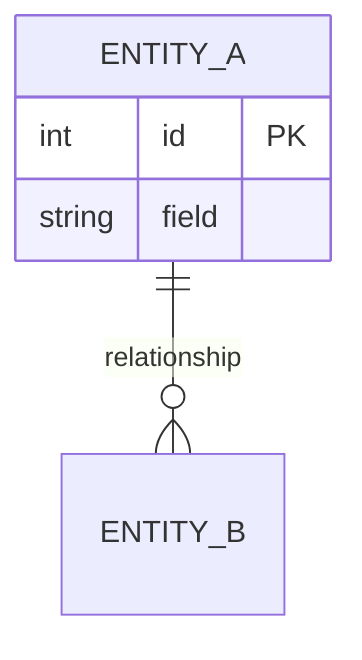

<!-- GUIDE: Filled by /architecture together with data-model.md. Every entity, field, and relationship here must appear there, and vice versa. Validate the Mermaid syntax before the gate. Remove this comment once filled. -->
# ER Diagram

**Data model version:** <n> (must match `data-model.md`)

## Notes

- <cardinality explanations, cascade rules>

<!-- Completion checklist (then remove this comment):
- [ ] Entities, fields, PK/FK, and cardinalities equal data-model.md.
- [ ] The data model version in the header equals data-model.md.
- [ ] The Mermaid block renders.
-->
