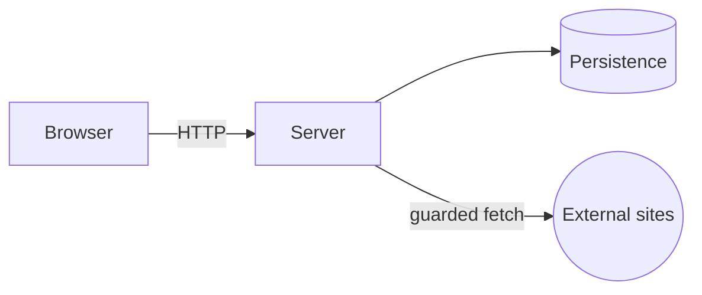
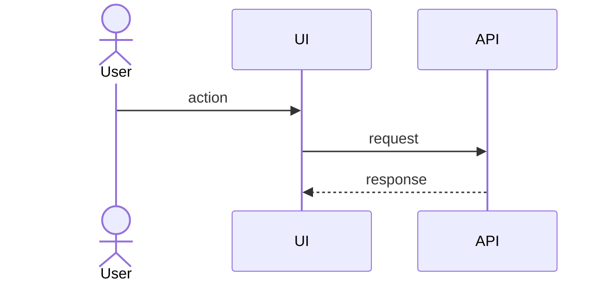
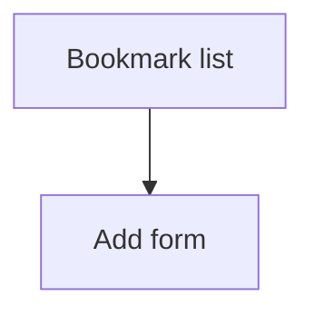

<!-- GUIDE: Filled by /architecture (architect agent; design-alternatives, secure-input-handling, component-resolution skills). Sources: specs/constitution.md, specs/product-spec.md (R-IDs, NFR IDs, edge cases), specs/technology.md, specs/backlog.md. Shared artifact: after approval, change it only through /amend-architecture. Remove every GUIDE comment once its section is filled. -->
# High-Level Design (HLD)

**Version:** <n>
**Status:** draft | approved
**Inputs:** constitution v<x.y.z>, product-spec v<n>, technology v<n>

## 1. Context and Goals

<what the system does, key quality goals (reference NFR IDs)>

## 2. Architecture Style

<e.g. modular monolith / client-server / microservices>. See Alternatives, section 10.



## 3. Component Map

<!-- GUIDE: Mirror component-map.json exactly (id, type, workspaceRoot, path). /sync-check C4 compares them. -->

> Human-readable copy. **`specs/architecture/component-map.json` is authoritative.**

| Component id | Type | Workspace root | Path | Responsibility |
|---|---|---|---|---|

## 4. Project Structure

```
<tree of folders per component>
```

## 5. Layers and Responsibilities

<!-- GUIDE: The "Must not" column is what /review-phase checks for maintainability, for example "routes must not run SQL". -->

| Layer | Responsibility | Must not |
|---|---|---|
| Routes / controllers | | |
| Services (business rules) | | |
| Data access | | |
| UI / views | | |

## 6. Key Flows

<!-- GUIDE: At least: add bookmark including the guarded title fetch, search/filter, and edit/delete. Every R-ID should appear in a flow or a component responsibility. -->



## 7. UI / User Flow (screens)



## 8. Cross-Cutting Concerns

<!-- GUIDE: The trust-boundary table must cover every untrusted input from product-spec, with the S-clause it satisfies. The error shape defined here is reused by every LLD §8. -->

- **Validation strategy:** <where and how>
- **Error handling strategy:** <error shape, user messages, logging>
- **Security design (trust boundaries):**

| Untrusted input | Entry point | Validation | Escaping/Restriction |
|---|---|---|---|
| Submitted URL | | | |
| Fetched page title | | | |
| Search / tag text | | | |

- **Dependency safety:** <audit, pinning>

## 9. Meeting the NFRs

<!-- GUIDE: One row per NFR ID in product-spec §4. Name the concrete mechanism, not "will be fast". -->

| NFR | Design approach (indexes, pagination, persistence, a11y) |
|---|---|

## 10. Alternatives and Trade-offs (architecture level)

<!-- GUIDE: At least 2 AD decisions (docs/02 needs ≥2 app-wide). Use the design-alternatives skill. The decision is the human's. -->

### AD-01 <decision>

| Option | Pros | Cons |
|---|---|---|

**Decision:** <…>
**Trade-off:** <…>

## 11. Constitution Compliance

| Clause | How complied |
|---|---|

## 12. Clarifications

<!-- GUIDE: Questions from /architecture Step 4 or /clarify architecture, with the human's answers verbatim. -->

| Q-ID | Question | Answer (human) | Date | Affects |
|---|---|---|---|---|

## 13. Change Log

<!-- GUIDE: Every post-approval change references an Applied AMD-nnn. -->

| Version | Date | Change | Why | AMD |
|---|---|---|---|---|

<!-- Completion checklist (validated in /architecture Step 6, then remove this comment):
- [ ] Every R-ID maps to at least one flow or component. Every NFR ID has a §9 row.
- [ ] The §3 table equals component-map.json.
- [ ] Every untrusted input has a validation and an output control in §8.
- [ ] §10 has at least 2 AD decisions with human decisions.
- [ ] Mermaid diagrams are syntactically valid.
- [ ] Technology named here matches technology.md.
- [ ] No placeholders `<...>` or GUIDE comments remain.
-->
