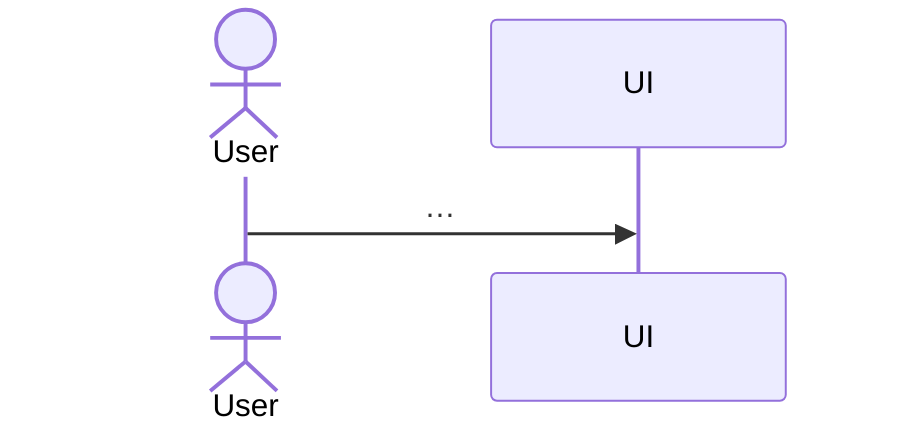

<!-- GUIDE: Filled by /design-feature (architect agent; design-alternatives, secure-input-handling, accessibility-review, component-resolution skills). Sources: this feature's approved spec.md, hld.md, data-model.md, component-map.json, technology.md, constitution.md. Never add entities, fields, or components here. Those need an AMD (§12). Remove every GUIDE comment once its section is filled. -->
# Fnn: <Feature Title> (Low-Level Design)

**Feature ID:** Fnn-<slug>
**Status:** draft | approved | blocked-on-AMD-<nnn>
**Spec version:** <n>
**HLD version:** <n>
**Data model version:** <n>
**Component map version:** <n>
**Components affected:** <ids, validated against component-map.json>

## 1. Design Overview

<2–5 sentences>

## 2. Alternatives Considered (≥2)

<!-- GUIDE: Decisions specific to this feature (for example, duplicate check location, title-fetch timing). Each option set is genuinely different. The decision is the human's. -->

### LD-01 <decision>

| Option | Pros | Cons |
|---|---|---|
| A | | |
| B | | |

**Decision:** <…> (human-approved)
**Trade-off:** <…>

## 3. Component Changes

<!-- GUIDE: The resolved path comes from component-resolution, not from convention. Every file listed here must also appear in tasks.md. -->

| Component id | Resolved path | File (new/changed) | Responsibility |
|---|---|---|---|

## 4. API / Interface Contract

<!-- GUIDE: Every error response uses the error shape from hld.md §8. Each AC should be reachable through a row here or a UI action in §6. -->

| Method | Route / function | Input | Success response | Error responses |
|---|---|---|---|---|

## 5. Data Access

- **Tables/entities used:** <must exist in data-model.md>
- **Queries:** <described, parameterized; no raw SQL blocks > 15 lines>

## 6. UI Changes and States

<!-- GUIDE: Fill every state column, or write "n/a" with a reason. The accessibility notes follow constitution U1–U4. -->

| View/component | Loading | Empty | Error | Success | Accessibility notes |
|---|---|---|---|---|---|

## 7. Validation Rules

<!-- GUIDE: Write the exact user message text. Tests assert on it. -->

| Field | Rule | User message |
|---|---|---|

## 8. Error Handling

| Condition | Detected where | Response / UI feedback |
|---|---|---|

## 9. Security Considerations

<!-- GUIDE: One row per untrusted input this feature touches (secure-input-handling). Cite the S-clause. -->

| Untrusted input | Control applied | Constitution clause |
|---|---|---|

## 10. Sequence

## 11. Test Hooks

- <what must be testable; seams for stubbing, e.g. the title fetcher>

## 12. Architecture Impact

None | AMD-<nnn> (proposed on <date>; feature blocked until resolved)

## 13. Constitution Check

| Clause | Status | Note |
|---|---|---|

## 14. Change Log

| Date | Change | Why | Source |
|---|---|---|---|

<!-- Completion checklist (validated in /design-feature Step 6, then remove this comment):
- [ ] Every AC in spec.md is covered by §4 or §6 and by a task.
- [ ] Every edge case in spec.md is handled in §7, §8, or §9.
- [ ] §2 has at least 2 options with a human decision.
- [ ] §3 paths resolve through component-map.json. §5 uses only existing entities.
- [ ] §12 is "None", or names an AMD and Status is blocked-on-AMD-nnn.
- [ ] Version headers match the current spec, hld, data-model, and component-map.
- [ ] No placeholders `<...>` or GUIDE comments remain.
-->
