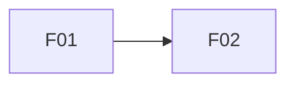

<!-- GUIDE: Filled by /plan-phase app (planner agent; requirements-analysis, edge-case-discovery skills). Sources: specs/constitution.md and the requirement source (.github/seeds/*.seed.md or the human's brief). Never add requirements the source doesn't state. Remove every GUIDE comment once its section is filled. -->
# Product Specification

**Project:** <name>
**Version:** <n>
**Status:** draft | approved
**Constitution version:** <x.y.z>

## 1. Problem Understanding

- **Problem:** <in plain words>
- **Target user:** <persona, synthetic>
- **Value delivered:** <why it matters>

## 2. Functional Requirements

<!-- GUIDE: Keep the source wording in the acceptance summary. Cite the section. List nice-to-haves separately as "Optional enhancements (deferred)". -->

| ID | Requirement | Acceptance summary (from source) | Source |
|---|---|---|---|
| R01 | <name> | 
 | <assignment § / stakeholder> |

## 3. Requirement Breakdown and Dependencies

<!-- GUIDE: Every R-ID appears in at least one feature, and every feature covers at least one R-ID. No dependency cycles. Each effort value gets a one-line reason. These rows seed specs/backlog.md. -->

| Feature ID | Feature | Covers requirements | Depends on | Est. effort (S/M/L) |
|---|---|---|---|---|
| F01 | <title> | R01, R09 | — | M |

## 4. Non-Functional Requirements (measurable)

<!-- GUIDE: Each target has a number, a data volume where relevant, and a method /test-phase can actually run. Replace the examples. -->

| ID | Category | Target | How it will be measured |
|---|---|---|---|
| NFR-01 | Performance | <e.g. search returns < 500 ms with 1,000 bookmarks> | <timed test over seeded data> |
| NFR-02 | Reliability/Persistence | <e.g. 100% of saved bookmarks present after restart> | <restart test> |
| NFR-03 | Usability/Accessibility | <e.g. all actions keyboard-operable; all inputs labelled> | <keyboard walkthrough + label audit> |
| NFR-04 | Security | <e.g. 0 accepted non-http(s) URLs; 0 private-IP fetches> | <security probe tests> |

## 5. Cross-Feature Edge Cases

<!-- GUIDE: From edge-case-discovery. The "Found by" tag is honest: `assignment` if the source names it. -->

| ID | Edge case | Features | Found by (assignment/AI/human) |
|---|---|---|---|
| EC01 | <case> | F01 | AI |

## 6. Risks, Assumptions and Questions

| ID | Type (Risk/Assumption/Question) | Description | Impact | Mitigation / Answer | Status |
|---|---|---|---|---|---|
| RK01 | Risk | <text> | <H/M/L> | <text> | open |

## 7. Clarifications Log

| Q-ID | Question | Answer (human) | Date | Affects |
|---|---|---|---|---|

## 8. Change Log

| Date | Change | Why | Source (phase/AMD) |
|---|---|---|---|

<!-- Completion checklist (validated in /plan-phase app Step 6, then remove this comment):
- [ ] Every R-ID cites its source. Traceability R↔F is complete. No dependency cycles.
- [ ] Every NFR has a number and a measurement method. Performance, persistence, a11y, and security are covered.
- [ ] At least 6 edge cases app-wide (together with feature specs), each with a source tag.
- [ ] Every risk has an impact and a mitigation. Open questions ≤ 5.
- [ ] Only synthetic data and personas.
- [ ] No placeholders `<...>` or GUIDE comments remain.
-->
