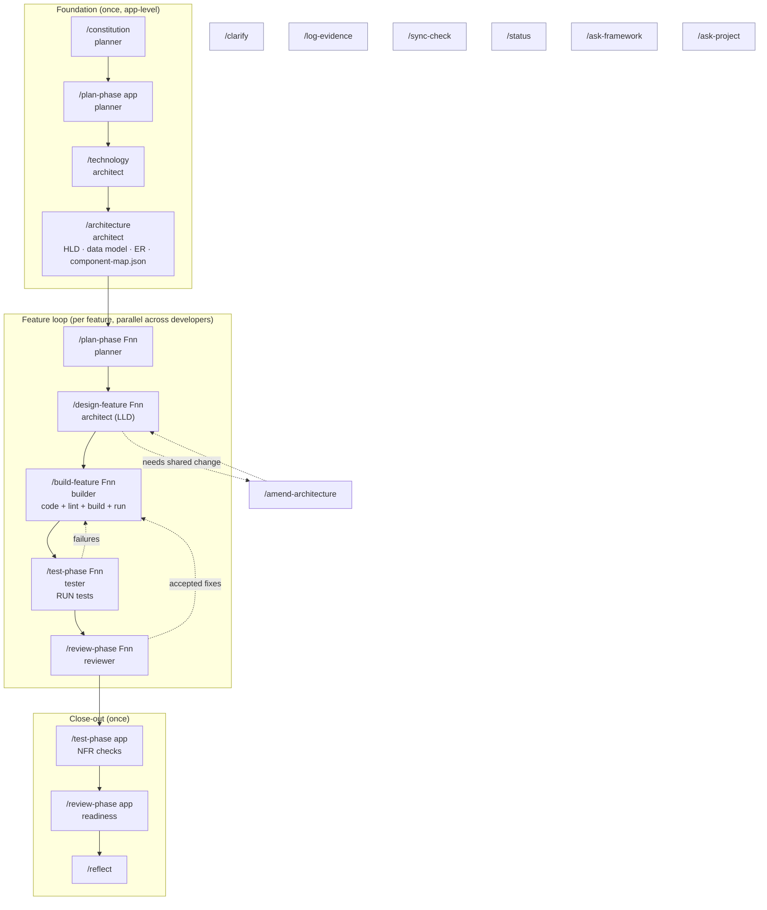
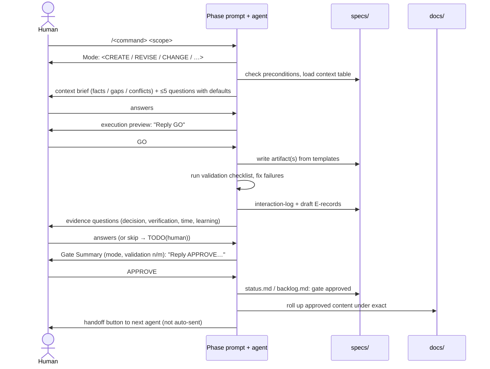
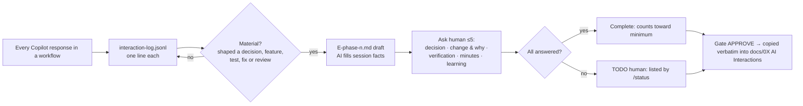
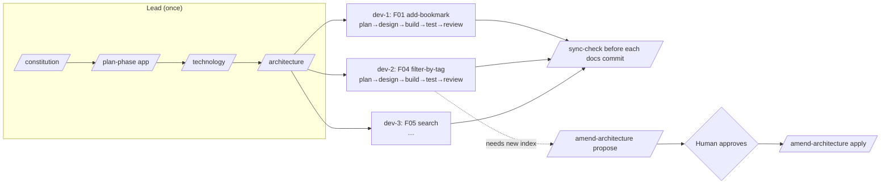
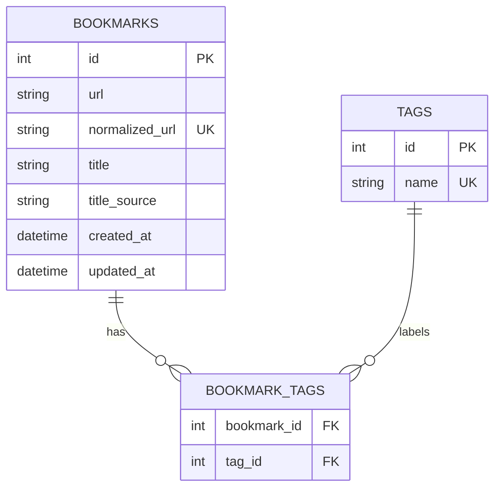

# SDD Framework for GitHub Copilot: Personal Bookmark Manager with Tagging

This repository contains a **Specification-Driven Development (SDD) framework** for GitHub Copilot in VS Code. The framework is reusable across projects. Its first use case is the **Personal Bookmark Manager with Tagging** from *AI SDLC Course 101 – Assignment 1*.

The framework moves each piece of work through **Constitution → Product Planning → Technology → Architecture → (per feature) Plan → Design → Build → Test → Review → Reflection**. A **human approval gate** sits between phases. Every AI interaction is logged, and material interactions become **Evidence E-&lt;phase&gt;-&lt;number&gt;** records in the exact assignment format. All approved content rolls up into the six graded files in `docs/`.

> **For evaluators:** the graded submission is `docs/01..06-*.md` plus the demo video. Everything under `.github/` is the framework, and `specs/` holds the working specifications the framework produced. The worked example in [§12](#12-worked-example-constitution-to-first-feature-f01-add-bookmark) is **illustrative**. It shows the shape of each step and artifact. Real decisions, results, and timings are recorded only in `specs/` and `docs/`, as they happened.

---

## Table of Contents

1. [Design principles](#1-design-principles)
2. [How the pieces fit together](#2-how-the-pieces-fit-together)
3. [Repository layout](#3-repository-layout)
4. [specs/ vs docs/](#4-specs-vs-docs)
5. [SDLC stages and how each one runs](#5-sdlc-stages-and-how-each-one-runs)
6. [Command reference (all slash commands)](#6-command-reference-all-slash-commands)
7. [Agents, skills, instructions, templates](#7-agents-skills-instructions-templates)
8. [Evidence model (honesty by design)](#8-evidence-model-honesty-by-design)
9. [Component map: where code is written (monorepo and multi-repo)](#9-component-map-where-code-is-written-monorepo-and-multi-repo)
10. [Multi-developer workflow](#10-multi-developer-workflow)
11. [Guardrails: how each hard rule is enforced](#11-guardrails-how-each-hard-rule-is-enforced)
12. [Worked example: constitution to first feature (F01 Add Bookmark)](#12-worked-example-constitution-to-first-feature-f01-add-bookmark)
13. [Mapping to the assignment submission checklist](#13-mapping-to-the-assignment-submission-checklist)
14. [Getting started and troubleshooting](#14-getting-started-and-troubleshooting)

---

## 1. Design principles

| Principle | What it means in practice |
|---|---|
| **Specification before code** | No code is written until the feature's spec and low-level design are approved by a human. |
| **Human gates** | Every phase ends with a *Gate Summary* and waits for `APPROVE`. Agent handoffs are pre-filled but never auto-sent (`send: false`), so the next phase needs a human click. |
| **Honesty over polish** | AI never invents decisions, timings, results, or rejections. Human-only facts are asked for, or left as `TODO(human)`. Incomplete evidence doesn't count toward minimums. |
| **Single source of truth** | Shared decisions live in one file each (constitution, technology, HLD, data model, component map). Later changes update the earlier artifact, and `/sync-check` enforces this. |
| **Simple first** | The stack is local, free/OSS, web-based, with no external DB. Core requirements come before optional enhancements. |
| **Constitution-governed** | `specs/constitution.md` holds non-negotiable principles (quality, security, a11y, architecture, licensing). Every agent checks against it at every gate. |
| **Scales to many developers and repos** | After architecture is approved, features are independent units. `component-map.json` tells every workflow where each component's code lives, including multi-repo setups. |

---

## 2. How the pieces fit together



Every box ends with a **Gate Summary → APPROVE → rollup into `docs/` → handoff**.



### 2.1 Workflow anatomy (every slash command)

Every prompt in `.github/prompts/` follows the same nine steps, defined in [.github/copilot-instructions.md](.github/copilot-instructions.md). Each prompt adapts them to its own inputs and outputs.

| Step | Name | What the prompt defines |
|---|---|---|
| 0 | Detect mode | A mode table, for example CREATE / REVISE / CHANGE / STOP, or START / RESUME / FIX / UNBLOCK. The mode is stated in the first line of the response. |
| 1 | Check preconditions | A *Check / If it fails* table: upstream gates, required files, blocking statuses. A failure stops the run with the exact fix command. |
| 2 | Load context | A *Source / Required / What to extract* table. A missing required source stops the run. |
| 3 | Build context brief | Facts with source IDs, gaps, and conflicts. Conflicts are quoted, never silently resolved. |
| 4 | Clarify and preview | ≤5 questions per round, each with a recommended default and its impact. Then an execution preview. **Nothing is written until the human replies `GO`.** |
| 5 | Execute | Section-by-section generation steps from the templates and skills. |
| 6 | Validate | A prompt-specific validation checklist, plus the template's *Completion checklist*. Unresolved failures appear in the Gate Summary. |
| 7 | Log evidence | The `evidence-logging` skill. |
| 8 | Gate and handoff | Gate Summary → `APPROVE` → record the gate → roll up to `docs/` → offer the handoff. |

- **`GO` vs. `APPROVE`:** `GO` approves the execution preview *inside* a phase. `APPROVE` passes the phase gate. Neither is assumed.
- **REVISE markers:** a human can write `<!-- REVISE: <comment> -->` anywhere in a draft artifact. The next run of the owning workflow detects the markers (REVISE mode), applies each one, removes it, and lists what changed.
- **Read-only commands** (`/status`, `/ask-framework`, `/ask-project`) skip the preview and gate steps.

---

## 3. Repository layout

```
.
├── README.md                          ← this guide
├── docs/                              ← GRADED: six assignment files + screenshots
│   ├── 01-planning.md … 06-reflection.md   (created by /constitution from templates)
│   └── assets/                        ← screenshots (synthetic data only)
├── specs/                             ← working source of truth (created by workflows)
│   ├── constitution.md
│   ├── product-spec.md
│   ├── backlog.md
│   ├── technology.md
│   ├── architecture/
│   │   ├── hld.md
│   │   ├── data-model.md
│   │   ├── er-diagram.md
│   │   ├── component-map.json
│   │   └── amendments/AMD-nnn-*.md
│   ├── evidence/                      ← app-level E-records + interaction-log.jsonl
│   └── features/Fnn-<slug>/
│       ├── spec.md  lld.md  tasks.md  status.md
│       └── evidence/                  ← feature E-records + interaction-log.jsonl
├── src/ (or as declared)              ← application code, paths come ONLY from component-map.json
└── .github/                           ← the framework
    ├── copilot-instructions.md        ← always-on global rules
    ├── instructions/                  ← scoped rules (applyTo globs)
    ├── prompts/                       ← 16 slash commands
    ├── agents/                        ← 5 phase agents with tool limits + handoffs
    ├── skills/                        ← 11 reusable skills
    ├── templates/                     ← 20 templates (6 docs + specs + evidence + JSON)
    └── seeds/                         ← project domain seed (bookmark manager)
```

The top-level layout of the starter repo is unchanged, and `docs/` stays at the root. `specs/` is added next to it.

---

## 4. specs/ vs docs/

| | `specs/` (working) | `docs/` (published) |
|---|---|---|
| Purpose | The source of truth the agents and developers work from | The graded assignment report |
| Granularity | Shared app-level files, plus **one folder per feature** | **One file per SDLC phase**, covering all features |
| Content | Full detail: specs, LLD, task lists, build-verify logs, every evidence record, and the full interaction log | Curated rollup under the exact mandatory `##` headings, deduplicated, with feature content under `### Fnn` sub-headings |
| Who writes | The phase agent for that scope. Developers own their feature folders. | Only the **rollup step** after a gate is approved (`doc-sync-consistency` skill) |
| Evidence | `E-*.md` files (canonical) and `interaction-log.jsonl` (every interaction) | Verbatim copies of the E-records under `## AI Interactions` |
| Consistency | Authoritative | Must match specs. `/sync-check` checks C1–C12. |

**Rollup map (summary):** product-spec and feature specs → 01. Technology, HLD, data model, ER diagram, and LLDs → 02. Tasks and build results → 03. Test results → 04. Review results → 05. Interaction logs and human answers → 06.

---

## 5. SDLC stages and how each one runs

Each stage lists its **command**, **agent**, **skills**, **inputs → outputs**, **gate**, and **evidence**.

### Stage 0: Constitution (once)

- **Command:** `/constitution`. To change it later: `/constitution amend <change>`.
- **Agent:** planner.
- **Does:**
  - Scaffolds `specs/` and `docs/`, and creates the six docs from templates.
  - Asks ≤5 questions: coverage bar, extra security, a11y, or constraints.
  - Writes `specs/constitution.md`. It covers **principles and constraints only**: P1–P6 core principles, Q1–Q5 quality, S1–S5 security, U1–U4 UX/a11y, A1–A4 architecture, D1–D3 confidentiality and licensing, E1–E3 documentation, governance, and the compliance checklist. **No tech stack.**
- **Gate:** approval sets the version to 1.0.0 and creates `specs/backlog.md`.
- **Evidence:** `E-planning-001…` (app range 001–099).

### Stage 1: Product planning (once)

- **Command:** `/plan-phase app`.
- **Agent:** planner.
- **Skills:** requirements-analysis, edge-case-discovery.
- **Inputs:** constitution, `.github/seeds/bookmark-manager.seed.md`, the assignment.
- **Outputs:**
  - `specs/product-spec.md`: problem, R01–R11, feature split with dependencies and effort, measurable NFRs, edge cases, risks, assumptions, and questions.
  - `specs/backlog.md`: feature IDs, owners, and status.
- **Rollup:** `docs/01-planning.md` (Problem Understanding, Requirement Breakdown, Edge Cases, Non-Functional Requirements, Risks, Assumptions & Questions, AI Interactions).

### Stage 2: Technology selection (once, interactive)

- **Command:** `/technology`. To change it later: `/technology change <layer>`.
- **Agent:** architect.
- **Skill:** technology-selection.
- **Does:**
  - Asks about context first.
  - For each layer (runtime, web framework, frontend approach, persistence, HTML parsing, tests, lint/format), presents **≥2 options** with pros, cons, license, and constitution fit. **The human picks.**
  - Records the tooling commands.
- **Output:** `specs/technology.md`.
- **Rollup:** `docs/02-design.md` → Proposed Solution (technology choices and reasons), Alternatives & Trade-offs.

### Stage 3: Architecture: HLD, data model, ER diagram, component map (once)

- **Command:** `/architecture`. Later changes go only through `/amend-architecture`.
- **Agent:** architect.
- **Skills:** design-alternatives, secure-input-handling, component-resolution, accessibility-review.
- **Outputs:**

| Artifact | Contains |
|---|---|
| `specs/architecture/hld.md` | Style, component table, project structure, layers, sequence flows, **UI/user flow**, validation and error-handling strategy, **security trust-boundary table**, NFR approach, **architecture-level alternatives (AD-01…)**, constitution compliance |
| `specs/architecture/data-model.md` | Entities, fields, constraints, relationships, indexes, invariants, **restart survival** |
| `specs/architecture/er-diagram.md` | Mermaid `erDiagram` that matches the data model |
| `specs/architecture/component-map.json` | Machine-readable: every component's `workspaceRoot`, `path`, `repo`, commands (format, lint, build, start, test, audit), and smoke checks |

- **Gate:** approval **unlocks parallel feature development**.
- **Rollup:** `docs/02-design.md`: Proposed Solution, Data Model, UI / User Flow, Error Handling, Security Design, Meeting the Non-Functional Requirements, Alternatives & Trade-offs.

**Who produces which design artifact:**

| Artifact | Location | Produced by | Rolled into |
|---|---|---|---|
| High-level design | `specs/architecture/hld.md` | architect · `/architecture` | 02 → Proposed Solution, UI / User Flow, Error Handling, Security Design, NFRs |
| Data model | `specs/architecture/data-model.md` | architect · `/architecture` | 02 → Data Model |
| ER diagram | `specs/architecture/er-diagram.md` | architect · `/architecture` | 02 → Data Model |
| Tech stack | `specs/technology.md` | architect · `/technology` | 02 → Proposed Solution, Alternatives & Trade-offs |
| Component map | `specs/architecture/component-map.json` | architect · `/architecture` | 02 → Proposed Solution (structure) |
| Low-level design (per feature) | `specs/features/Fnn/lld.md` | architect · `/design-feature` | 02 → `### Fnn` blocks in UI / User Flow, Error Handling, Security Design, Alternatives & Trade-offs, Design Verification |
| Shared-design changes | `specs/architecture/amendments/AMD-nnn.md` | architect · `/amend-architecture` | 02 → final position + `> Changed` note |

### Stage 4: The feature loop (per feature; can run in parallel)

| Step | Command | Agent | Key behavior | Rollup |
|---|---|---|---|---|
| 4a Plan | `/plan-phase Fnn-slug` | planner | User stories, **Given/When/Then AC**, edge cases (source tagged), applicable NFRs, effort, components affected | 01 → `### Fnn` stories, edge cases, planning outcome |
| 4b Design | `/design-feature Fnn-slug` | architect | **≥2 alternatives**, component changes (resolved paths), API contract, validation, error table, UI states, security controls, sequence diagram, **task list**. If shared artifacts must change, it writes an AMD proposal and the feature becomes blocked. | 02 → `### Fnn` blocks, Design Verification |
| 4c Build | `/build-feature Fnn-slug` | builder | One task at a time → **format → lint → build → start → smoke → tests** after each task. Up to **3 fix attempts**, then it stops and asks. The human does the local browser check and takes screenshots. | 03 → Plan vs. Actual, **Feature Evidence Matrix**, Troubleshooting, Human Changes, Local Run Evidence |
| 4d Test | `/test-phase Fnn-slug` | tester | AC and edge cases → test cases. Writes and **runs** them and records **actual** results. Fail → builder fix → retest. | 04 → all sections |
| 4e Review | `/review-phase Fnn-slug` | reviewer | Correctness, security, validation, maintainability, a11y, UX, defects. Each finding has a severity, and the **human decides**. The builder fixes and the reviewer **verifies**. | 05 → Findings, Accepted, Modified/Rejected, False Positives / Misses |

### Stage 5: App-level testing and review (once, after all features)

- `/test-phase app`: full regression plus **NFR checks** (1,000-bookmark search timing, restart persistence, keyboard and label walkthrough, security probes).
- `/review-phase app`: whole-app review, a **dependency audit** with its actual output, and the **Final Readiness Check** mapping R01–R11 and every NFR to the final solution.

### Stage 6: Reflection (once)

- `/reflect`: builds a fact sheet from the interaction logs and E-records, then asks the human (in rounds of ≤5 questions) for time per phase, judgments, rework, lessons, self-assessment, and the demo video link and duration. The **declaration is in the human's own words**.

### Cross-cutting (any time)

`/clarify`, `/log-evidence`, `/sync-check`, `/status`, `/amend-architecture`.

### Q&A (any time, read-only)

| Command | Answers | Examples | Sources |
|---|---|---|---|
| `/ask-framework <question>` | Process and progress: where you are, what to run next, how a phase or command works, which features are implemented, how far a feature has got | "What do I run next?" · "Is the F02 spec approved?" · "Which features are built?" · "How does /design-feature work?" | `.github/**`, `backlog.md`, `status.md`, artifact headers, `tasks.md` |
| `/ask-project <question>` | The application: how a feature works, what code does, which requirement / spec / AC covers a behavior, and which LLD / task / code / tests build it | "How does duplicate detection work?" · "Which spec covers this file?" · "Where is F04-AC2 implemented?" · "Why SQLite?" | `specs/**`, component code via `component-map.json`, `docs/04`, `docs/05` |

- `/ask-framework` places each feature on a **progress ladder**: 0 not planned → 1 spec drafted → 2 spec approved → 3 LLD drafted → 4 design approved → 5 build in progress (n/m tasks) → 6 built → 7 tested → 8 reviewed → 9 done. It uses gate records, never the mere presence of code. Then it applies fixed rules to recommend the next command.
- `/ask-project` walks a **trace chain** (R-ID → feature → AC → LLD → task → code → test → finding) in either direction. It tags every fact as `[spec]` (intended), `[code]` (as read, not run), or `[observed]` (a recorded test result), and reports any spec-vs-code mismatch without resolving it.
- Both write only one `material: false` interaction-log line. `/status` remains the full readiness dashboard.

---

## 6. Command reference (all slash commands)

| # | Command | Arguments | Agent | When | Reads | Writes |
|---|---|---|---|---|---|---|
| 1 | `/constitution` | `[amend <change>]` | planner | First, once | templates, seed | `specs/constitution.md`, `specs/backlog.md`, scaffold of `specs/` and `docs/` |
| 2 | `/clarify` | `<app\|technology\|architecture\|Fnn-slug> [topic]` | planner | Any time something is ambiguous | the scope's specs | the Clarifications table in that spec |
| 3 | `/plan-phase` | `app` | planner | After the constitution | constitution, seed | `product-spec.md`, `backlog.md` → docs/01 |
| 4 | `/technology` | `[change <layer>]` | architect | After product planning | constitution, product-spec | `technology.md` → docs/02 |
| 5 | `/architecture` | – | architect | After technology | all of the above | `hld.md`, `data-model.md`, `er-diagram.md`, `component-map.json` → docs/02 |
| 6 | `/plan-phase` | `Fnn-slug` | planner | Per feature | product-spec, backlog, component map | `features/Fnn/spec.md`, `status.md` → docs/01 |
| 7 | `/design-feature` | `Fnn-slug` | architect | Per feature | spec, HLD, data model, component map | `lld.md`, `tasks.md` (or an AMD) → docs/02 |
| 8 | `/build-feature` | `Fnn-slug [Fnn-Txx]` | builder | Per feature | lld, tasks, component map | source code, `tasks.md` logs → docs/03 |
| 9 | `/test-phase` | `Fnn-slug` \| `app` | tester | Per feature, then app | spec, lld, NFRs | tests, results → docs/04 |
| 10 | `/review-phase` | `Fnn-slug` \| `app` | reviewer | Per feature, then app | code, specs, tests | findings, readiness → docs/05 |
| 11 | `/amend-architecture` | `propose <Fnn> <summary>` \| `apply AMD-nnn` \| `reject AMD-nnn` | architect | When a feature needs a shared change | architecture | `amendments/AMD-nnn.md`, updated shared files → docs/02 |
| 12 | `/log-evidence` | `<phase> <scope> <summary>` \| `complete E-<phase>-<n>` | default | Any time (outside workflows, or to fill `TODO(human)`) | session, logs | `E-*.md`, `interaction-log.jsonl`, docs AI Interactions |
| 13 | `/sync-check` | `[app\|Fnn-slug]` | default | Before every docs commit, after amendments | specs and docs | drift report, approved fixes |
| 14 | `/status` | `[Fnn-slug]` | default | Any time | everything (read-only) | dashboard, readiness verdict, next command |
| 15 | `/reflect` | – | default | Last | logs, E-records, human answers | `docs/06-reflection.md` |
| 16 | `/ask-framework` | `<question>` | default | Any time | `.github/**`, backlog, status files, artifact headers | answer in chat (log line only) |
| 17 | `/ask-project` | `<question>` | default | Any time | specs, component code, test and review docs | answer in chat (log line only) |

**Canonical order:**

```
/constitution → /plan-phase app → /technology → /architecture
  → for each feature: /plan-phase Fnn → /design-feature Fnn → /build-feature Fnn → /test-phase Fnn → /review-phase Fnn → /sync-check
→ /test-phase app → /review-phase app → /sync-check → /reflect → /status
```

---

## 7. Agents, skills, instructions, templates

### Agents (`.github/agents/`)

| Agent | Tools | Commands | Must never | Handoffs (all `send: false`) |
|---|---|---|---|---|
| **planner** | read, search, edit, todo | `/constitution`, `/clarify`, `/plan-phase` | Design, choose technology, or write code | → architect (technology / design-feature) |
| **architect** | read, search, edit, web, todo | `/technology`, `/architecture`, `/design-feature`, `/amend-architecture` | Pick a stack without a human choice; write app code | → architect (architecture), → planner, → builder |
| **builder** | read, search, edit, **execute**, todo | `/build-feature` | Write outside component-map paths; suppress errors; exceed 3 fix attempts | → tester, → reviewer (verify), → tester (retest) |
| **tester** | read, search, edit, **execute**, todo | `/test-phase` | Record a Pass without running the test; invent failures | → builder (fix), → reviewer |
| **reviewer** | read, search, edit, **execute**, todo | `/review-phase` | Edit app code; decide for the human; mark a fix done without verifying it | → builder (fixes), → planner (next feature) |

`/log-evidence`, `/sync-check`, `/status`, `/reflect`, `/ask-framework`, and `/ask-project` run in the default agent, because they cut across phases.

### Skills (`.github/skills/`, auto-loaded by description, hidden from the `/` menu)

| Skill | Used by | Purpose |
|---|---|---|
| requirements-analysis | planner | Features, stories, G/W/T AC, NFRs, risks, traceability |
| edge-case-discovery | planner, tester | Lens-based edge cases with an honest source tag |
| technology-selection | architect | Interactive, ≥2 options per layer, license check, tooling commands |
| design-alternatives | architect | ≥2 options per decision, trade-off table, human choice, challenge the first design |
| secure-input-handling | architect, builder, tester, reviewer | URL validation, **SSRF-safe title fetch**, XSS escaping, parameterized queries, `LIKE` escaping, dependency hygiene, security probes |
| component-resolution | builder, tester, reviewer, sync | Resolve component ids → paths and commands through `component-map.json`. Stops if the path isn't declared or the root isn't open. |
| build-verify-loop | builder | Format → lint → build → start → smoke → tests, **max 3 fix attempts** |
| test-design | tester | AC → tests, Test Matrix with actual results, NFR checks, Fail -> Fix -> Retest |
| accessibility-review | architect, reviewer | Keyboard, focus, labels, error text, states, delete confirmation |
| evidence-logging | all | Log every interaction; promote material ones; ask the human; `TODO(human)` |
| doc-sync-consistency | all (rollup), `/sync-check`, `/status` | Rollup map and checks C1–C12 |

Every skill has the same shape: **When used / Inputs table → Procedure → Validation checklist → Common errors (error / correct approach)**. Prompts run a skill's validation checklist in Step 6.

### Scoped instructions (`.github/instructions/`)

| File | applyTo | Enforces |
|---|---|---|
| docs-format | `docs/**/*.md` | Exact `##` headings and order, minimum evidence counts, the 11-row Feature Evidence Matrix, Test Matrix and Findings columns, rollup rules |
| evidence-format | `docs/**/*.md`, `specs/**/evidence/**` | Exact 12-field template, phase codes, collision-free numbering, AI-vs-human fields, materiality |
| specs-format | `specs/**` | Layout, IDs, ownership, shared-file governance, component map authority, status values |
| coding-standards | source file extensions | Component-map paths, simplicity, validation, escaping, licensing, build-verify loop |
| testing-standards | test folders and `*.test.*`/`*.spec.*` | Run everything, record actual results, deterministic tests, NFR and security checks |
| security | source + design and review docs + architecture and LLD | URL rules, SSRF, escaping, parameterized queries, headers, audit |

### Templates (`.github/templates/`)

- **Six docs:** `01-planning` … `06-reflection`, with exact headings, the Feature Evidence Matrix, Test Matrix, and Findings tables.
- **Evidence and project-level specs:** `evidence-record` (the exact Section 7 format), `constitution`, `product-spec`, `backlog`, `technology`.
- **Architecture:** `hld`, `data-model`, `er-diagram`, `component-map.template.json`, `amendment`.
- **Per feature:** `feature-spec`, `lld`, `task-list`, `feature-status`.

Each Markdown template starts with a header `<!-- GUIDE: … -->` comment. It names the workflow that fills the template and the source files to read. Each section has its own GUIDE comment saying what goes there and where it comes from. Most templates end with a `<!-- Completion checklist: … -->` comment that is checked in Step 6. The workflow removes the GUIDE comments as it fills each section, and removes the checklist once every item passes. The docs templates keep their exact `##` headings. Their guidance is in comments only, so it doesn't affect the graded structure. The JSON component map can't hold comments, so the `/architecture` prompt and the `component-resolution` skill carry its guidance.

The project seed `.github/seeds/bookmark-manager.seed.md` holds R01–R11, constraints, the suggested feature split, seed edge cases, NFR targets, security concerns, and the §12 checklist.

---

## 8. Evidence model (honesty by design)



- **Log every interaction:** `interaction-log.jsonl` is the full audit trail, satisfying "log every interaction with Copilot".
- **Promote material ones:** only these become `### Evidence E-<phase>-<number>` records, following assignment Section 7 ("routine completions don't count").
- **Field ownership:** AI fills Activity, Task, Context, Prompt, AI response summary, Iteration, and a draft Outcome. **Only the human** supplies Decision, What changed and why, Verification (unless it was observed in-session), Approx. time, and Learning.
- **Numbering (no collisions between developers):** app level is `001–099`. Feature `Fnn` gets `nn×100 + seq`, so F01 → `E-build-101`, `E-build-102`, and F04 → `E-testing-401`.
- **Minimums:** 01 ≥3, 02 ≥3, 03 ≥5, 04 ≥3, 05 ≥3. Only complete records count. `/status` shows the gaps.

---

## 9. Component map: where code is written (monorepo and multi-repo)

`/architecture` writes `specs/architecture/component-map.json`. **Every** workflow that touches code (build, test, review, sync) resolves paths and commands **only** from this file (the `component-resolution` skill).

**Monorepo (typical for this assignment):**

```json
{
  "version": 1,
  "repoLayout": "monorepo",
  "components": [
    {
      "id": "bookmark-app",
      "type": "fullstack",
      "workspaceRoot": ".",
      "path": "src",
      "repo": null,
      "commands": { "format": "npm run format", "lint": "npm run lint", "build": null,
                    "start": "npm start", "test": "npm test", "audit": "npm audit" },
      "smoke": { "baseUrl": "http://localhost:3000", "checks": [{ "method": "GET", "path": "/", "expectStatus": 200 }] }
    }
  ]
}
```

**Multi-repo (for example, micro-frontends and microservices):**

```json
{
  "version": 1,
  "repoLayout": "multi-repo",
  "components": [
    { "id": "shell-ui",      "type": "frontend", "workspaceRoot": "shell-ui",      "path": ".", "repo": "https://example.com/org/shell-ui.git" },
    { "id": "bookmarks-mfe", "type": "frontend", "workspaceRoot": "bookmarks-mfe", "path": ".", "repo": "https://example.com/org/bookmarks-mfe.git" },
    { "id": "bookmarks-api", "type": "backend",  "workspaceRoot": "bookmarks-api", "path": ".", "repo": "https://example.com/org/bookmarks-api.git" },
    { "id": "tags-api",      "type": "backend",  "workspaceRoot": "tags-api",      "path": ".", "repo": "https://example.com/org/tags-api.git" }
  ]
}
```

Commands and smoke settings are omitted here for brevity. The URLs are synthetic.

**How resolution works:**

1. A feature's `spec.md` and `lld.md` declare `Components affected: bookmarks-api, bookmarks-mfe`.
2. `/build-feature` looks up each id → `workspaceRoot` + `path` → runs that component's `commands` in that folder.
3. In multi-repo mode, each repo is opened as a folder in a **VS Code multi-root workspace**, named after its `workspaceRoot`. If it isn't open, the builder **stops**: "Open `bookmarks-api` as workspace folder `bookmarks-api`, then retry." It never guesses a path.
4. `specs/` and `docs/` always live in the **orchestrator** repo (the one containing `.github/`).
5. A new component or path change can only happen through `/amend-architecture`.

---

## 10. Multi-developer workflow



- **Ownership:** each developer claims backlog rows with a pseudonymous handle (`dev-1`) and writes only in their `specs/features/Fnn-*/` folder, so there are no file collisions in specs.
- **Shared artifacts are read-only** during feature work. Changes go through AMD proposals, which block only the affected features.
- **Evidence IDs never collide** thanks to the `nn×100` ranges.
- **Docs rollups** add `### Fnn` blocks and merge tables. Run `/sync-check` before committing docs to catch conflicts and drift.
- `/status` gives a project-wide feature × phase dashboard.

---

## 11. Guardrails: how each hard rule is enforced

| Hard rule | Enforced by |
|---|---|
| 1 Honesty over polish | `copilot-instructions.md` rule 1 · `evidence-logging` skill (AI-vs-human field ownership, `TODO(human)`) · `evidence-format.instructions.md` (forbidden list) · tester ("Not run" ≠ Pass) · reviewer (no fix without verification) · `/reflect` (declaration in the human's words) · `/sync-check` C10 |
| 2 Evidence format and counts | `templates/evidence-record.template.md` (exact 12 fields) · `evidence-format.instructions.md` · `docs-format.instructions.md` (minimums) · `/status` (complete-only counts) · `/sync-check` C7 |
| 3 Exact headings | Six doc templates · `docs-format.instructions.md` (applyTo `docs/**`) · `/sync-check` C1 · `/status` |
| 4 Keep files in sync | `doc-sync-consistency` skill (rollup map, C1–C12) · `/sync-check` · `/amend-architecture` · change logs in every spec · `> Changed` notes |
| 5 Confidentiality and licensing | Constitution D1–D3 · `coding-standards` (license check before dependencies) · `technology-selection` (license column) · `security.instructions.md` · `/sync-check` C11 (PII/secret scan) · synthetic-data rules in testing standards |
| 6 Simple first | Constitution P4/A1 · `technology-selection` (constitution-fit column) · `design-alternatives` (always include the simplest option) · builder ("no optional enhancements") · `coding-standards` |
| 7 Human gates, ≤5 questions | Gate Summary format in `copilot-instructions.md` · every prompt ends at a gate · handoffs `send: false` · gate approvals recorded in `status.md` and `backlog.md` · `/clarify` caps at 5 |
| Component map | `component-resolution` skill · builder preconditions · `coding-standards` · `/sync-check` C4 |
| Bounded fix loop | `build-verify-loop` (max 3 attempts → `blocked-on-human`) |

---

## 12. Worked example: constitution to first feature (F01 Add Bookmark)

> **Illustrative walkthrough.** It shows the commands, the kinds of questions asked, and the shape of the resulting artifacts. Human answers are marked *example answer*. Results that exist only after running things are shown as `<observed>` or `TODO(human)`. **None of this is recorded evidence.** Real evidence is created only in `specs/` and `docs/` during actual sessions.

### Step 0: `/constitution`

**Copilot (planner) asks:**

1. Project name and one-line purpose?
2. Test coverage bar?
3. Extra security or privacy non-negotiables?
4. Extra UX or a11y standard (for example, WCAG 2.1 AA)?
5. Other constraints?

*Example answer:* "Personal Bookmark Manager. Every AC has an automated test, with ≥80% line coverage on service logic. Nothing extra on security beyond the defaults. WCAG 2.1 AA where practical. Windows laptop, offline-capable."

**Produces:**

- `specs/constitution.md` v1.0.0. Excerpt:

  ```
  Q1 Every acceptance criterion has at least one automated test…
  Q4 ≥ 80% line coverage on service logic
  S2 Server-side fetches of user-supplied URLs are SSRF-guarded…
  U4 Destructive actions require confirmation or offer undo.
  A1 Runs locally with a browser UI. No paid cloud service or external database server.
  ```

- The six `docs/` files from templates.
- `E-planning-001` (draft, human fields asked).

**Gate:** `Reply APPROVE to proceed to /plan-phase app` → *APPROVE* → the backlog gate row "Constitution: approved".

### Step 1: `/plan-phase app`

**Produces** `specs/product-spec.md` and `specs/backlog.md`:

| Feature ID | Title | Requirements | Depends on | Owner | Status |
|---|---|---|---|---|---|
| F01 | add-bookmark | R01, R08, R09, R10, R11 | – | dev-1 | not-started |
| F02 | tag-bookmarks | R02 | F01 | dev-2 | not-started |
| F03 | list-bookmarks | R03, R11 | F01 | dev-1 | not-started |
| F04 | filter-by-tag | R04, R11 | F02, F03 | dev-2 | not-started |
| F05 | search | R05, R11 | F03 | dev-3 | not-started |
| F06 | edit-bookmark | R06, R09, R10 | F01, F02 | dev-3 | not-started |
| F07 | delete-bookmark | R07, R11 | F03 | dev-1 | not-started |

The NFRs come from the seed, for example `NFR-01: search < 500 ms at 1,000 bookmarks, measured by a timed test over seeded data`. **Gate** → rollup to `docs/01-planning.md`.

### Step 2: `/technology`

The architect asks about context first (language comfort, OS, SSR vs. SPA), then presents options per layer. For example:

**TD-04 Persistence**

| Option | Pros | Cons | Constitution fit |
|---|---|---|---|
| A: Embedded SQLite file | Real queries, indexes, unique constraints, transactions | Needs a driver package | ✅ A1 local, no DB server |
| B: JSON file | Zero dependencies, easy to read | Manual indexing, risk of partial writes, slow at volume | ✅ but NFR-01/02 risk |

*Example answer:* "A." Other layers are decided the same way. For example: Node.js LTS, Express, server-rendered templates with auto-escaping, a SQLite driver, the Node test runner or Jest, ESLint and Prettier. Every choice is recorded **with the human's selection**.

**Produces** `specs/technology.md`, including the tooling commands: `npm run format`, `npm run lint`, `npm start`, `npm test`, `npm audit`. **Gate** → rollup to `docs/02-design.md`.

### Step 3: `/architecture`

**Questions:** monorepo or multi-repo? *Example answer:* "Monorepo, one full-stack component, port 3000, data in `data/bookmarks.db`."

**AD-02 Tag storage (alternatives)**

| Option | Pros | Cons |
|---|---|---|
| A: `bookmarks` + `tags` + `bookmark_tags` join table | Indexed filter (NFR-01), no duplicate tags, clean edits | Three tables, join queries |
| B: A comma-separated `tags` column | One table, simplest | `LIKE` filtering is slow and error-prone (a `java` search matches `javascript`) |

*Example answer:* "A."

**Produces:**

- `data-model.md`:
  - `bookmarks(id, url, normalized_url UNIQUE, title, title_source, created_at, updated_at)`
  - `tags(id, name UNIQUE)`
  - `bookmark_tags(bookmark_id, tag_id)`, with an index on `created_at` and on `tag_id`
- `er-diagram.md`:



- `hld.md`: layers (routes → services → repository), a title-fetch sequence with an SSRF guard, a trust-boundary table, and UI flow.
- `component-map.json`: the monorepo shape shown in [§9](#9-component-map-where-code-is-written-monorepo-and-multi-repo), with `id: bookmark-app`, `path: src`.

**Gate** → rollup to `docs/02-design.md`. **Feature work can now fan out.**

### Step 4a: `/plan-phase F01-add-bookmark` (dev-1)

**Produces** `specs/features/F01-add-bookmark/spec.md`. Excerpt:

- **F01-US1:** As a researcher, I want to save a URL with an optional title, so that I can find the resource later.

| AC ID | Given | When | Then |
|---|---|---|---|
| F01-AC1 | an empty list | I submit `https://example.com/a` with the title "Example A" | it appears at the top with that title, and a success message is shown |
| F01-AC2 | the title is blank | I submit a valid URL whose page has a `<title>` | the saved title is the fetched `<title>` text |
| F01-AC3 | the title is blank, and the fetch fails or times out | I submit | the bookmark is saved with the hostname as the title, and a notice says the title couldn't be fetched |
| F01-AC4 | – | I submit an empty value, `example`, or `javascript:alert(1)` | nothing is saved, and a field error explains why |
| F01-AC5 | `https://example.com/a` exists | I submit `HTTPS://EXAMPLE.com/a/` | nothing is saved, and the message "Already saved" links to the existing bookmark |
| F01-AC6 | a bookmark was saved | the app is restarted | the bookmark is still listed |

Edge cases EC01–EC09 each carry a source tag, for example `EC07 redirect to 127.0.0.1 (AI)`. *Components affected:* `bookmark-app`. **Gate** → rollup to `docs/01-planning.md` under `### F01 Add Bookmark`.

### Step 4b: `/design-feature F01-add-bookmark`

**LD-01 Title fetch timing**

| Option | Pros | Cons |
|---|---|---|
| A: Synchronous fetch at save time with a 3 s timeout | Simple, and the user sees the final title immediately | The save can wait up to 3 s |
| B: Save immediately, fetch in the background, update later | Instant save | Needs a job or polling, and the UI changes after save (complexity) |

*Example answer:* "A. It's simpler and meets NFR-05 (≤5 s)."

**LD-02 Duplicate policy:** reject and link to the existing bookmark, or merge tags. *Example answer:* reject and link.

**Produces:**

- `lld.md`:
  - API: `POST /bookmarks` → 303 redirect on success, 422 on a validation error, 409 on a duplicate.
  - Validation table and error table.
  - UI states: loading, empty, error, and success, with `role="status"` messages.
  - SSRF controls and a sequence diagram.
- `tasks.md`:

| Task | Description | Covers |
|---|---|---|
| F01-T01 | Scaffold the app, DB init, and the schema from the data model | AC6 |
| F01-T02 | URL validator and normalizer | AC4, AC5 |
| F01-T03 | SSRF-safe title fetcher with a timeout, size cap, and redirect re-validation | AC2, AC3 |
| F01-T04 | Repository `create` / `findByNormalizedUrl` | AC1, AC5 |
| F01-T05 | Route plus form view with labelled inputs and error and status messages | AC1–AC5 |

**Gate** → rollup to `docs/02-design.md` under `### F01`.

### Step 4c: `/build-feature F01-add-bookmark`

For each task, the builder resolves `bookmark-app` → `./src` and implements the task. It then runs `npm run format` → `npm run lint` → (no build) → `npm start` → `GET /` expecting 200 → `npm test`. Results are recorded **as observed** in `tasks.md`:

| Task | Attempt | Step | Command | Result (observed) | Action |
|---|---|---|---|---|---|
| F01-T03 | 1 | test | `npm test` | `<observed output>` | `<fix applied, if any>` |

If a step still fails after 3 attempts, the builder stops, reports the errors, what it tried, and the options, and sets `blocked-on-human`. After the last task, it asks dev-1 to check the app in the browser and save `docs/assets/F01-add-bookmark-1.png`.

**Evidence draft** (`specs/features/F01-add-bookmark/evidence/E-build-101.md`):

```
### Evidence E-build-101

**SDLC activity:** build

**Task/feature:** F01-T03 SSRF-safe title fetcher

**Context given to AI:** F01-AC2/AC3, LLD §9 security controls, constitution S2, secure-input-handling checklist

**Prompt/request:** Implement the title fetcher with a 3 s timeout, 512 KB cap, http/https only, private-IP block, redirect re-validation

**AI response summary:** <what the builder actually produced>

**Your decision:** TODO(human)

**What you changed and why:** TODO(human)

**How you verified it:** <in-session command + observed result, or TODO(human)>

**Outcome:** <draft, to be confirmed by human>

**Iteration:** <what happened next>

**Approx. time:** TODO(human)

**Learning:** TODO(human)
```

**Gate** → rollup to `docs/03-build.md`: Plan vs. Actual, Feature Evidence Matrix rows (Add Bookmark, and partial contributions to Validation, Duplicate Handling, Persistence, and Empty/Error States), Troubleshooting, Local Run Evidence.

### Step 4d: `/test-phase F01-add-bookmark`

| ID | Requirement | Scenario | Expected result | Actual result | Pass/Fail | AI helped? |
|---|---|---|---|---|---|---|
| F01-TC01 | Add Bookmark | Valid URL and title | Saved; listed first | `<observed>` | `<observed>` | No |
| F01-TC04 | Validation | `javascript:alert(1)` | 422, not saved | `<observed>` | `<observed>` | Yes |
| F01-TC07 | Duplicate | Case- and slash-variant URL | 409, "Already saved" | `<observed>` | `<observed>` | Yes |
| F01-TC09 | Security | Stubbed redirect to 127.0.0.1 | Fetch blocked; fallback title | `<observed>` | `<observed>` | Yes |

The tester **runs** `npm test` and fills in the observed results. Any failure → builder fix → retest → a **Fail -> Fix -> Retest** entry. **Gate** → rollup to `docs/04-testing.md`.

### Step 4e: `/review-phase F01-add-bookmark`

| ID | Finding | Severity | My assessment | Action taken | How verified |
|---|---|---|---|---|---|
| F01-RV01 | *(example)* The redirect target isn't re-validated against private ranges | High | TODO(human) | TODO(human) | `<re-run F01-TC09: observed>` |
| F01-RV02 | *(example)* The title input's hint isn't linked with `aria-describedby` | Low | TODO(human) | TODO(human) | `<inspection>` |

The human decides each finding. The builder applies accepted fixes and the reviewer verifies them. **Gate** → rollup to `docs/05-review.md` → `status.md` = `done` (if the DoD holds) → `/sync-check` → `Sync status: CLEAN`.

### Step 4f: `/status`

```
F01 add-bookmark | dev-1 | Plan ✅ Design ✅ Build ✅ Test ✅ Review ✅ | done
Evidence 03-build: required 5 · complete 2 · incomplete 1 · gap 3
Next: /plan-phase F03-list-bookmarks (dev-1) · /log-evidence complete E-build-102
```

---

## 13. Mapping to the assignment submission checklist

| Assignment §12 item | Framework mechanism |
|---|---|
| All mandatory requirements implemented or incomplete ones identified | Seed R01–R11 → backlog → Feature Evidence Matrix (11 fixed rows) → `/review-phase app` Final Readiness Check → `/status` |
| Application runs locally | Constitution A1/A3 · the build-verify loop smoke check after every task · human local-run gate in `/build-feature` |
| 01-planning.md completed | `/plan-phase app` and per feature → rollup · headings C1 · ≥4 stories and ≥6 edge cases checked by `/status` |
| 02-design.md completed | `/technology`, `/architecture`, `/design-feature` → rollup · ≥2 alternatives enforced by `design-alternatives` |
| 03-build.md with Feature Evidence Matrix | `/build-feature` rollup · 11-row matrix template · ≥2 troubleshooting items from the build-verify log |
| 04-testing.md with actual outcomes | `/test-phase` · the tester must run tests · `Not run` ≠ Pass · `/sync-check` C10 |
| 05-review.md completed | `/review-phase` feature and app · human decisions · verified fixes |
| 06-reflection.md completed | `/reflect` (human-supplied time, judgments, video, declaration) |
| Standard evidence format | Exact template · evidence-format instructions · `/log-evidence` · C7 |
| Demo video recorded and accessible | `/reflect` asks for the link and duration and checks 5–8 min · `/status` checks it |
| No fabricated content | Hard rule 1 · AI-vs-human field ownership · `TODO(human)` · complete-only counts |
| Keep the project available | Constitution A3 · `/status` shows the last observed smoke run |

---

## 14. Getting started and troubleshooting

1. Open this folder in VS Code with GitHub Copilot Chat in **Agent** mode.
2. Type `/` in chat. You should see the 16 commands (`/constitution`, `/plan-phase`, …).
3. Run `/constitution`, answer the questions, and reply `APPROVE`. Then follow the canonical order in [§6](#6-command-reference-all-slash-commands). Use the handoff buttons at the end of each phase to switch agents.
4. Run `/ask-framework what next?` (or `/status` for the full dashboard) whenever you're unsure what to do next. Use `/ask-project <question>` to ask how the app or a piece of code works.

| Symptom | Fix |
|---|---|
| Slash commands aren't listed | Make sure prompt files are enabled in VS Code settings (`chat.promptFiles`) and that the files are in `.github/prompts/`. |
| Skills are never used | Make sure agent skills are enabled in your VS Code version (setting `chat.useAgentSkills` if present). Skills load by their `description`. |
| Builder refuses to write code | Check `status.md` gates, `component-map.json`, and that the component's workspace root is open. |
| Builder stopped after 3 attempts | Working as designed. Read the report, decide, then re-run `/build-feature Fnn-slug Fnn-Txx`. |
| `/status` says evidence is incomplete | Run `/log-evidence complete E-<phase>-<n>` and answer the `TODO(human)` fields. |
| Docs disagree with specs | Run `/sync-check` and approve the proposed fixes. |
