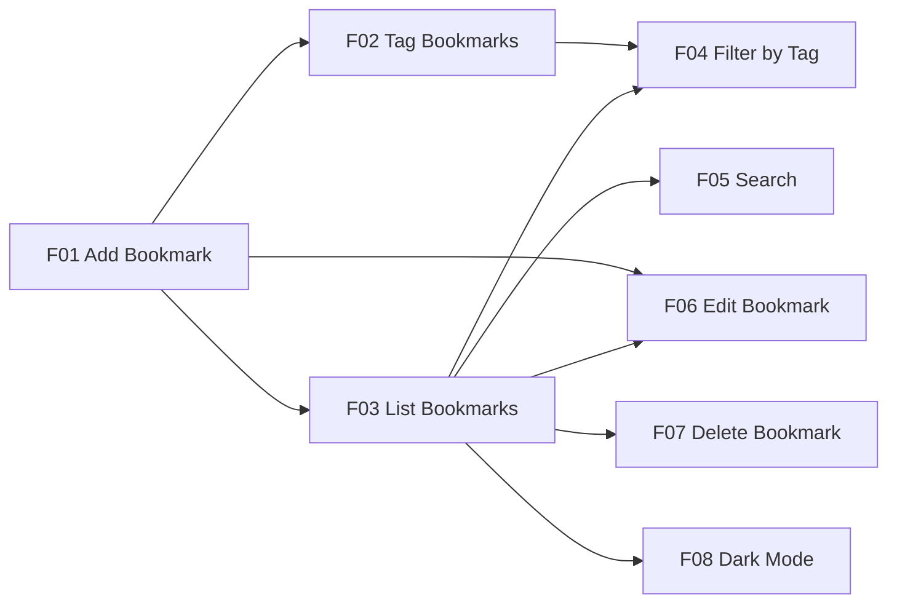

# 01 · Planning

> Rolled up from `specs/product-spec.md` v1 (approved 2026-09-30) against `specs/constitution.md` v1.0.0. Feature-level user stories and acceptance criteria are added by `/plan-phase <feature-id>`.

## Problem Understanding

**Problem.** Links worth keeping get scattered across browser bookmark bars, chat messages to oneself, and open tabs. Browser folders force a single location per link, so a page that is both a CSS reference and an accessibility reference has to go in one folder or the other. There is no way to attach several labels to one link and then narrow a long list down to the few that matter.

**Target user.** *Priya*, a self-taught developer (synthetic persona). She saves five to ten reference links on a busy day — documentation, recipes, design inspiration — and comes back to them weeks later remembering a word from the title but not the site. She works on one machine and does not want an account, a subscription, or a sync service.

**Value delivered.** One local list of bookmarks, each carrying as many tags as it needs, that can be narrowed by tag or searched by title and web address, and that is still there after the application is stopped and restarted.

**Scope constraints** (from `specs/constitution.md` §5, §10): runs locally with a browser UI; no paid cloud service and no external database server; embedded, file-based persistence; browser `localStorage` explicitly excluded as a persistence mechanism; `docs/mockup.html` is the binding UX reference; one developer (`dev-1`); completion by 2026-10-05.

## Requirement Breakdown

### Functional requirements

| ID | Requirement | Acceptance summary | Source |
|---|---|---|---|
| R01 | Add Bookmark | Submit a URL with an optional title. If no title is given, try to retrieve a useful page title. On failure the bookmark is still saved, the hostname is used as the title, and a non-blocking notice is shown. | Assignment §3 (via seed); failure behavior clarified by the human, 2026-09-30 |
| R02 | Tag Bookmarks | Assign one or more tags. Tags are trimmed and stored lowercase, at most 24 characters each, at most 8 per bookmark; duplicates within one bookmark are merged. | Assignment §3 (via seed); limits clarified by the human, 2026-09-30 |
| R03 | List Bookmarks | View all saved bookmarks, most recent first (by date added). | Assignment §3 (via seed) |
| R04 | Filter by Tag | Select a tag and see only the bookmarks associated with it. | Assignment §3 (via seed) |
| R05 | Search | Search bookmarks by title or URL. | Assignment §3 (via seed) |
| R06 | Edit Bookmark | Change the URL, title, or tags of an existing bookmark. | Assignment §3 (via seed) |
| R07 | Delete Bookmark | Remove a bookmark, with a reasonable confirmation or safeguard. | Assignment §3 (via seed) |
| R08 | Persistence | Bookmarks remain after the app is stopped and restarted. | Assignment §3 (via seed) |
| R09 | Validation | Clearly invalid or empty URLs are not saved. Show understandable feedback. | Assignment §3 (via seed) |
| R10 | Duplicate Handling | Saving an already-saved URL is blocked; a banner offers *View existing* and *Edit existing*. | Assignment §3 (via seed); resolution by the human, 2026-09-30 |
| R11 | Empty/Error States | No bookmarks, no search results, title-fetch failure, invalid input: all handled in a user-friendly way. | Assignment §3 (via seed) |
| R12 | Dark Mode | The user can switch between light and dark appearance, and the choice persists across restarts. | Human decision, 2026-09-30 — **not stated in the assignment source** |
| R13 | Undo Delete | After deleting a bookmark, the user can restore it from a transient undo affordance. | Human decision, 2026-09-30 — **not stated in the assignment source** |
| R14 | Tag Autocomplete | While typing a tag on the add or edit form, existing tags are suggested. | Human decision, 2026-09-30 — **not stated in the assignment source** |
| R15 | Paginated List | The list is paginated. The user selects a page size of 10, 20 or 50 records; the available sizes are fixed constants in code, not external configuration. | Human decision, 2026-09-30 — **not stated in the assignment source** |

R12–R15 are mandatory for this project but originate from the developer, not the assignment. They are marked so that `docs/05-review.md` can distinguish assignment-mandated scope from self-imposed scope.

**Optional enhancements (deferred):** import/export, favicon display, bulk actions, browser-extension capture, full-text search of page contents. None were requested by the source or the human. Full reasoning in `specs/product-spec.md` §2.

### Feature breakdown

| Feature ID | Feature | Covers | Depends on | Effort | Effort rationale |
|---|---|---|---|---|---|
| F01 | Add Bookmark | R01, R08, R09, R10, R11 | — | M | Carries URL validation, the SSRF-guarded title fetch with its timeout and fallback, and the duplicate check; the largest single risk surface |
| F02 | Tag Bookmarks | R02, R09, R14 | F01 | M | Tag entry, normalization and the eight-tag limit, plus the autocomplete suggestion list |
| F03 | List Bookmarks | R03, R08, R11, R15 | F01 | M | Ordering is simple, but pagination and the page-size selector add state that interacts with filter and search |
| F04 | Filter by Tag | R04, R11 | F02, F03 | S | One predicate over the list query, plus the tag list and its empty state |
| F05 | Search | R05, R11 | F03 | S | One predicate over title and URL, plus wildcard escaping and the no-results state |
| F06 | Edit Bookmark | R06, R08, R09, R10 | F01, F03 | M | Reuses F01's validation and duplicate rules, but must exclude the record being edited from the duplicate check |
| F07 | Delete Bookmark | R07, R08, R11, R13 | F03 | S | Confirmation dialog plus a transient undo that restores the record |
| F08 | Dark Mode | R12 | F03 | S | A theme toggle and a persisted preference; no data model impact |

**Traceability.** R01→F01 · R02→F02 · R03→F03 · R04→F04 · R05→F05 · R06→F06 · R07→F07 · R08→F01, F03, F06, F07 · R09→F01, F02, F06 · R10→F01, F06 · R11→F01, F03, F04, F05, F07 · R12→F08 · R13→F07 · R14→F02 · R15→F03. Every requirement maps to at least one feature, and every feature covers at least one requirement.

**Build order.** The assignment-mandated slices (R01–R11) are completed before the human-added requirements R12–R14, following constitution P4. If the 2026-10-05 date comes under pressure, the honest response is to report R12–R14 incomplete in `docs/03-build.md`, not to drop them silently (P3).

## User Stories & Acceptance Criteria

One `### Fnn` block per feature, added at that feature's planning gate. **Running totals: 30 user stories and 90 acceptance criteria across 7 of 8 features** (minimum 4 stories app-wide, already met).

### F01 Add Bookmark

Approved 2026-10-01 by dev-1. Covers R01 and R09 and R10 in full, and R08 and R11 in part. Source: `specs/features/F01-add-bookmark/spec.md`.

- **F01-US1:** As Priya, I want to save a web address from the main screen in one step, so that keeping a link costs me less effort than leaving the tab open.
- **F01-US2:** As Priya, I want a useful title filled in for me when I do not type one, so that my list is readable without extra typing.
- **F01-US3:** As Priya, I want to be told in plain words when an address cannot be saved and what to do about it, so that I am not left guessing why nothing happened.
- **F01-US4:** As Priya, I want to be stopped from saving the same link twice, so that my list does not fill up with duplicates I have to clean out later.
- **F01-US5:** As Priya, I want the bookmarks I saved to still be there after I stop and restart the application, so that I can trust it with links I care about.

| AC ID | Given | When | Then |
|---|---|---|---|
| F01-AC1 | The application is running and the add dialog is open | I enter `https://example.com/article` in *Web address*, enter `My article` in *Title*, and activate *Save bookmark* | `POST /api/bookmarks` returns **201**; a `bookmark` row exists with `url = 'https://example.com/article'`, `title = 'My article'`, `title_source = 'user'`, `created_at` and `updated_at` set to the same ISO-8601 UTC instant, and `deleted_at IS NULL` |
| F01-AC2 | A user title was supplied (F01-AC1) | The save completes | **No outbound HTTP request is made to the bookmarked host.** The fetcher is not called at all |
| F01-AC3 | The save in F01-AC1 succeeded | The response is received | The dialog closes and a toast reading `Bookmark saved` appears in the `aria-live="polite"` toast region |
| F01-AC4 | The *Title* field is left empty and the target page returns HTML whose `<title>` is `Weeknight tomato pasta` | I activate *Save bookmark* | **201**; the stored row has `title = 'Weeknight tomato pasta'` and `title_source = 'fetched'`; the title is stored as plain text with HTML entities decoded and whitespace collapsed |
| F01-AC5 | The *Title* field is left empty and the fetch fails (timeout, non-2xx, non-HTML `Content-Type`, redirect loop, or an empty/whitespace-only `<title>`) for `https://www.example.com/x` | I activate *Save bookmark* | **201** — not an error response. The stored row has `title = 'example.com'` (the hostname with a leading `www.` removed) and `title_source = 'hostname'`. The note region below *Title* shows exactly: `Couldn't fetch the title, so we used the domain instead. You can edit it anytime.` The dialog still closes and the bookmark is still saved |
| F01-AC6 | The *Title* field is left empty and the target host never responds | I activate *Save bookmark* | The interval from submit to the 201 response is **≤ 5 s** measured at the API. The read is abandoned at 512 KB or after `</title>`, whichever comes first |
| F01-AC7 | The add dialog is open | I activate *Save bookmark* with *Web address* empty or containing only whitespace | `POST` returns **400** with `error.code = 'INVALID_URL'` and `error.field = 'url'`; the inline error region under the field reads exactly `Enter a web address to save.`; the field carries `aria-invalid="true"`; focus moves to the field; **no row is written** |
| F01-AC8 | The add dialog is open | I submit `example.com`, `http://localhost:3000`, `http://intranet`, or `//example.com/x` (no scheme, or a hostname with no dot) | **400** `INVALID_URL`; the inline error reads exactly `Enter a web address starting with http:// or https://.`; `aria-invalid="true"`; focus moves to the field; no row is written |
| F01-AC9 | The add dialog is open | I submit `javascript:alert(1)`, `file:///etc/passwd`, `ftp://example.com/x`, or `data:text/html,Hello` | I activate *Save bookmark* | The stored `title` is the literal text, not HTML. When rendered, the characters appear on screen as text and **no script executes**; no `[innerHTML]` binding receives the value |
| F01-AC17 | The application is loaded in a browser with no bookmarks saved | I navigate using only the keyboard | The header, its *Add bookmark* button, the floating add button and the toast region are present. `Tab` reaches the *Add bookmark* button with a visible focus indicator; `Enter` opens the dialog; focus moves into the dialog and is trapped; `Esc` closes it and returns focus to the *Add bookmark* button. Every dialog input has a `<label for>` |

**Requirement coverage:** R01 → AC1, AC2, AC4, AC5, AC6, AC13 · R08 → AC15 · R09 → AC7–AC10 · R10 → AC11, AC12 · R11 → AC3, AC5, AC7, AC8, AC10, AC11.

**Scope boundaries.** F01 ships the application shell (header, *Add bookmark* button, floating action button, dialog host, toast region) and the add dialog with *Web address* and *Title* only. Tag entry and autocomplete belong to F02; the list and its empty state to F03; editing to F06; delete and undo to F07. F01 owns the duplicate 409 contract and its banner, but the destinations of the banner's *View existing* and *Edit existing* buttons are verified in F03 and F06 respectively.

**Deviations from the approved UX reference (constitution U6), both declared and accepted by dev-1 on 2026-10-01:** the invalid-scheme message uses the HLD wording rather than the mockup's; and the dialog carries no tag row until F02 lands. Both must be justified in writing in F01's `lld.md`.

**Blocker carried into design — now cleared.** `AMD-001` (`specs/architecture/amendments/AMD-001-url-host-and-fetch-notice.md`) was approved by dev-1 and **applied on 2026-10-01**. `hld.md` and `data-model.md` are at version 2 and now describe the behavior F01-AC5 and F01-AC8 assert, so `/design-feature F01-add-bookmark` is unblocked.

### F02 Tag Bookmarks

Approved 2026-10-01 by dev-1. Covers R02 and R14 in full, and R09 in part. Source: `specs/features/F02-tag-bookmarks/spec.md`.

- **F02-US1:** As Priya, I want to attach one or more tags to a bookmark when I save it, so that I can find it later by topic rather than only by title or web address.
- **F02-US2:** As Priya, I want existing tags suggested to me as I type, so that I reuse a tag I already have instead of creating near-duplicates.
- **F02-US3:** As Priya, I want to be stopped from adding a tag that is too long, too numerous, or made of odd characters, so that my tag list stays clean and useful.
- **F02-US4:** As Priya, I want two spellings of the same tag that differ only by case to count as one tag, so that my bookmarks are not split across "Research" and "research".

| AC ID | Given | When | Then |
|---|---|---|---|
| F02-AC1 | The add dialog is open with a valid *Web address* entered | I add the tags `Research` and `docs` via the tag input (Enter after each) and activate *Save bookmark* | `POST /api/bookmarks` returns **201**; the response's `bookmark.tags` contains exactly `["docs","research"]` (lowercased, alphabetical); a `tag` row with `name='research'` and a `tag` row with `name='docs'` exist, each linked to the new bookmark through `bookmark_tag` |
| F02-AC2 | The tag input already has a chip `research` | I type `Research` and press Enter | No second chip appears — the chip list still shows exactly one `research` entry. On save, the bookmark's `tags` array is exactly `["research"]` and exactly one `bookmark_tag` row exists for it (EC14) |
| F02-AC3 | The tag input is empty or focused | I type only spaces and press Enter or comma | No chip is added; the chip list is unchanged; no error message appears (EC15) |
| F02-AC4 | The tag input is empty | I type `urgent,docs,offline` (the commas trigger as I type) | Three chips appear — `urgent`, `docs`, `offline` — each created through the same normalize/dedupe/cap rules as pressing Enter individually, and the input clears |
| F02-AC5 | 8 tag chips are already present | I type a 9th tag and press Enter | No 9th chip appears; the input clears as it would for a successful add; no error message is shown |
| F02-AC6 | No UI is involved | `POST /api/bookmarks` is called directly with a valid URL and 9 distinct valid tag strings (bypassing the client's 8-tag cap) | **400** with `error.code='INVALID_TAG'`, `error.field='tags'`, message `You can add up to 8 tags.`; **no bookmark row is written at all** |
| F02-AC7 | The tag input is empty | I type a 30-character tag and press Enter | The chip shown holds the **first 24 characters** of what I typed, lowercased; no error message appears |
| F02-AC8 | No UI is involved | `POST /api/bookmarks` is called directly with a valid URL and one tag of exactly 25 characters | **400** `INVALID_TAG`, `field='tags'`, message `Tags can be up to 24 characters.`; no row written. The identical call with a 24-character tag instead returns **201** |
| F02-AC9 | No UI is involved | `POST /api/bookmarks` is called directly with a valid URL and a tag containing a disallowed character, e.g. `re$earch` or `tag!` | **400** `INVALID_TAG`, `field='tags'`, message `Tags can only contain letters, numbers, spaces, hyphens and underscores.`; no row written. The identical call with `front-end dev_2` instead returns **201** |
| F02-AC10 | The add dialog is open | I operate the tag input using only the keyboard | `Tab` reaches the tag input with a visible focus indicator; `Enter` or `,` commits a chip; `Backspace` on an empty input removes the last chip; every chip's remove control has `aria-label="Remove tag <name>"`; the input has an associated `<label for>` reading `Tags` |
| F02-AC11 | Bookmarks exist carrying the tags `docs`, `design` and `database`, and no other tag starts with `d` | `GET /api/tags?prefix=d` and `GET /api/tags?prefix=DOC` are called | Both return **200**: `["database","design","docs"]` and `["docs"]` respectively — alphabetical, case-insensitive match |

> Changed 2026-10-01: the second example was corrected from `prefix=DA` → `["database","design"]` (mathematically impossible against the documented plain-prefix-match algorithm — "design" does not start with "da") to `prefix=DOC` → `["docs"]`, as F02-RV04 at the Review gate, approved by dev-1 the same day; see `docs/05-review.md`.
| F02-AC12 | No bookmarks have been saved yet (no `tag` rows exist) | The add dialog's tag field triggers `GET /api/tags?prefix=` | **200** with an empty array `[]`; the suggestion list shows no options and no error appears (EC25) |
| F02-AC13 | More than 10 distinct tags share the prefix `s` | `GET /api/tags?prefix=s` is called; a suggestion is then chosen | The response contains **exactly 10** names, alphabetically. Choosing a suggestion adds it as a chip through the same normalize/dedupe/cap path as typing it |

**Requirement coverage:** R02 → AC1–AC5, AC7, AC10 · R09 → AC6, AC8, AC9 · R14 → AC11, AC12, AC13.

**Scope boundaries.** F02 owns the tag chip input on the add dialog, tag normalization and its limits, and the autocomplete service. Displaying tags on the list card belongs to F03 (already shipped, read-only); clicking a tag to filter belongs to F04; wiring the same chip input into the edit dialog belongs to F06; a tag-management/rename screen is out of scope entirely (AS04).

No deviations from the approved UX reference are declared for F02 — the chip input, its commit/remove keys, and the suggestion list are ported directly from `docs/mockup.html`.

### F03 List Bookmarks

Approved 2026-10-01 by dev-1. Covers R03 and R15 in full, and R08 and R11 in part. Source: `specs/features/F03-list-bookmarks/spec.md`.

- **F03-US1:** As Priya, I want to see all my saved bookmarks with the newest one first, so that I can quickly find what I saved most recently.
- **F03-US2:** As Priya, I want to choose how many bookmarks appear on a page — 10, 20 or 50 — so that I can control how much I scroll versus how often I click through pages.
- **F03-US3:** As Priya, I want a clear message and a way to add my first bookmark when I have none saved yet, so that I am not looking at a blank screen wondering if something is broken.
- **F03-US4:** As Priya, I want the list to stay fast and correct even after I have saved hundreds of links, so that the app still feels usable as my collection grows.
- **F03-US5:** As Priya, I want the bookmarks I saved to still appear in the same order after I stop and restart the app, so that I can trust the list is accurate.

| AC ID | Given | When | Then |
|---|---|---|---|
| F03-AC1 | Three bookmarks exist, saved at three distinct instants | `GET /api/bookmarks` is called with no query parameters | **200**; body is `{ items, total, page, size }`; `items` are ordered newest `created_at` first, ties broken by `id DESC`; the count region reads `3 bookmarks` |
| F03-AC2 | No bookmarks are saved | The list screen loads | **200** `{ items: [], total: 0, page: 1, size: 20 }`; empty state shows `No bookmarks yet`, the explanatory text, and a primary *Add bookmark* action |
| F03-AC3 | 25 bookmarks are saved | `GET /api/bookmarks` is called with no `page`/`size` | **200**; `size = 20` (default), `page = 1`, `items.length = 20`, `total = 25` |
| F03-AC4 | 25 bookmarks are saved, page 2 at size 10 is showing | The page-size selector changes to 20 | The next request is `page=1&size=20` — never `page=2&size=20` |
| F03-AC5 | Any number of bookmarks are saved | `size=500`, `size=7`, `size=abc`, `page=0`, `page=-1`, or `page=abc` is supplied | **200** always — never 400. Invalid `size` falls back to 20; invalid `page` falls back to 1 |
| F03-AC6 | 25 bookmarks at `size=10` (3 pages) | `page=99&size=10` is requested | **200**; `page` in the response is `3` (the last valid page); `items` are the 5 bookmarks of page 3, not empty |
| F03-AC7 | Bookmarks spanning more than one page were saved | The application is stopped and restarted, then both pages are requested | Both pages return identical `items` and the identical `total` as before the restart |
| F03-AC8 | A live bookmark has a title, a `www.`-prefixed URL, a 2-day-old timestamp, and 2 tags | The card renders | Shows the title as a link; hostname with `www.` stripped, bold, plus path; `Added 2 days ago` (mockup wording); static non-interactive tag chips; *Edit*/*Delete* buttons with correct `aria-label`s present but unwired |
| F03-AC9 | More than one page exists | The screen is navigated by keyboard only | `Tab` reaches every card control and the pagination control in order, each with a visible focus indicator; the page-size control is labelled; the current page is conveyed as text |
| F03-AC10 | The list is loading for the first time, or page/size just changed | The request is in flight | The list region carries `aria-busy="true"` and a visible loading indicator |
| F03-AC11 | `GET /api/bookmarks` fails | The failure is received | Plain-text message `Something went wrong loading your bookmarks.` in a live region, plus *Retry*, which re-issues the identical request |
| F03-AC12 | Exactly 1 bookmark, and separately exactly 2 | The list renders | Count region reads `1 bookmark` (singular) / `2 bookmarks` (plural) |

**Requirement coverage:** R03 → AC1, AC7, AC8, AC12 · R08 → AC7 · R11 → AC2, AC10, AC11 · R15 → AC3, AC4, AC5, AC6, AC9.

**Scope boundaries.** F03 owns the list, its ordering, pagination, empty state and list-fetch-error state. Search (F05) and its no-results state, tag filtering and clickable tag chips (F04) and its empty-filter state, *Edit*/*Delete* behavior behind the rendered buttons (F06/F07), undo (F07), the theme toggle (F08) and tag autocomplete (F02) are all explicitly out of scope; F03 renders each bookmark's tags as static, non-interactive chips so F04 can add the click-to-filter behavior on the same markup rather than reworking it.

**Additions to the approved UX reference (constitution U6), declared and accepted by dev-1 on 2026-10-01:** the pagination control (no counterpart in `docs/mockup.html`, required by R15); and the list-fetch-error state with its *Retry* button (the mockup's list never fails). Neither changes the reference's existing layout, states or copy — everything else (card layout, count wording, empty-state copy, relative-time wording) is ported verbatim.

### F04 Filter by Tag

Approved 2026-10-01 by dev-1. Covers R04 in full, and R11 in part (the empty-tag-filter state). Source: `specs/features/F04-filter-by-tag/spec.md`.

- **F04-US1:** As Priya, I want to click a tag and see only the bookmarks carrying it, so that I can narrow a long list down to the topic I care about right now.
- **F04-US2:** As Priya, I want to see how many bookmarks each tag covers before I click it, so that I know which tag is worth narrowing to.
- **F04-US3:** As Priya, I want an obvious way to tell that a filter is active and to clear it, so that I am never confused about why some of my bookmarks are missing from the list.
- **F04-US4:** As Priya, I want a clear message when a tag has nothing in it, so that I know the filter worked rather than wondering if the app is broken.

| AC ID | Given | When | Then |
|---|---|---|---|
| F04-AC1 | Live bookmarks exist carrying the tags `research` (3), `design` (1) and `docs` (2) | The list screen loads | The tag rail renders an `All bookmarks` button first with the total live count, followed by one button per tag — alphabetically `design`, `docs`, `research` — each showing its live-bookmark count from `GET /api/tags`; every button carries `aria-pressed="false"` |
| F04-AC2 | The rail is rendered as in F04-AC1, and a visible bookmark card carries the tag `research` | I activate the rail's `research` button, or separately the `research` chip on the card | Either control issues `GET /api/bookmarks?tag=research&page=1&size=<current size>`; the rail's button becomes `aria-pressed="true"`; an active-filter chip reading `Tag: research` appears with a `Clear tag filter` control; the list narrows to bookmarks carrying `research` |
| F04-AC3 | Bookmarks exist: two carry `research`, one carries only `design` | `GET /api/bookmarks?tag=research` is called directly | **200**; `items` contains exactly the two bookmarks carrying `research`; `total = 2`; the `design`-only bookmark is absent |
| F04-AC4 | The `research` filter is active | I activate the rail's `research` button a second time | The filter clears: the next request carries no `tag` parameter; the button returns to `aria-pressed="false"`; the active-filter chip disappears |
| F04-AC5 | The `research` filter is active | I activate the rail's `design` button | The next request carries `tag=design` only, never both; `research`'s button returns to `aria-pressed="false"` and `design`'s becomes `true` in the same update (single-select, AS-F04-01) |
| F04-AC6 | 25 bookmarks carry `research`; page 3 at size 10 is showing with `research` active | A different tag, `All bookmarks`, or a page-size change to 20 is activated | The next request's `page` is always `1`; a page-size change alone still carries `tag=research` — the filter is not dropped (EC22, closed here) |
| F04-AC7 | A live bookmark carries the tag `research` | `GET /api/bookmarks?tag=Research` or `tag=%20research%20` is called directly | **200**; normalized identically to how the tag is stored; the bookmark is included, identically to `tag=research` |
| F04-AC8 | No bookmark, and no tag row, named `doesnotexist` | `GET /api/bookmarks?tag=doesnotexist` is called directly | **200** (never 400/500); `{ items: [], total: 0, page: 1, size: <default> }` |
| F04-AC9 | The `design` filter is active and no live bookmark carries `design` | The list renders | Empty state: `No bookmarks tagged "design"`, `Remove the filter to see everything you have saved.`, and a primary `Clear tag filter` action (EC13) |
| F04-AC10 | A tag's last live bookmark is removed | The rail next re-renders | The tag's button is absent from the rail entirely; if it was the active filter, the view falls back to `All bookmarks` rather than requesting a dead tag forever (EC17) |
| F04-AC11 | The list screen has more than one tag in the rail | Navigated using only the keyboard | `Tab` reaches `All bookmarks` then every tag button in order, each with a visible focus indicator; `Enter`/`Space` toggles exactly as a click would; pressed state is conveyed through `aria-pressed`, not colour alone; `Clear tag filter` is keyboard-reachable |
| F04-AC12 | 10 bookmarks live; a filter matching 3 is active, and separately no filter is active | The count region renders | With the filter: `3 of 10 bookmarks`. Without: `10 bookmarks` (F03-AC12's wording, unchanged) |

**Requirement coverage:** R04 → AC1–AC7, AC10–AC12 · R11 → AC9.

**Scope boundaries.** F04 owns the tag rail, the click-to-filter behaviour on both the rail and a card's tag chips, the active-filter indicator, and the empty-tag-filter state. Multi-tag combination filtering is out of scope (AS-F04-01, single-select only); combining a tag filter with search is F05's; tag creation/autocomplete is F02's; the delete action that triggers EC17 is F07's; edit behaviour is F06's; the filter is not persisted across a reload (AS-F04-02), consistent with F01's no-router decision and F03's C-F03-02.

No deviations from the approved UX reference are declared for F04 — the rail, its `aria-pressed` toggle semantics, the clickable card chip, the active-filter chip and the EC13 empty-state copy are all ported verbatim from `docs/mockup.html`.
### F05 Search

Approved 2026-10-01 by dev-1. Covers R05 in full, and R11 in part (the no-results state). Source: `specs/features/F05-search/spec.md`.

- **F05-US1:** As Priya, I want to type a word and see only the bookmarks whose title or web address contains it, so that I can find a link quickly without scrolling through everything I have saved.
- **F05-US2:** As Priya, I want search to work together with an active tag filter, so that I can narrow by topic and then narrow further by what I remember about the title or address.
- **F05-US3:** As Priya, I want an easy way to clear my search, so that I can get back to my full list without retyping or reloading.
- **F05-US4:** As Priya, I want a clear message when nothing matches what I typed, so that I know the search worked rather than wondering if the app is broken.

| AC ID | Given | When | Then |
|---|---|---|---|
| F05-AC1 | Bookmarks titled `Weeknight tomato pasta` and `CSS grid guide` are live | `GET /api/bookmarks?q=tomato` is called | **200**; `items` contains exactly the pasta bookmark; `total = 1` |
| F05-AC2 | A live bookmark's title does not contain `docs`, but its URL does | `GET /api/bookmarks?q=docs` is called | **200**; the bookmark is included — the match covers the title **or** the full URL, not the title alone |
| F05-AC3 | A live bookmark is titled `Weeknight Tomato Pasta` | `q=TOMATO` and `q=tomato` are both called | Both return identical `items` and `total` — case-insensitive match |
| F05-AC4 | Two live bookmarks titled `100% done` and `100X done` | `GET /api/bookmarks?q=100%25` is called | **200**; only `100% done` matches — `%` treated as a literal character, never a wildcard (EC12, S6) |
| F05-AC5 | Two live bookmarks titled `under_score test` and `underXscore test` | `GET /api/bookmarks?q=under_score` is called | **200**; only the literal-underscore bookmark matches — `_` is escaped (EC12, S6) |
| F05-AC6 | A title contains a quote (`O'Reilly guide`); none contain `` and `q=O'Reilly` are called directly | **200** in both cases, never an error; literal bound-parameter matching, nothing executes (EC12, S6) |
| F05-AC7 | At least one bookmark is live; none match `zzzqqq` | `q=zzzqqq` is called and rendered | **200**; `items: []`; no-results state: `No bookmarks match "zzzqqq"`, the mockup's exact text, and a primary `Clear search` action (EC11) |
| F05-AC8 | No bookmarks are saved at all | The user types any search text | F03's `No bookmarks yet` empty state shows, **not** F05's no-results state — mockup's `!n` precedence |
| F05-AC9 | Bookmarks carry `research`; some also match `guide`, some don't; others match `guide` without `research` | `GET /api/bookmarks?tag=research&q=guide` is called | **200**; `items` is exactly the **intersection** (AND semantics, AS-F05-01) |
| F05-AC10 | 25 bookmarks match `q=guide`, page 2 at size 10 is showing | The search text changes, or the page size changes to 20 | The next `page` is always `1`; a page-size change alone still carries `q=guide` — the search is not dropped (EC22, closed here) |
| F05-AC11 | No UI is involved | `GET /api/bookmarks?q=` is called with a 210-character value | **200**, never 400; capped at 200 characters server-side |
| F05-AC12 | The list screen is loaded | Operated using only the keyboard | `Tab` reaches `#q` with a visible focus indicator and an associated label; debounced 250 ms; `Clear search` (`#qx`) appears only with text present and is keyboard-activatable |
| F05-AC13 | Two keystrokes in rapid succession put two requests in flight | The slower request resolves after the faster one | The list reflects only the most recently typed search text; the stale response is discarded |

**Requirement coverage:** R05 → AC1–AC6, AC9–AC13 · R11 → AC7, AC8.

**Scope boundaries.** F05 owns the search box, its debounce, the no-results state, and search-plus-tag-filter composition (AND, AS-F05-01). Search by tag name, full-text search of page contents, persisting the search text across reload (AS-F05-02), combining more than one active tag, the tag rail itself, and loading/list-fetch-error states are all explicitly out of scope — owned by F04, a deferred enhancement, or F03 respectively.

No deviations from the approved UX reference are declared for F05 — the search box, the `Clear search` control, the no-results copy, and the `!n ? 'none' : q ? 'search' : 'tag'` precedence are all ported verbatim from `docs/mockup.html`.

### F06 Edit Bookmark

Approved 2026-10-01 by dev-1. Covers R06 in full, and R08, R09 and R10 in part. Source: `specs/features/F06-edit-bookmark/spec.md`.

- **F06-US1:** As Priya, I want to open an existing bookmark pre-filled in the same form I used to add it, so that I can correct a mistake without retyping everything.
- **F06-US2:** As Priya, I want my edit blocked if it would duplicate another bookmark I already have, so that editing can't create the exact problem duplicate detection prevents on add.
- **F06-US3:** As Priya, I want an edited bookmark to keep its place in the newest-first order, so that fixing a typo doesn't make it look like I just added it.
- **F06-US4:** As Priya, I want to be told clearly if the bookmark I'm editing has changed elsewhere or is gone, so that I don't silently overwrite a more recent change or edit something that no longer exists.
- **F06-US5:** As Priya, I want *Edit existing* on the duplicate warning to take me straight to fixing the bookmark that's already there, so that I'm not left stuck when adding something I already saved.

| AC ID | Given | When | Then |
|---|---|---|---|
| F06-AC1 | A live bookmark exists: `https://example.com/a`, title `Example`, tags `docs`, `research` | I activate its *Edit* button | The dialog opens titled `Edit bookmark`; *Web address* holds `https://example.com/a`; *Title* holds `Example`; the tag chips show `docs` and `research`; the submit control reads `Save changes` |
| F06-AC2 | The edit dialog is open as in F06-AC1 | I change *Web address* to `https://example.com/b`, *Title* to `Example B`, replace the tags with `design`, and activate *Save changes* | `PUT /api/bookmarks/:id` returns **200**; the row has `url='https://example.com/b'`, `title='Example B'`, `title_source='user'`, `tags=['design']`; `updated_at` advances; `created_at` is unchanged; the dialog closes and a toast reads `Changes saved` |
| F06-AC3 | A live bookmark owns `url_normalized` for `https://example.com/a` as its **own** stored row | I resave it with only the title or tags changed, URL unchanged | `PUT` returns **200**, not 409 — the duplicate lookup excludes the record's own id (`AND id <> ?`, INV-04) |
| F06-AC4 | Two live bookmarks exist: A at `https://example.com/a`, B at `https://example.com/c` | I edit B's *Web address* to `https://EXAMPLE.com/a/` | `PUT` returns **409** `DUPLICATE_URL` with `error.existingId` equal to A's id; the same banner contract as F01-AC11 (`View existing` / `Edit existing`) appears; B's stored row is unchanged |
| F06-AC5 | The edit dialog is open | I clear *Web address* and activate *Save changes* | `PUT` returns **400** `INVALID_URL`, `field='url'`, the identical inline message, `aria-invalid` and focus contract as F01-AC7; no row is modified |
| F06-AC6 | No UI is involved | `PUT /api/bookmarks/:id` is called directly with 9 distinct valid tag strings | **400** `INVALID_TAG`, `field='tags'`, identical message to F02-AC6; the row is unchanged |
| F06-AC7 | Bookmark X was created before bookmark Y | X is edited (title changed only) | `GET /api/bookmarks` still lists Y before X — X's position in the newest-first order is unchanged even though its `updated_at` is now later than Y's `created_at` (AS02, AS03, INV-10) |
| F06-AC8 | The edit dialog is open for a bookmark with a populated *Title* | I clear *Title*, leave or change *Web address*, and activate *Save changes* | The same fetch-or-hostname-fallback path as F01-AC4/AC5 runs against the current *Web address*. On failure, `title_source='hostname'`, and the F01-AC5 toast notice appears **in place of** `Changes saved` |
| F06-AC9 | A bookmark was edited (new url, title and tags) | The application is stopped and restarted, then `GET /api/bookmarks` is called | The edited values are returned — not the pre-edit ones — with `created_at` unchanged from before the edit |
| F06-AC10 | A bookmark was soft-deleted (for example, from another browser tab) after the edit dialog opened with its data | I activate *Save changes* | `PUT` returns **404** `NOT_FOUND`, message `That bookmark is no longer here.`, shown in a live region; no row is created or resurrected |
| F06-AC11 | The edit dialog loaded a bookmark whose `updated_at` was `T1`; before I save, another tab edits the same bookmark, advancing it to `T2` | I activate *Save changes*, submitting the edit carrying `T1` | `PUT` returns **409** `EDIT_CONFLICT` — not a silent overwrite; the message explains the bookmark changed elsewhere and offers to reload; the stored row keeps the other tab's `T2` values |
| F06-AC12 | The add dialog's duplicate banner is showing for an existing bookmark D (F01-AC11) | I activate *Edit existing* | The add dialog closes; the edit dialog opens pre-filled with D's current url/title/tags, exactly as F06-AC1; whatever was typed into the abandoned add attempt is discarded |
| F06-AC13 | The edit dialog is open | Navigated using only the keyboard | `Tab` reaches every control in visual order with a visible focus indicator; the same commit/remove keys as F02-AC10 operate the tag chips; `Esc` closes the dialog and returns focus to the *Edit* button that opened it; every input has an associated `<label for>` |

**Requirement coverage:** R06 → AC1, AC2, AC7, AC8, AC12 · R08 → AC9 · R09 → AC5, AC6 · R10 → AC3, AC4.

**Scope boundaries.** F06 reuses F01's URL validation and duplicate-contract and F02's tag validation and chip input on the `PUT` path rather than restating their wording; it owns the pre-fill, the self-exclusion duplicate check (INV-04), the unchanged-position guarantee (AS02/AS03, INV-10), the title-cleared re-fetch, and two new failure modes (`NOT_FOUND`, `EDIT_CONFLICT`). Delete/undo (F07), the *Edit* button's rendering (F03), and the tag chip input's own interaction rules (F02) are explicitly out of scope.

**New error code raised, not yet in the approved architecture (F06-RK1).** F06-AC11's `EDIT_CONFLICT` response (optimistic-concurrency conflict detection for two tabs editing the same bookmark, C-F06-01) requires a new entry in `hld.md` §8's error-handling and trust-boundary tables. `data-model.md`'s `updated_at` column already documents "EC21 conflict detection" as its purpose, but the response contract itself is not yet approved. `/design-feature F06-edit-bookmark` must raise and apply this amendment, following the AMD-001 precedent, before the LLD can be finalized against it.

**Additions to the approved UX reference (constitution U6), declared and accepted by dev-1 on 2026-10-01:** the `NOT_FOUND` state when the row is deleted mid-edit, and the `EDIT_CONFLICT` state for a cross-tab conflict — both have no counterpart in `docs/mockup.html`, whose in-memory single-tab model cannot have either race. Neither changes the reference's existing layout or copy for the success path, which is ported verbatim (prefill, title-cleared re-fetch, `Edit existing` reopening the form).

### F07 Delete Bookmark

Approved 2026-10-01 by dev-1. Covers R07 and R13 in full, and R08 and R11 in part. Source: `specs/features/F07-delete-bookmark/spec.md`.

- **F07-US1:** As Priya, I want to be asked to confirm before a bookmark is actually removed, so that an accidental click on *Delete* doesn't lose a link.
- **F07-US2:** As Priya, I want a short window to undo a delete right after it happens, so that I can recover instantly if I change my mind or deleted the wrong one.
- **F07-US3:** As Priya, I want a deleted bookmark to stay deleted — and a restored one to come back exactly as it was — even if I stop and restart the app, so that I can trust what the list shows.
- **F07-US4:** As Priya, I want the list, the page I'm on, and the tag filter rail to stay sensible after I delete something, so that I'm never looking at an empty page or a dead filter for no visible reason.
- **F07-US5:** As Priya, I want a double-click or a stale confirmation dialog to never cause a confusing error or a duplicate action, so that deleting feels predictable even if I'm not careful.

| AC ID | Given | When | Then |
|---|---|---|---|
| F07-AC1 | A live bookmark row is rendered | I activate its *Delete* button | A confirmation dialog opens titled `Delete this bookmark?`, naming the bookmark's title and URL; initial focus is on *Cancel*, not *Delete* (U4) |
| F07-AC2 | The confirmation dialog is open | I activate *Cancel*, or press `Esc` | The dialog closes; no request is sent; focus returns to the *Delete* button that opened it |
| F07-AC3 | The confirmation dialog is open | I activate *Delete* (confirm) | `DELETE /api/bookmarks/:id` returns **204**; `deleted_at` is set; the dialog closes; a toast reads `Bookmark deleted` with an *Undo* action; the list no longer shows the row |
| F07-AC4 | The toast from F07-AC3 is showing | I activate *Undo* before the toast clears | `POST /api/bookmarks/:id/restore` returns **200**; `deleted_at` is cleared; tags and position are unchanged (INV-09, AS02); the toast clears |
| F07-AC5 | The toast from F07-AC3 is showing | 6 seconds elapse without *Undo* | The toast clears itself automatically; the bookmark remains deleted |
| F07-AC6 | A bookmark was already deleted (e.g. from another tab) | `DELETE` is called again for the same id | **404** `NOT_FOUND`; the list refreshes so the row is not shown (EC21) |
| F07-AC7 | A deleted bookmark's URL was re-saved as a new live bookmark before *Undo* | *Undo* is activated on the original toast | **409** `DUPLICATE_URL`, `That address has been saved again since. Nothing was restored.`; nothing is restored (EC21) |
| F07-AC8 | An id is not currently soft-deleted (live, already restored, or never existed) | `POST .../restore` is called for that id | **404** `NOT_FOUND`; no row is created or changed |
| F07-AC9 | The confirm *Delete* button is activated twice in rapid succession | Both activations are processed | Exactly one soft delete persists; the second request returns **404** (the same path as F07-AC6); the user sees one toast, never a visible error |
| F07-AC10 | No UI is involved | `DELETE` or `restore` is called with a non-numeric, zero, negative, or never-existed `:id` | **404** `NOT_FOUND` in every case — never a 500 (S1) |
| F07-AC11 | 25 bookmarks at `size=10`; 1 item remains on page 3 | That item is deleted | The view clamps to page 2 rather than an empty page 3 (EC23, reusing F03-AC6) |
| F07-AC12 | A tag has exactly one live bookmark | That bookmark is deleted | `GET /api/tags` no longer includes the tag. *The rail's re-render and active-filter fallback are F04-AC10's; F07 provides only the trigger (EC17)* |
| F07-AC13 | Exactly one live bookmark remains | It is deleted | `GET /api/bookmarks` returns `{ items: [], total: 0 }`. *F03 owns the empty-state rendering (F03-AC2)* |
| F07-AC14 | A bookmark is deleted and *Undo* is **not** activated | The app is stopped and restarted | The bookmark stays soft-deleted; it does not reappear (NFR-02) |
| F07-AC15 | A bookmark is deleted, then restored via *Undo* | The app is stopped and restarted | The bookmark appears live, with its original tags and position (NFR-02) |
| F07-AC16 | The confirm dialog and, separately, the undo toast are showing | Each is navigated using only the keyboard | Dialog: `Tab` reaches *Cancel*/*Delete* with visible focus, `Esc` behaves as F07-AC2. Toast: *Undo* is reachable by `Tab` and operable by `Enter`/`Space` |

**Requirement coverage:** R07 → AC1, AC2, AC3, AC9, AC10 · R08 → AC14, AC15 · R11 → AC6, AC8, AC12, AC13 · R13 → AC4, AC5, AC7.

**Scope boundaries.** F07 reuses F03's *Delete* button and F01's toast region rather than new UI; it owns the soft-delete/restore service logic, the confirmation dialog, and the undo window. The tag rail's re-render and active-filter fallback (F04), the empty-state rendering (F03), `EDIT_CONFLICT` (F06), and hard delete/purge (not requested by the source) are explicitly out of scope.

**A gap found in F01's already-reviewed build, not silently fixed here.** Writing F07-AC5 (the undo toast auto-closes after 6 seconds) exposed that the shared `Toast` component has **no auto-dismiss at all** today — an undeclared departure from `docs/mockup.html`'s timed `toast()` function. dev-1 directed, during this planning session, that the fix generalize to **every** toast in the app (F01's `Bookmark saved` and title-fallback notice included), all using one 6-second duration rather than the mockup's split 3.5 s/6 s timing — a declared U6 deviation. F07 will add the fix to the shared component as part of its own build (F07-RK1); the follow-up to update F01's `spec.md` wording and re-run its toast-related tests is recorded as F07-RK2 and left for a short F01 CHANGE-mode pass rather than edited into F01's artifacts from this session.

### F08 Dark Mode

Approved 2026-10-01 by dev-1. Covers R12 in full. Source: `specs/features/F08-dark-mode/spec.md`.

- **F08-US1:** As Priya, I want to switch between a light and a dark appearance from the header, so that I can read the app comfortably in whatever lighting I'm in.
- **F08-US2:** As Priya, I want my appearance choice to still be in effect after I stop and restart the app, so that I don't have to re-select it every time I come back.
- **F08-US3:** As Priya, I want the page to load already showing my chosen appearance, not flash the other one first, so that the switch feels deliberate rather than broken.

| AC ID | Given | When | Then |
|---|---|---|---|
| F08-AC1 | No `setting` row for `theme` exists yet (a fresh database) | `GET /api/settings/theme` is called | **200** with `{ "theme": "light" }` — never 404 or 500; no row is created by the read itself |
| F08-AC2 | The application is loaded in a browser with no prior visit (no `localStorage` mirror) | The page first paints | The page renders with the `light` appearance (`<html data-theme="light">`); the header toggle shows `aria-pressed="false"` and the label `Dark mode`; **no OS `prefers-color-scheme` detection is used to choose the initial value** |
| F08-AC3 | The app is showing the `light` appearance | I activate the header toggle | `PUT /api/settings/theme` is called with `{ "theme": "dark" }`; it returns **200** with the updated value; `<html data-theme>` switches to `dark` immediately (optimistically, not waiting for the response); the toggle's `aria-pressed` becomes `"true"` and its accessible label changes to `Light mode`; a mirror value is written to `localStorage` for next load's first paint only |
| F08-AC4 | The theme was set to `dark` in F08-AC3 | The `setting` table is inspected directly | Exactly one row exists with `key='theme'`, `value='dark'`, and `updated_at` advanced to the write's timestamp — the row is updated in place (`UPSERT`/`INSERT ... ON CONFLICT`), never a second row |
| F08-AC5 | The theme was set to `dark` (F08-AC3) | The application process is stopped and started again, then the page is loaded in a fresh browser session with no `localStorage` mirror | `GET /api/settings/theme` returns `{ "theme": "dark" }`; the page renders the `dark` appearance (EC26) |
| F08-AC6 | No UI is involved | `PUT /api/settings/theme` is called directly with `{ "theme": "blue" }`, `{ "theme": "" }`, or a body missing the `theme` field | **400** with `error.code='INVALID_THEME'` and `error.field='theme'`; the inline/announced message reads exactly `Theme must be "light" or "dark".`; the stored `setting` row (if any) is unchanged |
| F08-AC7 | The header toggle is reachable | I operate it using only the keyboard | `Tab` reaches the toggle with a visible focus indicator; `Enter` or `Space` activates it exactly as a click would; its pressed state is conveyed through `aria-pressed`, not colour alone (NFR-03) |
| F08-AC8 | The toggle is activated twice in rapid succession (light→dark, then dark→light before the first response returns) | Both requests are processed by the server | The final stored `value` matches the **last** toggle the user performed, not an earlier in-flight request that resolves out of order; the UI reflects the same final state, never flickering back to a stale value after both responses settle |
| F08-AC9 | `GET /api/settings/theme` fails (network error or non-2xx) on page load | The page renders anyway | The app falls back to its last-known `localStorage` mirror if present, or `light` if not; **the page is still usable** — no blocking error screen is shown for a theme-read failure alone |
| F08-AC10 | `localStorage` is unavailable (for example, disabled by the browser or a private-mode restriction that throws on write) | The toggle is activated | The theme still switches visually and the `PUT` request still succeeds; only the first-paint mirror optimization is lost, not the feature itself |

**Requirement coverage:** R12 → AC1–AC10.

**Scope boundaries.** F08 owns the header toggle, the `setting` table's `theme` row, and the two theme routes. Detecting OS `prefers-color-scheme` as the initial default, live cross-tab theme sync, a third "system/auto" option, per-component theme overrides, and any visual redesign beyond the token set `docs/mockup.html` already defines are all explicitly out of scope.

**Deviation from the approved UX reference (constitution U6), declared and accepted by dev-1 on 2026-10-01:** the toggle's accessible label is state-aware (`Dark mode` / `Light mode`) rather than the mockup's static `Dark mode` text, the same kind of small, declared deviation as F07's toast-duration change. To be justified in `lld.md`.

## Edge Cases

**Sixty-two edge cases are recorded: 18 tagged `assignment`** (named in the requirement source), **42 tagged `AI`** (raised by Copilot and not present in the source list), and **2 tagged `human`**. Twenty-six are cross-feature, identified during `/plan-phase app`; five more were added at F01's planning gate, five more at F02's, five more at F03's, four more at F04's, six more at F05's, three more at F06's, three more at F07's, and five more at F08's. *(Corrected at the F06 rollup: the assignment/AI split was previously miscounted as 16/28; the true split by the `Found by` column below is 18/29 — the total of 45, now 54, was already right.)*

| ID | Edge case | Expected behavior | Features | Found by |
|---|---|---|---|---|
| EC01 | Empty or whitespace-only URL submitted | Not saved. Inline message "Enter a web address to save." | F01, F06 | assignment |
| EC02 | URL with no scheme, e.g. `example.com` | Not saved as-is. Inline message naming the `http://` / `https://` requirement. | F01, F06 | assignment |
| EC03 | Non-http scheme: `javascript:`, `file:`, `ftp:` | Rejected. Never fetched. | F01, F06 | assignment |
| EC04 | Overlong URL beyond the accepted maximum | Rejected with a message stating the limit. | F01, F06 | assignment |
| EC05 | Duplicate URL differing only by case, trailing slash, or fragment | Treated as the same bookmark. Save blocked; banner offers *View existing* / *Edit existing*. | F01, F06 | assignment |
| EC06 | Title fetch times out, returns 404/500, returns non-HTML, or redirects in a loop | Bookmark still saved with the hostname as title, plus a non-blocking notice. Never longer than 5 s. | F01 | assignment |
| EC07 | Fetched page title contains HTML or a script tag | Stored as text and escaped on output. Nothing executes. | F01 | assignment |
| EC08 | Fetched page is very large | Read is capped; the cap does not delay the save beyond 5 s. | F01 | assignment |
| EC09 | URL resolves to a private, loopback, link-local or reserved address | No outbound fetch is made. | F01 | assignment |
| EC10 | No bookmarks saved yet | Empty state with an explanation and a primary action to add the first bookmark. (F03-AC2) | F03 | assignment |
| EC11 | Search returns no results | No-results state naming the search text and offering to clear it. | F05 | assignment |
| EC12 | Search text contains `%`, `_`, quotes or `<script>` | Treated as literal text, not as a pattern or markup. | F05 | assignment |
| EC13 | Filter applied to a tag with no bookmarks | Empty state offering to clear the filter. | F04 | assignment |
| EC14 | Duplicate tags on one bookmark differing only by case | Merged into one tag. | F02 | assignment |
| EC15 | Empty or whitespace-only tag entered | Not added. No empty chip appears. | F02 | assignment |
| EC16 | Editing a URL so that it matches another existing bookmark | Blocked with the duplicate banner. The edited record is excluded from its own check. (F06-AC3, F06-AC4) | F06 | assignment |
| EC17 | Deleting the last bookmark that carries a given tag | Fully closed: F07 provides the trigger (F07-AC12, zero live bookmarks for the tag); F04 closes the rail's disappearance and the active-filter fallback (F04-AC10). | F04, F07 | AI |
| EC18 | Double-submit of the add form | One bookmark is created, not two. | F01 | assignment |
| EC19 | Application restarted mid-write | No partially written bookmark survives. F03's obligation is that the list read is correct afterward (F03-AC7); the write-side fault injection is F01's `/test-phase` item. | F01, F03 | assignment |
| EC20 | Internationalized or unicode host, e.g. `münchen.example` | Normalized consistently so the duplicate check cannot be fooled by two spellings of one host. | F01, F06 | AI |
| EC21 | Two browser tabs edit or delete the same bookmark | Fully closed: F06 closes the edit half (F06-AC10 not-found, F06-AC11 `EDIT_CONFLICT`); F07 closes the delete half (F07-AC6 already-deleted → 404, F07-AC7 restore race → 409). | F06, F07 | AI |
| EC22 | Page size changed while a tag filter or search is active | F03 covers the page-1-reset half (F03-AC4). The tag-filter half is closed by F04-AC6; the search half is closed by F05-AC10. Fully closed across F03, F04 and F05. | F03, F04, F05 | AI |
| EC23 | The last bookmark on the final page is deleted | Fully closed: F03 provides the page-clamp mechanism (F03-AC6); F07's delete triggers the re-fetch that exercises it (F07-AC11). | F03, F07 | AI |
| EC24 | Page or page-size value outside the allowed set (page 0, negative page, size 500) | Falls back to a valid default instead of erroring or returning everything. (F03-AC5) | F03 | AI |
| EC25 | Tag autocomplete when no tags exist yet | The suggestion list is simply empty. No error, no empty dropdown artifact. | F02 | AI |
| EC26 | Dark-mode preference set, then the application restarted | The chosen appearance is still in effect. | F08 | human |
| F01-EC1 | Hostname contains no dot: `http://localhost:3000`, `http://intranet`, `http://router` | Rejected with the invalid-scheme message before any fetch is considered. Ruled in by dev-1 on 2026-10-01; carried into `hld.md` v2 by AMD-001, applied 2026-10-01. | F01, F06 | AI |
| F01-EC2 | Host is an IP literal, including `http://127.0.0.1/`, `http://[::1]/`, `http://[::ffff:127.0.0.1]/`, `http://2130706433/` (decimal) and `http://0x7f.1/` (hex) | Refused by the SSRF guard **after** resolution — no connection, hostname fallback title. The decimal and hex forms must resolve and be checked, not pattern-matched. | F01 | AI |
| F01-EC3 | Fetch succeeds (200, `text/html`) but `<title>` is absent, empty, or whitespace only | Treated as a fetch failure: hostname fallback and the non-blocking notice. `title` is never stored empty. | F01 | AI |
| F01-EC4 | URL of exactly 2,048 characters, and of exactly 2,049 | 2,048 is accepted; 2,049 is rejected. The boundary is tested on both sides, not assumed. | F01, F06 | AI |
| F01-EC5 | Redirect chain whose first hop is public and whose second hop targets a private address | The guard re-runs on every hop; the chain is abandoned at the private hop. At most 3 hops are followed. | F01 | AI |
| F02-EC1 | A comma-separated or pasted list of tags is entered in one action | Each segment becomes its own chip through the same normalize/dedupe/cap rules as typing one tag at a time. | F02 | AI |
| F02-EC2 | The 8-tag limit, the 24-character limit, or the character allow-list is bypassed by calling the API directly rather than through the chip input | The whole request is rejected with `INVALID_TAG` and no row is written at all. | F02 | AI |
| F02-EC3 | A tag is exactly at the 24-character boundary, and separately one character over it | 24 characters is accepted and stored unchanged; 25 is rejected at the API. | F02 | AI |
| F02-EC4 | Autocomplete `prefix` is supplied in a different case than the stored (always-lowercase) tag names | The match is case-insensitive; the same set of names is returned regardless of the prefix's case. | F02 | AI |
| F02-EC5 | More than 10 stored tags share the same prefix | The suggestion list is capped at 10 results, alphabetically. | F02 | AI |
| F03-EC1 | Multiple bookmarks share the exact same `created_at` instant at a page boundary | The `id DESC` tie-break makes the split total and stable: no row appears on two pages, none is skipped (F03-EC1) | F03 | AI |
| F03-EC2 | `total` is an exact multiple of `size` | The last page has no phantom, empty extra page ever offered | F03 | AI |
| F03-EC3 | Exactly 1 bookmark vs. 2 or more | Count text is singular for 1, plural otherwise (F03-AC12) | F03 | AI |
| F03-EC4 | `GET /api/bookmarks` fails outright (network error, 5xx) | Plain-text error state with *Retry*, not a silent blank list (F03-AC11) | F03 | AI |
| F03-EC5 | A live bookmark carries zero tags | The card renders no tag-chip row at all, not an empty container | F03 | AI |
| F04-EC1 | A tag value is supplied with different case or surrounding whitespace via a direct API call | Normalized identically to how the tag is stored before the equality match; the same bookmarks match regardless (F04-AC7) | F04 | AI |
| F04-EC2 | No bookmarks are saved at all | The rail renders only the `All bookmarks` button with a count of 0, and no tag buttons — not an error or an empty-rail artifact | F04 | AI |
| F04-EC3 | A tag name containing a space, e.g. `front end` | Matches correctly as a single filter value; the space is part of the tag's identity, not a delimiter | F04 | AI |
| F04-EC4 | Two tag buttons are activated in rapid succession, so two list requests are in flight at once | The list reflects only the most recently selected tag's results; a slower, now-stale response is discarded | F04 | AI |
| F05-EC1 | Two keystrokes in rapid succession put two list requests in flight at once | The list reflects only the most recently typed search text; a slower, now-stale response for an earlier keystroke is discarded (F05-AC13) | F05 | AI |
| F05-EC2 | A `q` value longer than 200 characters is supplied via a direct API call | Capped server-side to 200 characters before matching; never a 400 (F05-AC11) | F05 | AI |
| F05-EC3 | Search text is combined with an active tag filter | Both predicates apply together (AND); only bookmarks satisfying both are returned (F05-AC9) | F05 | AI |
| F05-EC4 | A match exists only in the URL (host, path, or query string), not in the title | Still returned — the match covers the full URL, not the title alone (F05-AC2) | F05 | AI |
| F05-EC5 | The store has zero live bookmarks in total, and the user types a search query anyway | F03's "no bookmarks yet" empty state renders, not F05's no-results state (F05-AC8) | F05 | AI |
| F05-EC6 | Search is cleared while a tag filter is active, or a tag filter is cleared while search text is present | Only the cleared predicate is removed from the request; the other stays applied | F05 | AI |
| F06-EC1 | Editing a bookmark's tags down to zero | Succeeds; `tags=[]` is a valid stored state, consistent with C-F02-05 (tags are optional) — to test in `/test-phase` | F06 | AI |
| F06-EC2 | Editing only the title or tags, resubmitting the *same* URL the record already owns | Must not trip the duplicate check against its own `url_normalized` (F06-AC3) | F06 | AI |
| F06-EC3 | Activating *Edit existing* from the duplicate banner raised while adding a new bookmark | Discards the abandoned add attempt rather than merging any of its typed values into the edit (F06-AC12) | F06 | AI |
| F07-EC1 | The confirm *Delete* button is activated twice in rapid succession before the first response returns | One soft delete persists; the second request is treated as an ordinary already-deleted case (404), not an error surfaced to the user (F07-AC9) | F07 | AI |
| F07-EC2 | `DELETE` or `restore` is called with an id that is non-numeric, zero, negative, or does not exist | 404 in every case, never a 500 or a stack trace reaching the client (F07-AC10) | F07 | AI |
| F07-EC3 | The undo toast's window elapses without *Undo* being activated | The toast clears itself automatically after 6 seconds; the delete stands (F07-AC5) | F07 | human |
| F08-EC1 | No `setting` row exists yet (very first run, nobody has ever toggled) | `GET` returns `200` with a server-side default of `light`; no row is created until the user actually toggles (F08-AC1) | F08 | AI |
| F08-EC2 | `PUT /api/settings/theme` is called with an invalid or missing `theme` value, bypassing the toggle's own two-value constraint | Rejected with `400 INVALID_THEME`; no row is written or changed (F08-AC6) | F08 | AI |
| F08-EC3 | The toggle is clicked twice in rapid succession, putting two `PUT` requests in flight at once | The stored value and the rendered UI both reflect the last user action, not whichever response happens to arrive first (F08-AC8) | F08 | AI |
| F08-EC4 | `GET /api/settings/theme` fails outright on page load (network error, 5xx) | The app still renders, falling back to the `localStorage` mirror or `light`; no blocking error state (F08-AC9) | F08 | AI |
| F08-EC5 | `localStorage` is unavailable or throws on write (private browsing, disabled storage) | The toggle and the server-side persistence still work; only the first-paint mirror optimization is lost (F08-AC10) | F08 | AI |

Two cases cannot be written as user-observable acceptance criteria and are carried into `/test-phase` as fault-injection items rather than being dropped: **EC19** (restart mid-write) and the DNS-rebinding half of **F01-EC2**. **EC22**, **EC17**, **EC21** and **EC23** are now all fully closed: EC22 by F04-AC6 (tag-filter half) and F05-AC10 (search half); EC17 by F04-AC10 (rail reaction) and F07-AC12 (delete trigger); EC21 by F06-AC10/AC11 (edit half) and F07-AC6/AC7 (delete half); EC23 by F03-AC6 (page-clamp mechanism) and F07-AC11 (delete-triggered re-fetch).

## Non-Functional Requirements

| ID | Category | Target | How it will be measured |
|---|---|---|---|
| NFR-01 | Performance | With 1,000 bookmarks stored: search and tag filter return in < 500 ms; a list page renders in < 1 s. | Seed 1,000 synthetic bookmarks, run a timed test over search, filter and list, record observed median and maximum. Constitution Q6 forbids estimates. |
| NFR-02 | Reliability/Persistence | 100% of saved bookmarks and their tags present after stop/restart. No partial writes. | Save a known synthetic set, stop, restart, compare against the expected set. Interrupt a write and confirm no half-written record survives. |
| NFR-03 | Usability/Accessibility | Every action keyboard-operable with a visible focus indicator; every input labelled; every error conveyed as text, not colour alone. Target WCAG 2.1 AA where practical. | Keyboard-only walkthrough of every flow, plus a label and role audit of every form control, recorded pass/fail per flow. |
| NFR-04 | Security | 0 non-`http(s)` URLs accepted; 0 title fetches to private, loopback, link-local or reserved addresses; all untrusted text escaped on output; all persistence queries parameterized. | Negative probe tests: `javascript:`/`file:`/`ftp:`/scheme-less input; hosts resolving to `127.0.0.1`, `10.x`, `192.168.x`, `169.254.x`; a page whose `<title>` holds a script tag; search text with `%`, `_`, quotes, `<script>`. |
| NFR-05 | Robustness | A title fetch never blocks a save for more than 5 s. | Point the add form at a deliberately unresponsive endpoint and time submit → saved confirmation. |

All five targets come from the requirement source. The measurement methods were added during planning so `/test-phase` has something it can actually run.

## Risks, Assumptions & Questions

### Risks

| ID | Risk | Impact | Mitigation | Status |
|---|---|---|---|---|
| RK01 | Scope against the time box: 8 features covering 15 requirements, one developer, completion date 2026-10-05. | H | Build order puts R01–R11 first. If the date is at risk, report R12–R14 incomplete rather than dropping them silently. | open |
| RK02 | The SSRF guard on the title fetch is the easiest thing in this project to implement incorrectly — DNS rebinding, redirects to a private address after an initially public one, and IPv6 loopback forms are all easy to miss. | H | Treat the redirect chain as untrusted and re-validate after every hop. Cover each bypass shape with its own probe test. | open |
| RK03 | The requirement source PDF could not be read by the agent, so R01–R11 cite the seed's restatement of assignment §3. | M | **Closed 2026-09-30:** the human reviewed the requirement inventory against the PDF and confirmed all requirements are captured. | closed |
| RK04 | R12–R14 add UI surface (theme toggle, undo affordance, suggestion list) that NFR-03 must still cover. | M | Include the new controls in the keyboard walkthrough rather than auditing only the original forms. | open |
| RK05 | Performance at 1,000 records cannot be judged until persistence is chosen in `/technology`. | M | Measure at the real volume in `/test-phase`. Treat indexing as an architecture decision, not a planning one. | open |

### Assumptions

| ID | Assumption | Status |
|---|---|---|
| AS01 | Single user, single machine, no authentication or multi-user access control. | accepted |
| AS02 | "Most recent first" orders by date added, not date last edited. | confirmed by the human, 2026-09-30 |
| AS03 | Editing a bookmark does not move it to the top of the list. | confirmed by the human, 2026-09-30 |
| AS04 | Tags are free text created on demand; there is no tag-management screen for renaming or merging tags. | accepted |
| AS05 | Search matches title and URL only, not tag names; tag narrowing is R04's job. | confirmed by the human, 2026-09-30 |

All assumptions are reversible: each would become a new requirement or a change to one feature's acceptance criteria.

### Questions

| ID | Question | Answer | Status |
|---|---|---|---|
| Q01 | Does the assignment PDF state any requirement, constraint or deliverable that the seed does not restate? | No — the human confirmed on 2026-09-30 that all are captured. | closed |

No open questions at the planning gate.

## AI Interactions

_Records are copied verbatim from `specs/evidence/` and each feature's own `evidence/` folder. Minimum 3 complete records required; **10 records exist, 2 complete: E-planning-301, E-planning-401**. E-planning-001, -002 and -101 await only the human-owned **Learning** field; E-planning-201 awaits **Decision**, **What you changed and why**, **Approx. time** and **Learning**; E-planning-501, E-planning-601 and E-planning-701 await **Approx. time** and **Learning** (E-planning-701 also awaits **What you changed and why**); E-planning-801 awaits **Your decision**, **What you changed and why**, **How you verified it**, **Approx. time** and **Learning**._

### Evidence E-planning-001

**SDLC activity:** planning

**Task/feature:** Establish the project constitution (non-negotiable principles, quality, security, UX and architectural constraints) for TagVault, the personal bookmark manager, before any planning or design work begins.

**Context given to AI:** `.github/copilot-instructions.md` hard rules 1–9; `.github/templates/constitution.template.md`; `.github/seeds/bookmark-manager.seed.md` (functional requirements R01–R11, technical constraints from assignment §3, NFR targets NFR-01–NFR-05, security concerns, deliverables from §12); `docs/AI SDLC Course 101 Assignment - 1.pdf` (present but a binary PDF the agent could not read); `docs/mockup.html` supplied by the human as the UX reference; and the human's answers: project name TagVault, coverage target accepted, WCAG 2.1 AA where practical accepted, operating constraints accepted, all proposed project-specific clauses accepted, offline capability explicitly not required.

**Prompt/request:** Run `/constitution` for this project, then apply the answers to the clarifying questions, incorporate `docs/mockup.html` as the UX/UI design reference, and drop the offline requirement.

**AI response summary:** Detected INIT mode and verified preconditions. Reported that the assignment PDF could not be read and that the seed would be used as the cited stand-in. Proposed five project-specific clauses beyond the template — P7 (every requirement carries a testable Given/When/Then criterion and every NFR a numeric target plus measurement method), Q6 (performance and persistence NFRs verified by a measured run at 1,000 records, not estimates), S6 (search/filter text treated as data, wildcards escaped), U5 (errors state cause and next step, no stack traces), A5 (embedded file-based persistence, no database server or container runtime). On reading the mockup, flagged a conflict rather than resolving it silently: the file loads an externally hosted webfont and persists to browser `localStorage`, which contradicts A1/A2 as written. Proposed U6 to make the mockup binding for layout, state coverage, error placement and confirmation/undo patterns while explicitly excluding its storage mechanism. After the human removed the offline requirement, amended U6 to permit externally hosted assets subject to A1 and D2, and dropped the offline wording from A3. On `GO`, scaffolded `specs/`, `specs/evidence/`, `specs/features/`, `specs/architecture/amendments/`, `docs/assets/`, created the six `docs/0X-*.md` from templates, and wrote `specs/constitution.md` at v0.1.0 with status draft.

**Your decision:** Modified

**What you changed and why:** Accepted TagVault as the project name, the ≥80% coverage target, WCAG 2.1 AA "where practical", the operating constraints, and all five proposed project-specific clauses (P7, Q6, S6, U5, A5) as drafted — then made three changes. **(1) Removed the offline requirement** ("I dont want the offline capability, the app will load if the app is online"), which forced U6 to be reworded to permit externally hosted assets subject to A1 and D2, and the offline wording to be dropped from A3. Without this the mockup's Google-hosted webfont would have been a standing violation. **(2) Supplied `docs/mockup.html` as a binding UX reference but ruled its storage mechanism out of scope** — browser `localStorage` is explicitly not acceptable persistence, which became a §10 Project Context row and is what makes A2/A5 meaningful. **(3) Supplied the time box and team size after the gate** (complete by 2026-10-05, one developer) and replaced an initially supplied real first name with the pseudonymous handle `dev-1` once the AI flagged the conflict with hard rule 5 and clause D1. Source: interaction log seq 1–4.

**How you verified it:** Read the clauses themselves before replying `APPROVE` at seq 2 — a clause-by-clause read, not a skim of the gate summary. This is the human-side check behind the ratification; the interaction log records the `APPROVE` but not the reading, so this record is its only account. Agent-side verification was limited to its own Step 6 checklist against `specs/constitution.md` (clause IDs unique, no technology product names, Q4 holds a number and a measurement method, six docs created with the mandatory headings); no command was executed. Separately, at seq 3 an external edit reverted the ratification header from v1.0.0 back to draft and the agent re-applied it on its next read; the origin of that edit is not established.

**Outcome:** Worked. `specs/constitution.md` was ratified at v1.0.0 on 2026-09-30 with 7 core principles, 6 quality, 6 security, 6 UX, 5 architectural, 3 data/licensing and 3 evidence clauses; the six `docs/0X-*.md` are scaffolded and `specs/backlog.md` records the Constitution gate as approved. The time box (complete by 2026-10-05) and the pseudonymous handle `dev-1` were supplied after the gate and are recorded in section 10.

**Iteration:** Three rounds. Round 1: five clarifying questions with defaults, plus the initial preview. Round 2: the human supplied the project name and accepted the defaults and proposed clauses, and attached `docs/mockup.html`; the AI surfaced the webfont/`localStorage` conflict and proposed U6. Round 3: the human accepted U6 but removed the offline requirement, so U6 and A3 were reworded before generation.

**Approx. time:** 15–20 min

**Learning:** TODO(human)

### Evidence E-planning-002

**SDLC activity:** planning

**Task/feature:** Produce the app-level product specification for TagVault — requirement inventory, feature breakdown with dependencies and effort, measurable NFRs, cross-feature edge cases, and risks — and seed the feature backlog.

**Context given to AI:** `specs/constitution.md` v1.0.0 (P4 core-before-enhancements, P7 measurable requirements, Q6 measured NFR verification, S1–S6, U3/U4/U6, A1–A5, and the §10 Project Context rows: single developer `dev-1`, completion by 2026-10-05, `localStorage` excluded, `docs/mockup.html` binding as the UX reference); `.github/seeds/bookmark-manager.seed.md` (R01–R11 with assignment §3 citations, the suggested seven-feature split, the seed edge-case list, NFR-01–NFR-05, security concerns); `docs/mockup.html`; the empty `docs/01-planning.md`; and the human's answers to five clarifying questions across three rounds.

**Prompt/request:** Run `/plan-phase app` for TagVault, then apply the answers: save on title-fetch failure with a hostname fallback; block duplicates with the mockup's banner; adopt the mockup's tag limits as requirements; treat dark mode, undo and autocomplete as mandatory but built last; and paginate with a user-selectable page size of 10, 20 or 50 hardcoded in the code.

**AI response summary:** Detected APP-CREATE and asked five questions, each with a recommended default and its impact. Explained what a "page title" is when the human asked, and took the mockup's documented fallback as the answer since U6 already made it binding. When the human made dark mode, undo and autocomplete mandatory, declined to cite them to the assignment: recorded them as R12–R14 sourced to "human decision, 2026-09-30" with an explicit traceability-honesty note, and raised RK01 (scope against the five-day box, impact H) rather than absorbing the extra scope into the estimates. Restated R15 after the human clarified that "configurable" meant a user-selectable page size from hardcoded constants, not external configuration. Produced `specs/product-spec.md` v1 (draft): 15 requirements, 5 deferred optional enhancements, 8 features with an acyclic dependency graph and per-feature effort rationale, a two-way traceability table, 5 NFRs each with a runnable measurement method, 26 cross-feature edge cases tagged 16 `assignment` / 9 `AI` / 1 `human`, 5 risks, 5 reversible assumptions, and 1 open question. Added 8 rows to `specs/backlog.md` with `Components affected` left as `TBD`.

**Your decision:** Modified

**What you changed and why:** Four substantive changes to what the AI proposed. **(1) Promoted three optional enhancements to mandatory** — "all are mandatory and can not be deffered", with "we will complete it in the last but we have to complete all". These became R12 (dark mode), R13 (undo delete) and R14 (tag autocomplete), cited to your decision rather than to the assignment, and drove both the build-order note (R01–R11 first) and RK01. **(2) Redefined "configurable page size"** as a user-selectable 10/20/50 held in hardcoded constants, not external configuration — "this value can be hardcoded in the code itself" — which became R15 and removed a settings surface the AI had implied. **(3) Adopted the mockup's duplicate and tag behavior as requirements** rather than leaving them to design: duplicates blocked with a banner offering *View existing* / *Edit existing*, tags lowercased, trimmed, ≤24 chars, ≤8 per bookmark. **(4) Confirmed three AI assumptions**, moving AS02, AS03 and AS05 from assumed to confirmed and adding clarifications C06–C08: "most recent first" means date added, editing does **not** re-sort, and search covers title and URL only, not tags. Source: interaction log seq 5–6 and `specs/product-spec.md` §8.

**How you verified it:** Reviewed §2 against the assignment PDF and confirmed "all are captured" (interaction log seq 6), which closed Q01 and downgraded RK03 to closed. This is the **only** check anchoring R01–R11 to the real requirement source: the PDF is a binary the agent could not read, so every citation was to the seed's restatement until you confirmed it. The check was a **full read of the assignment PDF**, not a spot-check of §2's 15 rows, so the closure of Q01 and RK03 rests on complete coverage of the source document. Agent-side verification was limited to its own Step 6 checklist (R↔F traceability complete both ways, dependency graph acyclic, every NFR carrying a number and a method, every edge case a source tag, backlog rows matching §3); no command was executed.

**Outcome:** Worked. `specs/product-spec.md` is at Version 1, **approved by dev-1 on 2026-09-30** against constitution 1.0.0, and the backlog carries 8 planned features with the Product planning gate approved. Q01 and RK03 are closed; AS02, AS03 and AS05 are confirmed. Four risks remain open (RK01 scope against the deadline, RK02 SSRF-guard correctness, RK04 added UI surface, RK05 unmeasured performance), and the User Stories section of `docs/01-planning.md` stays pending until the first feature's planning gate.

**Iteration:** Three rounds of clarification before generation. Round 1: five questions with defaults, plus the first preview. Round 2: the human accepted the mockup's duplicate and tag behavior, asked what "title" meant, and made the three extra features mandatory — the AI answered the title question, added R12–R14 with honest `human` citations, and raised RK01. Round 3: the human confirmed the title-fetch fallback, clarified that the extras are built last, and redefined R15's "configurable" as a user-selectable page size from hardcoded constants.

**Approx. time:** 15–20 min

**Learning:** TODO(human)

### Evidence E-planning-101

**SDLC activity:** planning

**Task/feature:** F01 Add Bookmark — produce the feature specification: user stories, testable acceptance criteria for R01, R08, R09, R10 and R11, feature-level edge cases, applicable NFRs, scope boundaries against the other seven features, and the constitution check.

**Context given to AI:** `specs/constitution.md` v1.0.0 (P4, P7, Q1, S1–S4, U1–U6, A2/A4/A5, D1); `specs/product-spec.md` v1 approved (R01/R08/R09/R10/R11 with their assignment §3 citations via the seed, NFR-01–NFR-05, the 26 cross-feature edge cases with their source tags, RK01/RK02/RK06, AS02/AS03, clarifications C01–C08); `specs/backlog.md` (the F01 row: components `api` + `web`, no dependencies, owner `dev-1`, and the four approved app-level gates); `specs/architecture/hld.md` v1 (§6.1 add flow, §6.3 edit reuse, §8 validation order, error-code table and trust-boundary table); `specs/architecture/data-model.md` v1 (INV-01…INV-06, INV-10, INV-12, `ux_bookmark_url_live`); `specs/architecture/component-map.json` v1; and `docs/mockup.html` (the add dialog markup, its labels and button text, `parse()`, `keyOf()` and the fetch-failure branch).

**Prompt/request:** Run `/plan-phase F01-add-bookmark`. Then: resolve three source conflicts (HLD wording for the invalid-scheme message; mockup behavior for dotless hostnames; mockup wording for the fetch-failure notice), accept all five scope recommendations, accept the `www.`-stripping fallback, and write the spec at the final position while raising the architecture edits as a single AMD-001 proposal.

**AI response summary:** Detected FEATURE-CREATE, verified the six preconditions, and built the context brief. Before asking anything, cross-read `docs/mockup.html` against `hld.md` §8 and reported **three concrete disagreements between two approved artifacts** rather than silently picking one: the invalid-scheme message differs word for word; the mockup rejects a hostname with no dot while the HLD requires only "hostname present", so `http://localhost:3000` would pass HLD validation and reach the title fetcher; and the fetch-failure notice differs. Asked five scope questions with recommended defaults (tag input deferred to F02, F01 owns the application shell, F01 owns the 409 duplicate contract with the banner's two destinations verified in F03/F06, which copy is binding, and whether a dotless host is rejected). After the rulings, raised a fourth conflict the human had not been asked about — the mockup's hostname fallback strips a leading `www.`, which neither the HLD nor INV-06 mentions — and asked before writing it into an AC. **Refused to edit `hld.md` and `data-model.md` directly**, quoting the constitution's source-of-truth rule that architecture changes go through `/amend-architecture` only, and proposed AMD-001 instead. Then wrote `spec.md` (5 stories, 17 AC, 17 edge cases, a requirement-coverage table, 4 applicable NFRs, 8 out-of-scope boundaries, 7 clarification rows, an 18-row constitution check), `status.md`, and `AMD-001-url-host-and-fetch-notice.md` with four options considered and option B argued and rejected on E3 grounds.

**Your decision:** Modified

**What you changed and why:** Six rulings, all yours. **(1) Split the three source conflicts rather than deferring to one artifact wholesale** — HLD wording for the invalid-scheme message, mockup behavior for the dotless host, mockup wording for the fetch-failure notice. This is what produced the declared U6 deviation in spec §8 instead of a silent divergence. **(2) Rejected the dotless host** (`http://localhost:3000`, `http://intranet`), which moves one class of SSRF target out of the guard RK02 flags as the project's most error-prone component and into cheap boundary validation. **(3) Kept the tag input out of F01**, so R02 and R14 stay whole in F02 and no two specs claim tag entry. **(4) Gave F01 the application shell**, making it the first runnable slice — nothing else could open the add dialog otherwise. **(5) Gave F01 the 409 duplicate contract and banner** while leaving the two buttons' destinations to be verified in F03 and F06, so no behavior is orphaned and R10 stays traceable to one feature. **(6) Accepted the `www.`-stripping fallback**, which the AI then recorded as F01-RK1 so `/review-phase` does not later mistake it for a normalization defect. **(7) Directed that the architecture edits be raised as AMD-001** rather than applied in place, keeping `hld.md` v1's approval meaningful.

**How you verified it:** Confirmed by reading that the acceptance-criteria error strings match `docs/mockup.html` and `hld.md` §8 as intended — the check that matters most here, since `/test-phase` will assert against those exact strings and a divergence would surface as a failing test rather than a spec defect. No command was run and no code exists yet, so nothing in this record is machine-verified. Agent-side checks were limited to the `/plan-phase` Step 6 checklist, all of which passed by inspection: every AC is Given/When/Then with an observable outcome (HTTP status and error code, an exact UI string, or a stored column value); all five covered R-IDs have at least one AC; 15 of 17 edge cases map to an AC and the two that do not (EC19 and the DNS-rebinding half of F01-EC2) are named as `/test-phase` items with a stated reason; `api` and `web` both exist in `component-map.json` v1; every out-of-scope item names the feature that owns it; and no AC overlaps another feature's claimed behavior.

**Outcome:** Worked. `specs/features/F01-add-bookmark/spec.md` is **approved by dev-1 on 2026-10-01** with 5 stories and 17 acceptance criteria; `status.md` records the AMD-001 blocker against design rather than against this gate; `AMD-001` is Proposed and awaiting your decision. The three artifact disagreements are resolved in writing rather than carried forward. Planning is not blocked; `/design-feature F01-add-bookmark` is, until AMD-001 is applied.

**Iteration:** Three rounds. Round 1: preconditions, context brief, the three conflicts quoted verbatim, five questions with defaults, and the first preview. Round 2: the human ruled on all three conflicts and accepted all five recommendations — the AI then flagged that two rulings touched approved architecture artifacts it may not edit, proposed AMD-001, and raised the previously unasked `www.`-strip question with a delta preview. Round 3: the human accepted the `www.` recommendation and replied GO.

**Correction appended 2026-10-01.** The Outcome above is preserved as written at the planning gate and is **no longer current**: AMD-001 was approved by dev-1 ("Product team wants the outlined behaviour") and applied the same day, taking `hld.md` and `data-model.md` to version 2 and `er-diagram.md` to v2, with `component-map.json` unchanged at v1. `/design-feature F01-add-bookmark` is therefore **no longer blocked** — see `status.md` and E-design-101. The record's facts are left intact per the evidence-format rule that published records are corrected by an appended note, not a silent edit.

This record was also moved from `specs/evidence/` to `specs/features/F01-add-bookmark/evidence/` on 2026-10-01 to match the scope path `/log-evidence` writes to. The ID is unchanged.

**Approx. time:** 15–20 min

**Learning:** TODO(human)

### Evidence E-planning-201

**SDLC activity:** planning

**Task/feature:** Draft `specs/features/F02-tag-bookmarks/spec.md` — user stories, acceptance criteria, edge cases, NFR mapping, scope boundaries and constitution check for the Tag Bookmarks feature.

**Context given to AI:** `specs/product-spec.md` (R02, R09, R14 and their clarifications C03; NFR-03, NFR-04; EC14, EC15, EC25); `specs/backlog.md` F02 row (depends on F01, owner dev-1); `specs/features/F01-add-bookmark/spec.md` (F01 defers the tag input to F02, C-F01-05); `specs/features/F03-list-bookmarks/spec.md` (F03-AC8 already renders read-only tag chips, "F04 adds" the click/filter behavior); `specs/architecture/hld.md` §5–§8 (tag normalization order, `GET /api/tags?prefix=`, the `INVALID_TAG` error code and its partial wording); `specs/architecture/data-model.md` (`tag`, `bookmark_tag` tables, 1–24 chars, character allow-list, 0..8 per bookmark); `specs/architecture/component-map.json`; `docs/mockup.html` (the `#tg`/`#ci`/`#tl` chip input, `addTag()`'s silent truncate/cap/dedupe, the comma-splitting `input` handler).

**Prompt/request:** `/plan-phase F02` to create the feature spec, followed by "Accept Default" for all 5 clarifying questions (all-or-nothing API validation on bypass; the disallowed-character message; the autocomplete cap of 10; add-dialog-only scope vs. F06; zero tags being valid).

**AI response summary:** Identified a boundary gap the HLD left unresolved (no wording for a disallowed-character tag) and a scope question (whether F02 also wires the edit dialog). Proposed defaults for both plus three narrower ones (all-or-nothing rejection, autocomplete cap, zero-tags-valid), then wrote a 4-story, 13-AC spec covering R02/R09/R14, 8 edge cases (3 inherited: EC14, EC15, EC25; 5 new: comma-paste, API-bypass-rejects-whole-request, the 24/25-char boundary, case-insensitive prefix match, the 10-result autocomplete cap), an Out of Scope section naming F03/F04/F06 boundaries explicitly, and a constitution check table.

**Your decision:** TODO(human)

**What you changed and why:** TODO(human)

**How you verified it:** No test or build was run in this session — this is a planning-only artifact. Verification is a human read-through of `spec.md` against `product-spec.md`, `hld.md` and `docs/mockup.html`, not yet confirmed.

**Outcome:** TODO(human) — draft outcome: the spec was generated and all 5 clarifying questions were answered by accepting the recommended default in one round, with no further corrections requested before this record was drafted.

**Iteration:** None yet — this is the first draft of `spec.md` for F02.

**Approx. time:** TODO(human)

**Learning:** TODO(human)

### Evidence E-planning-301

**SDLC activity:** planning

**Task/feature:** F03 List Bookmarks — produce the feature specification: user stories, testable acceptance criteria for R03, R08 (partial), R11 (partial) and R15, feature-level edge cases, applicable NFRs, scope boundaries against F02, F04, F05, F06 and F07, and the constitution check.

**Context given to AI:** `specs/constitution.md` v1.0.0 (P4, P7, Q1, Q6, S1, S4, U1–U3, U5, U6, A2/A4/A5, D1); `specs/product-spec.md` v1 approved (R03/R08/R11/R15 with citations, NFR-01–NFR-05, cross-feature edge cases EC10/EC19/EC22/EC23/EC24, RK04/RK05); `specs/backlog.md` (the F03 row: components `api`+`web`, depends on F01, owner `dev-1`, four approved app-level gates); `specs/architecture/hld.md` v2 §6.2 (list/search/filter/paginate flow with the shared predicate-and-count builder, AD-07), §7 (screen flow and the pagination U6 deviation already recorded), §9 (NFR-01 index design); `specs/architecture/data-model.md` v3 (`ix_bookmark_list`, `ix_bookmark_tag_lookup`, the NFR-01 seed script in §6); `specs/architecture/component-map.json` v1; F01's approved `spec.md` §5 (explicitly hands F03 the list, its rendering, ordering, pagination and empty state) and F01's already-built code (`routes/bookmarks.js`, `services/bookmark-service.js`, `data/bookmark-repository.js`, all marked as F03 placeholders); and `docs/mockup.html` (count-text wording, card markup, empty-state copy, the `ago()` relative-time function — with no pagination or list-error counterpart).

**Prompt/request:** Run `/plan-phase F03-list-bookmarks`. The human accepted all four recommended defaults in the clarification round, then replied `Go` to the execution preview.

**AI response summary:** Detected FEATURE-CREATE, verified the backlog/owner/dependency preconditions, and built the context brief. Surfaced four scope gaps before asking anything binding: whether F03's card renders tags at all given F02 and F03 are sibling (non-dependent) features; the default page size and whether it persists; whether the relative-time wording follows the mockup's `ago()` function verbatim; and what copy covers the list-fetch-error state, since the mockup's list never fails. Proposed a recommended default for each with its impact, then asked. After acceptance, flagged one further scope point as a correctable assumption rather than a blocking question: that F03 builds the shared predicate/count-query scaffold `hld.md` AD-07 requires, wiring in only the soft-delete and page/size predicates now, so F04 and F05 extend the same builder later instead of each writing a second one (AS-F03-01). Wrote `spec.md` (5 stories, 12 AC, 10 edge cases — 5 inherited with two only partially closed here, 5 new AI-found), `status.md`, and this evidence record.

**Your decision:** Accepted

**What you changed and why:** Nothing — all four recommended defaults (static tag chips for now, default page size 20 not persisted, mockup relative-time wording adopted verbatim, new error-state copy) and AS-F03-01 were accepted as proposed.

**How you verified it:** No command was run and no code exists for F03 yet. The human's verification was a full read-through of `spec.md` against the sources, confirming the AC wording, scope boundaries and edge cases were accurate as drafted. Agent-side checks were limited to the `/plan-phase` Step 6 checklist, all passing by inspection: every covered R-ID (R03, R08, R11, R15) has at least one AC; all 12 AC are Given/When/Then with an observable outcome; 8 of 10 edge cases map to an AC and the other two (EC19, EC22) are named as partially covered with the remainder explicitly handed to a later feature's `/test-phase`; `api` and `web` both exist in `component-map.json` v1; and no AC restates behavior F02, F04, F05, F06, F07 or F08 already claim, per §5.

**Outcome:** worked

**Iteration:** Two rounds. Round 1: preconditions, context brief, four scope questions each with a recommended default, and the first preview. Round 2: the human accepted all four recommendations; the AI restated AS-F03-01 as a correctable assumption in the same preview rather than asking a fifth question, then generated on `Go`.

**Approx. time:** 10 minutes

**Learning:** Reading through the generated spec confirmed it was accurate as drafted; no correction was needed.

### Evidence E-planning-401

**SDLC activity:** planning

**Task/feature:** F04 Filter by Tag — produce the feature specification: user stories, testable acceptance criteria for R04 (full) and R11 (partial, EC13), feature-level edge cases, applicable NFRs, scope boundaries against F02, F05, F06, F07 and F08, and the constitution check.

**Context given to AI:** `specs/constitution.md` v1.0.0 (P1, P3, P4, P7, Q1, S1, S4, U1-U3, U5, U6, A4, D1, E1); `specs/product-spec.md` v1 approved (R04/R11 with citations, NFR-01/NFR-03/NFR-04, cross-feature edge cases EC13/EC17/EC22); `specs/backlog.md` (the F04 row: components `api`+`web`, depends on F02+F03, owner `dev-1`, status `not-started`, all four app-level gates approved); `specs/architecture/hld.md` v2 section 6.2 (list/search/filter/paginate flow, shared predicate builder AD-07), section 9 (NFR-01 index design); `specs/architecture/data-model.md` v3 (`ix_bookmark_tag_lookup`, the tag-list query in section 3 that already excludes tags with zero live bookmarks); `specs/architecture/component-map.json` v1; F02's approved `spec.md` (owns tag entry/autocomplete, explicitly hands click-to-filter to F04); F03's approved `spec.md` section 5 (renders tags as static non-interactive chips, explicitly hands the click handler and the empty-tag-filter state to F04; AS-F03-01's shared builder); the already-built code `app/api/src/services/list-query.js` (`buildPredicate()`), `app/api/src/data/tag-repository.js` (`listWithLiveBookmarks`, already filters to tags with at least one live bookmark), `app/api/src/routes/tags.js`, `app/api/src/services/bookmark-service.js` (`list()`); and `docs/mockup.html` (`renderTags()`, `card()`'s clickable tag chips, `empty('tag')`'s exact copy, the "N of M bookmarks" count wording) — read directly to confirm the rail's single-`S.tag`-value toggle semantics and the per-card chip's `aria-label="Filter by tag <t>"` pattern.

**Prompt/request:** Run `/plan-phase F04`. The human did not ask any questions in response to the preview and replied `GO` directly, accepting both assumptions (AS-F04-01 single-select tag filter, AS-F04-02 no persistence of the active filter) as presented with their recommended defaults.

**AI response summary:** Detected FEATURE-CREATE, verified the backlog/dependency preconditions (F02 `designed`, F03 `done`, both ahead of F04), and read the HLD/data-model/mockup/existing code to confirm the shared query builder and the tag repository's existing "only tags with live bookmarks" behavior could be reused without a schema or index change. Resolved one apparent tension in the HLD's flow diagram (which shows writing filter state into a URL query) against F01's prior decision not to include an Angular Router and F03's C-F03-02 precedent of not persisting page size — concluded in-memory-only filter state (AS-F04-02) rather than raising it as a blocking question, since the precedent was already settled by two earlier approved specs. Presented both assumptions with recommended defaults in the execution preview rather than as blocking questions. Wrote `spec.md` (4 stories, 12 AC, 7 edge cases: EC13 and EC22 inherited with EC22 partially covered here, EC17 inherited and fully closed by this feature's rail-fallback behavior, plus 4 new AI-tagged edge cases), `status.md`, and this evidence record.

**Your decision:** Accepted

**What you changed and why:** Nothing — both recommended defaults (AS-F04-01 single-select filter, AS-F04-02 no persistence across reload) were accepted as proposed with no corrections requested.

**How you verified it:** No command was run and no code exists for F04 yet. Agent-side checks were limited to the `/plan-phase` Step 6 checklist, all passing by inspection: both covered R-IDs (R04, R11) have at least one AC; all 12 AC are Given/When/Then with an observable outcome (an HTTP status and JSON shape, an exact UI string, or a rendered DOM/ARIA attribute); all 7 edge cases map to an AC or are named as partially covered pending a dependency feature (EC17's delete trigger needs F07, EC22's search-combination half needs F05); `api` and `web` both exist in `component-map.json` v1; and no AC restates behavior F02, F03, F05, F06, F07 or F08 already claim, per section 5.

**Outcome:** worked

**Iteration:** One round. The initial preview already surfaced both assumptions with recommended defaults instead of open questions (no app-level ambiguity remained after reading F02/F03's specs and the mockup), and the human replied `GO` without requesting any change.

**Approx. time:** TODO(human)

**Learning:** TODO(human)

### Evidence E-planning-501

**SDLC activity:** planning

**Task/feature:** F05 Search — produce the feature specification: user stories, testable acceptance criteria for R05 (full) and R11 (partial, EC11), feature-level edge cases, applicable NFRs, scope boundaries against F02, F03, F04, F06 and F07, and the constitution check.

**Context given to AI:** `specs/constitution.md` v1.0.0 (P1, P3, P4, P7, Q1, S1, S4, S6, U1-U3, U5, U6, A4, D1, E1); `specs/product-spec.md` v1 approved (R05/R11 with citations, NFR-01/NFR-03/NFR-04, cross-feature edge cases EC11/EC12/EC22, AS05/C08 confirming search covers title and URL only, not tag names); `specs/backlog.md` (the F05 row: components `api`+`web`, depends on F03, owner `dev-1`, status `not-started`, all four app-level gates approved); `specs/architecture/hld.md` v2 section 6.2 (list/search/filter/paginate flow, shared predicate builder AD-07, the debounced `q` query parameter), section 8 (search text trust-boundary row: trim, cap at 200, bound parameter, `%`/`_`/`\` escaped with `ESCAPE '\'`), section 9 (NFR-01's accepted unindexed-scan cost for `LIKE`, AD-06); `specs/architecture/data-model.md` v3 section 3 (the exact search predicate, no new index); `specs/architecture/component-map.json` v1; F03's approved `spec.md` (owns loading/error/empty-list states, AS-F03-01's shared builder); F04's approved `spec.md` (sibling feature of identical shape and effort, explicitly hands "combine search with the tag filter" to F05, and names the stale-response guard pattern in its own F04-RK1/F04-EC4); and `docs/mockup.html` (`render()`'s `q` substring match and its AND-combination with `S.tag`, the `empty()` function's exact `search` copy, and the `!n?'none':q?'search':'tag'` precedence rule).

**Prompt/request:** Run `/plan-phase F05-search`. The human reviewed the planning preview (two assumptions presented with recommended defaults: AS-F05-01 AND combination with an active tag filter, AS-F05-02 no persistence of the search text across reload) and replied `GO` with no corrections.

**AI response summary:** Detected FEATURE-CREATE, verified the backlog/dependency preconditions (F03 `done`, ahead of F05), and read the HLD/data-model/mockup/F03/F04 specs to confirm the shared query builder and the exact `LIKE ... ESCAPE '\'` predicate already specified could be reused without a schema or index change. Treated F04's spec as the closest structural precedent (same depends-on-F03 shape, same `S` effort, same AD-07 builder) and mirrored its stale-response-guard risk (F04-RK1) into a parallel F05-RK1 rather than re-deriving it independently, since both features share the same race shape against the same list endpoint. Presented both assumptions with recommended defaults in the execution preview rather than as blocking questions, since both follow directly from reading the mockup's reference implementation and from precedents F03 and F04 already established and had approved. Wrote `spec.md` (4 stories, 13 AC, 9 edge cases: EC11 and EC12 inherited and fully closed, EC22 inherited with its search half closed here, plus 6 new AI-tagged edge cases), `status.md`, and this evidence record.

**Your decision:** Accepted

**What you changed and why:** Nothing — both recommended defaults (AS-F05-01 AND combination, AS-F05-02 no persistence across reload) were accepted as proposed with no corrections requested.

**How you verified it:** No command was run and no code exists for F05 yet. Agent-side checks were limited to the `/plan-phase` Step 6 checklist, all passing by inspection: both covered R-IDs (R05, R11) have at least one AC; all 13 AC are Given/When/Then with an observable outcome (an HTTP status and JSON shape, an exact UI string, or a rendered DOM/ARIA attribute); all 9 edge cases map to an AC or are named as the half closed here (EC22); `api` and `web` both exist in `component-map.json` v1; and no AC restates behavior F02, F03, F04, F06 or F07 already claim, per section 5.

**Outcome:** worked

**Iteration:** One round. The initial preview already surfaced both assumptions with recommended defaults instead of open questions (no app-level ambiguity remained after reading F03/F04's specs and the mockup), and the human replied `GO` without requesting any change.

**Approx. time:** TODO(human)

**Learning:** TODO(human)

### Evidence E-planning-601

**SDLC activity:** planning

**Task/feature:** F06 Edit Bookmark — produce the feature specification: user stories, testable acceptance criteria for R06, R08, R09 and R10 on the edit path, feature-level edge cases, applicable NFRs, scope boundaries against F01/F02/F03/F07, and the constitution check.

**Context given to AI:** `specs/constitution.md` v1.0.0; `specs/product-spec.md` v1 approved (R06/R08/R09/R10 citations, EC16/EC20/EC21, RK01); `specs/backlog.md` (the F06 row: components `api` + `web`, depends on F01/F03, owner `dev-1`); `specs/features/F01-add-bookmark/spec.md` approved (the URL-validation order, the 409 duplicate contract and banner, the `www.`-stripping fallback); `specs/features/F02-tag-bookmarks/spec.md` approved (tag normalization rules, and C-F02-04's ruling that F06 wires the same chip input into the edit dialog); `specs/features/F03-list-bookmarks/spec.md` approved (the rendered but unwired *Edit* button, F03-AC8); `specs/architecture/hld.md` §6.3 (edit reuses F01's validation with self-exclusion and unchanged `created_at`) and §8 (error-code table, trust-boundary table); `specs/architecture/data-model.md` v3 (INV-04, INV-10, and the `updated_at` column's documented "EC21 conflict detection" purpose); `specs/architecture/component-map.json` v1; `docs/mockup.html` (the shared `openForm`/submit handler at lines 252–290, used for both add and edit).

**Prompt/request:** Run `/plan-phase F06-edit-bookmark`. Then: accept all five recommended defaults in one round — optimistic-concurrency conflict detection for EC21's edit half; the mockup's title-clear re-fetch behavior; the duplicate banner's *Edit existing* discarding the abandoned add attempt; a `PUT` response shaped like `POST`'s; and no special no-op path for a no-change resave.

**AI response summary:** Detected FEATURE-CREATE, verified preconditions (constitution ratified, product planning and architecture gates approved, F06 present in the backlog with an owner, not blocked), and read F01/F02/F03's approved specs to find the exact boundary F06 must not restate. Found that `data-model.md`'s `updated_at` column already names "EC21 conflict detection" as its purpose but no response contract exists for it yet, and surfaced this as a genuine gap rather than inventing a silent answer. Asked five scope questions, each with a recommended default and its impact, flagging that the concurrency default would require a new `hld.md` error code. After the human accepted all five, wrote `spec.md` (5 stories, 13 AC, 6 edge cases, a requirement-coverage table, 3 applicable NFRs, 7 out-of-scope boundaries, 5 clarification rows plus 1 assumption, an 18-row constitution check naming `EDIT_CONFLICT` as a declared U6 addition rather than an already-approved one) and `status.md`, and recorded F06-RK1 (the `hld.md` amendment F06-AC11 depends on) as an explicit, non-blocking risk rather than quietly writing the new error code into the HLD itself.

**Your decision:** Accepted

**What you changed and why:** Accepted the recommended default for all five clarifying questions in one round, as instructed: optimistic concurrency for cross-tab edit conflicts (closes EC21's edit half honestly rather than leaving it a silent last-write-wins); the mockup's unconditional title re-fetch on a cleared *Title* field (keeps the edit path identical to the add path, no new logic); *Edit existing* discarding the abandoned add attempt (matches `docs/mockup.html`'s `openForm(d)` exactly); a `PUT` response shaped like `POST`'s (no second contract to design); and no diff-detection no-op path (simplest, matches the mockup's unconditional `Object.assign`).

**How you verified it:** No command was run and no code exists yet for F06. Verification here is by inspection against the `/plan-phase` Step 6 checklist: all four covered R-IDs (R06, R08, R09, R10) map to at least one AC; all 13 AC are Given/When/Then with an observable outcome; all six edge cases map to an AC or are named as reusing an existing one without needing a new AC (EC20); `api` and `web` both exist in `component-map.json` v1; every out-of-scope item names the feature that owns it, cross-checked against F01 §5, F02 §5 and F03 §5 so no two specs claim the same behavior; and the one new architecture dependency (F06-RK1) is flagged rather than silently assumed into the HLD.

**Outcome:** Worked. `specs/features/F06-edit-bookmark/spec.md` is **approved by dev-1 on 2026-10-01** with 5 stories and 13 acceptance criteria; `status.md` records F06-RK1 against the design phase rather than against this gate, following the AMD-001 precedent recorded in F01's evidence.

**Iteration:** One round. The five questions were asked together, each with a recommended default; the human replied "GO with accept all defaults" and the spec was written directly from that round with no further back-and-forth.

**Approx. time:** TODO(human)

**Learning:** TODO(human)

### Evidence E-planning-701

**SDLC activity:** planning

**Task/feature:** F07 Delete Bookmark — produce the feature specification: user stories, testable acceptance criteria for R07 and R13 (full) and R08/R11 (partial), feature-level edge cases, applicable NFRs, scope boundaries against F03, F04 and F06, and the constitution check.

**Context given to AI:** `specs/constitution.md` v1.0.0; `specs/product-spec.md` v1 approved (R07/R08/R11/R13 citations, EC17/EC21/EC23); `specs/backlog.md` (the F07 row: components `api`+`web`, depends on F03, owner `dev-1`); `specs/architecture/hld.md` §6.4 (the delete/undo sequence diagram, already approved — soft delete, the 0-rows-changed already-deleted path, the restore race) and §8 (the `NOT_FOUND` and `DUPLICATE_URL` error codes F07 reuses unchanged); `specs/architecture/data-model.md` v3 (INV-03, INV-04, INV-09, INV-10, the partial unique index that exempts soft-deleted rows); `specs/architecture/component-map.json` v1; `docs/mockup.html`'s delete-confirm dialog and its `toast(msg, undo)` timing function (3.5 s plain, 6 s with undo); F03's approved spec (renders the *Delete* button, owns the empty-state and page-clamp rendering); F04's approved spec (owns the tag rail's reaction to EC17); and F06/AMD-003 (confirms F07's concurrency cases need no new architecture amendment — every error code F07 uses is already approved).

**Prompt/request:** Run `/plan-phase F07 Delete Bookmark`. The human replied "GO with all defaults", adding an explicit instruction that the toast should auto-close after 6 seconds for every use case — not only the undo toast — including F01's title-fetch-error notice and its bookmark-added-successfully toast.

**AI response summary:** Detected FEATURE-CREATE, verified preconditions, and confirmed from `hld.md` §6.4/§8 that no architecture amendment is needed — unlike F06, every error code F07 uses (`NOT_FOUND`, `DUPLICATE_URL`) is already approved. Asked four clarifying questions with recommended defaults (undo-window duration, whether double-delete gets its own AC, whether an invalid `:id` is explicitly asserted, and whether "no purge" is an acceptable out-of-scope assumption). After "GO", inspected the shipped `Toast` component directly and found it has **no auto-dismiss at all** — an undeclared gap against `docs/mockup.html`'s timed `toast()` function — and that generalizing the fix to F01's existing toasts, as instructed, touches a feature that has already passed Build, Test and Review. Rather than silently editing F01's already-approved `spec.md`, recorded both as risks (F07-RK1: the shared component's missing auto-dismiss, fixed as part of F07's own build since F07-AC5 is the first AC to require it; F07-RK2: the generalization to F01's toasts, left as a recommended follow-up CHANGE-mode run on F01 rather than applied here) and wrote `spec.md` (5 stories, 16 AC, 6 edge cases — 3 inherited, 3 new, one of the new ones tagged `human` since the 6-second-for-every-toast instruction was a direct human decision, not an AI discovery), `status.md`, and this evidence record.

**Your decision:** Accepted

**What you changed and why:** TODO(human)

**How you verified it:** Inspected `app/web/src/app/features/toast/toast.ts`, `toast.html` and `bookmarks.store.ts` directly — confirmed the `toast` signal has no `setTimeout`/auto-clear logic anywhere in the current build, matching the human's observation that the toast does not disappear on its own today. No test was run and no code was changed in this session.

**Outcome:** worked

**Iteration:** One round. The four clarifying questions were answered together with "GO with all defaults" plus the toast-timing instruction; the spec was generated directly from that reply.

**Approx. time:** TODO(human)

**Learning:** TODO(human)

### Evidence E-planning-801

**SDLC activity:** planning

**Task/feature:** Produce the feature specification for F08 Dark Mode (R12) — user stories, Given/When/Then acceptance criteria for the theme toggle and its server-backed persistence, edge cases, applicable NFRs, and scope boundaries — ahead of its design (LLD).

**Context given to AI:** `specs/product-spec.md` (R12 wording and citation, EC26, NFR-02/03/04); `specs/backlog.md` (F08 row: requirements R12, components `api`/`web`, depends on F03, owner `dev-1`, status `not-started`); `specs/architecture/hld.md` §6.5/§7 (AD-05: `setting` row as the authoritative value, `GET`/`PUT /api/settings/theme`, non-authoritative `localStorage` render mirror) and `specs/architecture/data-model.md` (`setting` table, `CHECK (key IN ('theme'))`, `CHECK` on `value` restricted to `'light'`/`'dark'`); `docs/mockup.html` (the `#th` toggle button, `aria-pressed`, `data-theme` attribute); `docs/01-planning.md` (existing `### Fnn` blocks for F01–F07, for format consistency); `.github/templates/feature-spec.template.md` and `feature-status.template.md`.

**Prompt/request:** Run `/plan-phase F08-Dark-Theme`, then "Go with all recommendation" in response to 5 clarifying questions about the first-run default, OS theme auto-detection, invalid-PUT-body handling, the toggle's accessible label, and cross-tab sync.

**AI response summary:** Detected FEATURE-CREATE mode for `F08-dark-mode` (the backlog's canonical slug). Verified preconditions (constitution ratified, Product planning and Architecture gates approved, F08 present in the backlog with an owner and a non-blocked status). Asked 5 clarifying questions, each with a recommended default: (1) `GET` returns `200`/`"light"` when no row exists yet, never 404; (2) no OS `prefers-color-scheme` auto-default, always start `light`; (3) invalid `PUT` body → `400 INVALID_THEME`; (4) the toggle's accessible label is state-aware rather than the mockup's static text (a declared U6 deviation); (5) live cross-tab sync is out of scope. The human accepted all five defaults. Generated `specs/features/F08-dark-mode/spec.md` (3 user stories, 10 acceptance criteria, 6 edge cases — EC26 plus 5 new AI-found cases, 3 applicable NFRs, 5 out-of-scope items, a Constitution Check table flagging the U6 label deviation, and a Clarifications log recording C-F08-01..05) and `status.md`.

**Your decision:** TODO(human)

**What you changed and why:** TODO(human)

**How you verified it:** TODO(human)

**Outcome:** TODO(human)

**Iteration:** Single round — all 5 clarifying questions were accepted at their recommended default in one reply ("Go with all recommendation").

**Approx. time:** TODO(human)

**Learning:** TODO(human)

## Planning Outcome

What changed in the plan because of the AI interactions recorded above:

1. **Five clauses were added to the constitution that the template did not contain** (E-planning-001): P7 forcing every requirement to carry a testable criterion and every NFR a number plus a measurement method; Q6 forbidding estimated NFR results; S6 on search text as data; U5 on actionable errors; A5 pinning persistence to an embedded, file-based store. P7 and Q6 are the reason every NFR row in this document has a measurement method rather than a target alone.

2. **A conflict in the supplied UX reference was surfaced instead of being silently resolved** (E-planning-001). `docs/mockup.html` persists to browser `localStorage` and loads an externally hosted webfont, which contradicted the architectural clauses as drafted. The result was clause U6, which makes the mockup binding for layout, state coverage, error placement and confirmation/undo patterns while explicitly excluding its storage mechanism — and a Project Context row recording that `localStorage` is not acceptable persistence.

3. **Self-imposed scope was separated from assignment scope** (E-planning-002). When dark mode, undo and tag autocomplete were made mandatory, they were recorded as R12–R14 citing the developer's decision rather than the assignment, with a traceability note. This keeps `docs/05-review.md` able to report honestly on what the assignment asked for versus what was added.

4. **The scope/deadline tension was recorded as a risk rather than absorbed into the estimates** (E-planning-002). RK01 states plainly that 15 requirements across 8 features for one developer by 2026-10-05 is the project's largest risk, and fixes the response: build R01–R11 first, and report R12–R14 incomplete if needed rather than dropping them quietly.

5. **Nine edge cases were found that the requirement source does not name** (E-planning-002): EC17 (a tag vanishing when its last bookmark is deleted, while that tag is the active filter), EC20 (internationalized hosts defeating the duplicate check), EC21 (two tabs acting on one bookmark), EC22–EC24 (the interaction between pagination, filters and deletion, including out-of-range page values), and EC25 (autocomplete with no tags yet). EC22–EC24 exist only because pagination was introduced during this session; they will be the first candidates for *AI-Discovered Edge Cases* in `docs/04-testing.md` once tested.

6. **Three assumptions were promoted to confirmed decisions** rather than left as the AI's guesses: ordering is by date added, editing does not re-sort, and search covers title and URL only.

7. **Feature planning found that two approved artifacts disagreed, and the disagreements were resolved rather than carried** (E-planning-101). Writing F01's acceptance criteria required quoting exact error text, which exposed three conflicts between `docs/mockup.html` and the approved high-level design: the invalid-scheme message, the title-fetch-failure notice, and — the one with real consequences — whether a hostname with no dot is valid. The high-level design accepted `http://localhost:3000` and left the SSRF guard to catch it; the UX reference rejected it outright. The developer ruled for rejection, which removes a whole class of SSRF target before the resolver is consulted and takes load off the component RK02 names as the project's most error-prone. Two further consequences were recorded rather than absorbed: the change needed an architecture amendment (`AMD-001`, since **approved by dev-1 and applied on 2026-10-01**, taking `hld.md` and `data-model.md` to version 2) because the planner may not edit approved architecture artifacts, and keeping the high-level design's scheme message creates a deliberate, declared deviation from the UX reference that F01's low-level design must justify in writing under clause U6.

8. **Five edge cases were added that neither the requirement source nor app-level planning had named** (E-planning-101): a dotless hostname, IP literals in decimal and hexadecimal notation that must be resolved rather than pattern-matched, a fetch that succeeds but yields an empty `<title>`, the 2,048-character boundary tested on both sides, and a redirect chain that is public on the first hop and private on the second. The last two exist only because the acceptance criteria were forced to name an observable outcome, which is P7 doing its job.

9. **A tension between the approved HLD's flow diagram and two earlier feature decisions was resolved without a blocking question** (E-planning-401). The HLD's list/filter flow shows writing filter state into a URL query, but F01 had already ruled out an Angular Router and F03's C-F03-02 had already established that the page-size choice does not survive a reload. F04's active tag filter follows the same precedent (AS-F04-02): held only in client-side view state, never persisted. Reusing a settled precedent instead of re-opening it kept the round to zero blocking questions.

10. **F03's planning surfaced that pagination — introduced for R15 at app-level planning — needed its own shared query-builder shape decided before F04 and F05 exist** (E-planning-301). Rather than let F04 and F05 each invent a different predicate-and-count builder later, F03 shapes the one `hld.md` AD-07 already requires now, with only the soft-delete and page/size predicates wired in (AS-F03-01), so the two later features extend it instead of duplicating it. F03's planning also settled, before any code exists, that tag chips render statically on the list card ahead of F02 and F04 landing, and that two small UI additions with no counterpart in `docs/mockup.html` — the pagination control and a list-fetch-error state — are declared rather than silently added.

11. **F02's planning found a gap the approved HLD left unresolved, and settled a scope boundary against F06** (E-planning-201). The HLD's error table named wording for the tag length and count limits but not for a disallowed character, and the mockup's client code never rejects on characters at all — it only trims, truncates and caps silently. The default adopted treats a disallowed character the same as the other two limits: the API rejects the whole request, never silently drops or truncates a tag server-side, matching F01's precedent for the URL field (S1). Separately, F02 was scoped to the add dialog only — the same chip input and service are reused by F06 for the edit dialog later, rather than F02 claiming behavior on a form it does not own, mirroring F01's own precedent of deferring a field to its owning feature.

12. **F06's planning found that the data model already anticipated a conflict-detection contract that no approved architecture artifact had yet defined** (E-planning-601). `data-model.md`'s `updated_at` column documents "EC21 conflict detection" as its purpose, but neither `hld.md`'s error table nor its trust-boundary table names a response for it. Rather than inventing the contract silently inside the feature spec, F06 adopted optimistic concurrency (a submitted `updated_at` checked against the stored value, failing closed with a new `EDIT_CONFLICT` code) and recorded it as F06-RK1 — a risk that must be resolved through an architecture amendment at `/design-feature F06-edit-bookmark`, following the AMD-001 precedent, rather than assumed into existence. F06's planning also closed the two-tab edit half of EC21 (the delete half remains F07's) and settled, by reference rather than restatement, that F06 reuses F01's URL validation and F02's tag validation unchanged on the `PUT` path.

13. **F05's planning closed the search half of EC22, the last cross-feature edge case product-spec §5 had left open, by extending F04's already-approved precedent rather than re-deriving it** (E-planning-501). Search and the tag filter were ruled to combine with AND (AS-F05-01), read directly from `docs/mockup.html`'s reference implementation rather than guessed, and the search text was ruled not to persist across a reload (AS-F05-02), following the same precedent F03 (C-F03-02) and F04 (AS-F04-02) already set. F05 also mirrored F04-RK1's stale-response-guard risk into a parallel F05-RK1, flagging that the two near-identical guards (one for the tag rail, one for the search box) need an explicit LLD decision about whether they share one implementation, rather than letting two copies drift apart silently.

14. **F07's planning found an undeclared gap in F01's already-reviewed build, and a scope question on how far to generalize its fix, rather than silently patching either** (E-planning-701). Writing F07-AC5 (the undo toast auto-closes after 6 seconds) required checking what the shipped `Toast` component actually does today — and it does not auto-dismiss at all, departing from `docs/mockup.html`'s timed `toast()` function without that deviation ever being declared. The human then directed, mid-session, that the fix generalize to **every** toast in the app, including F01's `Bookmark saved` and title-fallback-notice toasts, with one 6-second duration replacing the mockup's split 3.5 s/6 s timing — a deliberate, declared U6 deviation (C-F07-05). Because F01 has already passed Build, Test and Review, the AI did not edit F01's `spec.md` from inside F07's planning session: it recorded the component fix as F07-RK1 (F07 adds the auto-dismiss, since F07-AC5 is the first AC to require it) and the generalization to F01's toasts as F07-RK2, a recommended follow-up CHANGE-mode pass on F01 rather than an in-session edit. This closed EC17, EC21 and EC23 fully across their owning features (F04/F07, F06/F07, F03/F07 respectively).

15. **F08's planning closed R12's last open question — what a fresh install's theme is before anyone has ever toggled it — without inventing a new persistence mechanism** (E-planning-801). The architecture gate had already settled the `setting` table and the `GET`/`PUT /api/settings/theme` contract (AD-05); F08's planning only had to rule on the five remaining behavioral gaps: a server-side `light` default rather than a 404 on first read, no OS `prefers-color-scheme` auto-detection (so the app never guesses a preference the user hasn't stated), a `400 INVALID_THEME` contract matching F01/F02's existing error shape, a state-aware toggle label as a small declared U6 deviation (the same pattern as F07's toast-duration change), and explicitly ruling live cross-tab sync out of scope. All five were accepted at their recommended default in a single round. Five new AI-found edge cases were added — the first-run default, an invalid `PUT` body, a rapid double-toggle race, a `GET`-failure fallback, and a `localStorage`-unavailable fallback — none of which the requirement source or the architecture gate had named.

<!-- Completion checklist (checked by /status and /sync-check; remove when all pass):
- [x] 8 mandatory ## headings, exact and in order. No extra ## headings.
- [x] At least 6 edge cases with sources (57 recorded).
- [x] At least 4 stories with testable AC (32 stories, 96 AC from F01, F02, F03, F04, F05, F06 and F07; 1 feature still to plan).
- [ ] At least 3 complete E-planning records (9 exist, 2 complete: E-planning-301, E-planning-401. E-planning-001, -002, -101, -201, -501, -601 and -701 still await human-owned fields).
-->
