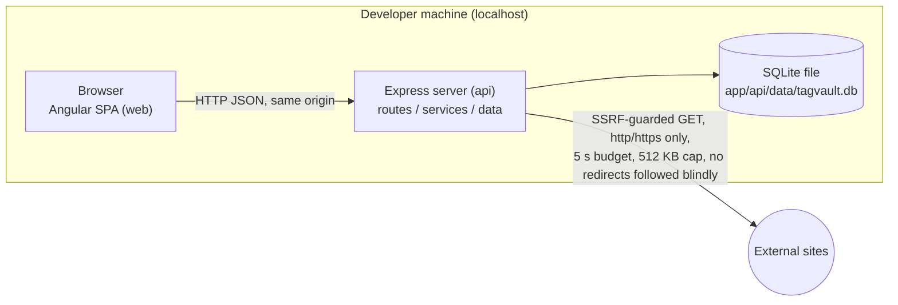
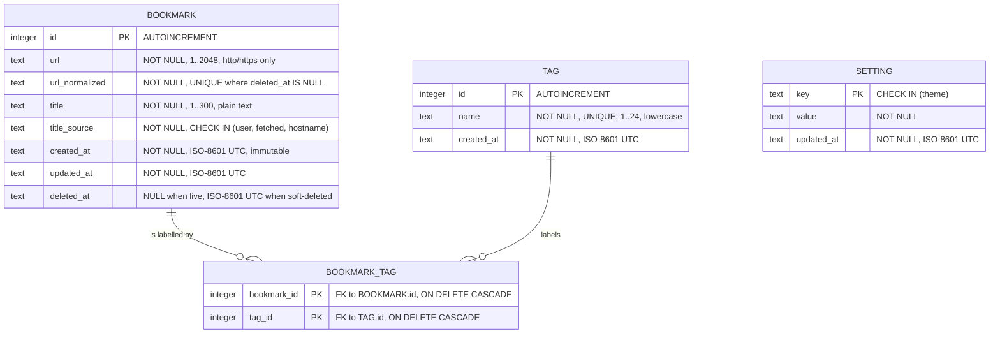
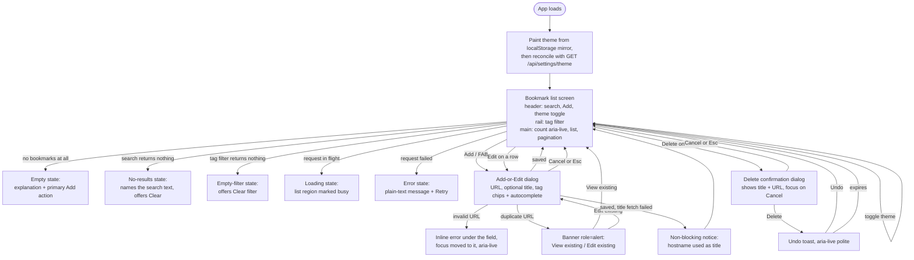

<!-- GUIDE: Created by /constitution INIT. Filled only by the gate rollup after /technology, /architecture, and /design-feature approvals. Keep the ## headings exactly as they are. Feature detail goes under ### Fnn. Replace each _Pending_ line and its GUIDE comment when the section is filled. -->
# 02 · Design

## Proposed Solution

_Technology approved at the technology gate on 2026-09-30. Architecture approved at the architecture gate on 2026-10-01 (`specs/architecture/hld.md`, now **v4** after AMD-001, AMD-002, AMD-003 and AMD-004)._

TagVault runs entirely on the developer's machine as two components: an **api** component (Express, serving a JSON API and the built frontend assets) and a **web** component (an Angular single-page application). Data lives in an embedded SQLite file inside the workspace, so the app needs no database server, no container runtime and no network service beyond the one outbound call that fetches a page title.

### Architecture style

**A local client–server modular monolith**, split into two deployable components in one repository.

`web` is an Angular single-page application. `api` is an Express server that owns **all** business rules, all validation, all persistence, and the only outbound network call. For the demo and for the NFR measurement runs, `api` also serves the built `web` assets, so the whole application is one process on one port. During development `ng serve` runs separately and proxies API calls to `api` — which avoids a cross-origin setup entirely, so there is no CORS middleware in this design and that absence is deliberate.

There is no intermediate tier, no message broker, no cache, no background worker, no ORM and no migration framework (P4).



### Components

Declared authoritatively in `specs/architecture/component-map.json` (version 1). No code may be written to a path this file does not declare (A4).

| Component id | Type | Path | Port | Responsibility |
|---|---|---|---|---|
| `api` | backend | `app/api` | 3000 | JSON API for R01–R15. URL validation and normalization, SSRF-guarded title fetch, duplicate detection, tag normalization, search and filter queries, pagination, soft delete and restore, theme setting. Owns the SQLite file. Serves the built `web` assets from `app/api/public`. |
| `web` | frontend | `app/web` | 4200 (dev) | Angular 22 zoneless SPA. Bookmark list with pagination, search box, tag filter rail, add/edit dialog with tag chips and autocomplete, delete confirmation dialog, undo toast, theme toggle. All state in signals. `dependsOn: ["api"]`. |

### Project structure

`app/` sits at the repository root, a sibling of `specs/` and `docs/`.

```
<repo root>/
├─ .github/   prompts, skills, instructions, templates
├─ docs/      the six assignment docs + mockup.html (UX reference)
├─ specs/     specifications only — no application code
└─ app/
   ├─ api/    src/{server.js, app.js, routes/, services/, data/, lib/}, test/,
   │          data/ (tagvault.db, git-ignored), public/ (generated, git-ignored)
   └─ web/    src/app/{core/, state/, features/}, src/styles.css
```

`app/api/public/` is **build output**, not source: `npx ng build` in `web` writes there so one Express process can serve the whole app. It is git-ignored and never hand-edited. This is the single place where one component's command writes into another's folder, and it is declared in the design rather than discovered during build. `app/api/data/` holds user data and is git-ignored (D1).

### Layers inside `api`

The "Must not" column is the maintainability check carried into `/review-phase`.

| Layer | Responsibility | Must not |
|---|---|---|
| Routes (`api/src/routes`) | Parse the request, call one service, map the result to a status code and JSON body. Translate `AppError` codes to HTTP status. | No SQL. No business rule. No direct call to the title fetcher. Never build `ORDER BY` or `LIMIT` from request data. |
| Services (`api/src/services`) | All business rules: validate and normalize the URL, decide the title and its source, enforce the duplicate rule and the 8-tag limit, normalize tags, clamp page and size, orchestrate transactions, decide soft delete vs restore. **This is the layer Q4's ≥80% coverage is measured on.** | Never reference `req`/`res`. Never write SQL strings. Never format markup. |
| Data access (`api/src/data`) | Own the connection and pragmas, bootstrap the schema, expose repositories running **prepared statements only**. Own transaction boundaries. | No business rule. Never concatenate a value into SQL (S4). |
| UI (`web/src/app`) | Render state, capture input, manage focus, present empty / loading / error / no-results states. | Never the only place validation happens (S1). Never `[innerHTML]` with user or fetched data (S3). Never hold UI-driving state outside a signal (zoneless: a plain field assignment renders nothing). Never build an `href` from an unchecked scheme. |

### Key flows

Full sequence diagrams are in `specs/architecture/hld.md` §6.

- **Add (R01, R09, R10)** — validate → normalize → duplicate lookup → *(if no user title)* guarded fetch within a 5 s budget → one transaction inserting the bookmark, upserting tags and linking them. `title_source` (`user` / `fetched` / `hostname`) comes back in the same 201 response, so the "we used the address as the title" notice needs no second round trip.
- **List / search / filter / paginate (R03–R05, R15)** — one predicate builder feeds **both** the `COUNT(*)` and the page query; page is clamped against the resulting total, then `LIMIT`/`OFFSET` with a fixed `ORDER BY created_at DESC, id DESC`. Building the two queries separately is the specific defect this design forbids.
- **Edit (R06)** — reuses the add path's validation and normalization, with two differences: the duplicate lookup excludes the row's own id, and `created_at` is never rewritten, so the bookmark keeps its place in the list.
- **Delete and undo (R07, R13)** — confirmation dialog focused on Cancel → `DELETE` sets `deleted_at` → undo toast → `POST /:id/restore` clears it after re-checking that no live row has taken the URL meanwhile.
- **Autocomplete and theme (R14, R12)** — `GET /api/tags?prefix=` is an indexed prefix match on the `tag` table alone; the theme lives in a SQLite `setting` row read on load and written on toggle.

### Technology (approved 2026-09-30)

| Layer | Choice | Version | License | Why |
|---|---|---|---|---|
| Runtime | Node.js 24 LTS | v24.18.0 installed | MIT | Already installed, so nothing to provision before the 2026-10-05 date (A3). One language across both components. |
| Web framework | Express | 5.2.1 | MIT | Smallest framework covering "HTTP server + JSON API for R01–R15" with no ORM, auth layer or build step (P4). |
| Frontend | Angular SPA, built to static assets, calling the API through the built-in `HttpClient` | 22.2.0 | MIT | Chosen by the human. `HttpClient` ships with the framework, so no HTTP client dependency is added (P4). |
| Persistence | SQLite via `better-sqlite3` | 13.0.3 | MIT | Embedded and file-based (A5). Prepared statements give S4; a `UNIQUE` index on the normalized URL gives R10. |
| Outbound HTTP | `node:https` with a custom `lookup`, redirects disabled | ships with Node | MIT | The only option that can inspect the DNS-resolved address **before** the socket opens, which is what S2 and NFR-04 require. Zero dependencies. |
| HTML parsing | Bounded regex over the first N KB | — | — | Only one `<title>` element is needed, and EC06 already defines a hostname fallback, so a parse miss degrades gracefully. Zero dependencies. |
| Test + coverage | Vitest + V8 coverage | 5.0.3 | MIT | One runner for both components; `@angular/build` 22.2.0 peers on `vitest ^5.0.0`. Supplies the measured percentage Q4 requires. |
| Lint / format | ESLint + Prettier | 10.11.0 / 3.9.9 | MIT | Q3 requires zero lint errors; the Angular CLI scaffolds ESLint. |
| Change detection | Zoneless (`provideZonelessChangeDetection()`, signal-driven state) | built into Angular 22.2.0 | MIT | The Angular 22 default, and it drops `zone.js` (~100 KB) from the bundle (P4). Signals suit R13 undo and R14 autocomplete. Not chosen for performance. |

Every version above was read from the npm registry on 2026-09-30, and every `engines.node` range was checked against the installed v24.18.0. Full record: `specs/technology.md` §7.

**Rejected: axios.** Requested in the first round, then withdrawn. Server-side it cannot intercept the connection between DNS resolution and socket open, so a public hostname resolving to a private address defeats it — it cannot satisfy S2. Client-side, Angular's `HttpClient` already covers every need in R01–R15.

**Two constraints carried forward.** TypeScript must be pinned to `~6.0`: npm's `latest` is 7.0.2, which `@angular/build` 22.2.0 does not support (RK07). And Express 5 is not Express 4 — routing, `req.query` and several `res` signatures changed, so 4.x-era snippets are a known trap.

### F01 Add Bookmark — low-level design (approved 2026-10-01)

_Source: `specs/features/F01-add-bookmark/lld.md` (14 sections) and `tasks.md` (12 tasks). The first feature designed, and the one that scaffolds both components — `app/` does not exist yet._

F01 covers R01, R08, R09, R10 and R11: save a URL with an optional title, fetch the page title when none is given, reject what is not an `http(s)` address, refuse duplicates, and keep the saved bookmark across a restart. It builds three `api` modules that later features reuse — the URL validator, the normalizer (INV-02) and the SSRF-guarded title fetcher — plus the repository and create service behind `POST /api/bookmarks`.

| Area | Design position |
|---|---|
| Validation order | Trim → length ≤ 2,048 → `new URL()` parses → scheme ∈ {http, https} → hostname contains a dot → title ≤ 140. Stops at the first failure. `new URL()` is a **parser, not a validator**, so the allow-list and the dot rule run on its output *before* normalization — an ordering the tests assert directly |
| Duplicates | Detected by a lookup on the normalized URL **and** enforced by the `ux_bookmark_url_live` partial unique index. A constraint violation is re-read and returned as a 409 byte-identical to the pre-insert one, because a disabled submit button cannot satisfy "exactly one row" for a caller using `curl` (S1) |
| Title fetch | Synchronous inside the create request (AD-03), 5 s total budget, 512 KB cap, at most 3 manually re-validated redirect hops. **Never throws** — a failed fetch is a specified 201 with the hostname as the title, so an escaping exception would turn a success into a 500 |
| Scope boundary | F01 ships *minimal* `GET /api/bookmarks` and `GET /api/tags` so the smoke contract declared in `component-map.json` passes from the first task rather than from F03. No query parameters, no rendering; the main region is a placeholder with a fixed internal `LIMIT 50` behind the route |
| Declared UX deviations (U6) | Four, each written up with its reason: the HLD's invalid-scheme wording rather than the mockup's, no tag row until F02, an ASCII apostrophe in the fetch-failure notice where `docs/mockup.html` uses a typographic one, and the fetch-failure notice announced in the toast region rather than held in the dialog's note region for ~1.5 s as the mockup does (C-F01-08) — a genuine trade-off, not a forced one: both halves of the mockup's behavior are reproducible, and dev-1 chose to avoid the stall at the stated cost of the notice no longer appearing beside the *Title* field |
| Architecture impact | **AMD-002 applied 2026-10-01** (INV-02's trailing-slash rule, `data-model.md`/`er-diagram.md` v2→v3). No entity, field, index or invariant beyond that one clause changed; no code changed |

**One specification ambiguity was settled at the gate rather than in code.** F01-AC13 lists `[::1]` and an IPv4-mapped IPv6 form among addresses that must still yield a 201, while F01-EC2 says IP literals pass the dot rule "only where a dot is literally present" — and `[::1]` has none. dev-1 confirmed that AC13's list is of **resolved** addresses, not literal submissions: a host that *resolves to* `[::1]` is saved with the hostname fallback, while the literal string `http://[::1]/` is refused at the dot rule. Both statements then agree, INV-01 is unchanged, and no amendment was needed.

**The AC5 notice-placement question was reopened, then settled as a declared choice rather than a forced one.** The design gate originally argued the note region and a closing dialog could not both hold. `docs/mockup.html` lines 283–290 disprove that: the mockup writes the notice into the note region, holds it ~1.5 s, then closes and toasts. dev-1 kept the shipped toast-region behavior anyway, as a declared U6 deviation with its cost stated rather than as a forced substitution (`/clarify`, C-F01-08; `lld.md` §6 revised 2026-10-01).

**One gap is declared open, deliberately.** The WHATWG parser preserves a trailing dot in a hostname and INV-02 does not strip it, so `https://example.com./a` and `https://example.com/a` would be stored as two bookmarks of the same host. Fixing it would extend an architecture invariant, so it is recorded as a known duplicate-detection gap and carried to `/test-phase` as a deliberate probe rather than quietly patched.

### F03 List Bookmarks — low-level design (approved 2026-10-01)

_Source: `specs/features/F03-list-bookmarks/lld.md` (14 sections) and `tasks.md` (8 tasks). Replaces F01's placeholder list (`listRecent()` / `countLive()` / the hardcoded `F01_LIST_LIMIT`) with the real, request-driven paging contract._

F03 covers R03, R08 (partial), R11 (partial) and R15: the newest-first bookmark list, its pagination, and its empty/loading/error states. It adds one new `api` module (`lib/pagination.js`, the clamp helpers) and a shared predicate builder (`services/list-query.js`) that AD-07 and AS-F03-01 require — shaped now with only `deleted_at IS NULL` wired in, so F04 and F05 extend the same builder rather than each writing their own. On `web`, it replaces the shell's neutral placeholder with the real card list, count region and a new pagination control.

| Area | Design position |
|---|---|
| Pagination contract | `GET /api/bookmarks?page=&size=` never returns 400 — `size` clamps to one of `{10, 20, 50}` (default 20) and `page` clamps to `[1, maxPage]`, both silently, both always `200` with the clamped values echoed back (F03-AC5, F03-AC6) |
| Ordering and the tie-break | `ix_bookmark_list (deleted_at, created_at DESC, id DESC)` serves the predicate and the sort together; `id DESC` is the tie-break that keeps rows sharing one identical `created_at` instant split stably across a page boundary (F03-EC1) |
| Tag lookup | `listTagsForBookmarks(ids)` uses the `bookmark_tag` composite primary key (`bookmark_id`-leading), not `ix_bookmark_tag_lookup` (`tag_id`-leading, built for F04's opposite query direction) — no new index proposed |
| Relative time | Computed client-side by a pure `relativeTime(iso, now)`, ported verbatim from the mockup's `ago()` (LD-02) — keeps formatting out of the API contract, per `hld.md` §5's services/UI split |
| Scope boundary | Tags render as static, non-interactive chips (C-F03-01); Edit/Delete buttons render with correct `aria-label`s and no handler — F02/F06/F07 wire the behavior onto the same markup |
| Declared U6 additions | Two, both already pre-recorded in `hld.md` §7: the pagination control (page-size select + Previous/Next + "Page X of Y", no mockup counterpart), and the list-fetch-error state with its *Retry* button (the mockup's list never fails) |
| Architecture impact | None. No entity, field, index or invariant changed |

**One design choice was deliberately not the "more capable" option.** LD-04 guards against a stale or out-of-order list response (for example, a slow page-1 request returning after a fast page-2 one) with a monotonic request token rather than switching the store to Observables with `switchMap` for true transport-level cancellation — chosen because the existing store is `async`/`await` throughout and no acceptance criterion asks for the cancelled request to stop consuming bandwidth, only for its result to never reach the screen.

### F04 Filter by Tag — low-level design (approved 2026-10-01)

_Source: `specs/features/F04-filter-by-tag/lld.md` (14 sections) and `tasks.md` (12 tasks). The first feature to extend `list-query.js`'s `buildPredicate()` beyond F03's `deleted_at IS NULL` constant — the exact extension point AS-F03-01 and `data-model.md` §3 reserved._

F04 covers R04 and R11 (partial, the empty-tag-filter state): a tag rail (`nav#tags`) that narrows the list to one tag at a time, a per-card clickable tag chip as a second way to select the same filter, an active-filter chip with a `Clear tag filter` control, and the empty-tag-filter state. It adds one `EXISTS` subquery to the shared predicate builder — `countWhere` and `listPage` need no change at all — and a new `GET /api/bookmarks/count` route that gives the rail's "All bookmarks" count and the "N of M bookmarks" wording an unfiltered total that stays correct independently of whatever tag filter is active.

| Area | Design position |
|---|---|
| Predicate extension | `buildPredicate({ tag } = {})` adds `EXISTS (SELECT 1 FROM bookmark_tag bt JOIN tag t ON t.id = bt.tag_id WHERE bt.bookmark_id = bookmark.id AND t.name = ?)` only when `tag` is present, through the already-approved `ix_bookmark_tag_lookup (tag_id, bookmark_id)` index — reserved for exactly this query shape since AD-02 and unused until now |
| Filter-value normalization | A new, separate `normalizeTagFilterValue()` (trim + lowercase, never rejects) rather than extending F02's already-tested, strict `tag-service.js` — storage validation (rejects) and filter matching (never rejects, an unrecognized value simply matches zero rows) are different concerns kept under different names |
| Keeping the rail and the filter in sync (F04-RK1) | The tag rail and the unfiltered count both reload after every successful list reload, not only at startup — this is what lets a tag's count reaching zero (EC17) actually fall back the active filter to "All bookmarks" rather than silently drifting out of sync with the list |
| Single-select | The filter holds one tag value at a time (AS-F04-01); activating a second tag replaces the first rather than combining them, matching `docs/mockup.html`'s single `S.tag` value |
| Scope boundary | Multi-tag combination, combining the filter with search (F05), tag creation/renaming/deletion (F02), and the delete action that triggers EC17 (F07) are all explicitly out of scope — F04 owns only the rail's and the filter's reaction |
| Architecture impact | None. `hld.md` v2, `data-model.md` v3 and `component-map.json` v1 already describe the tag/bookmark_tag tables and the index this feature uses |

**One route-ordering constraint was recorded for later features rather than left implicit.** `GET /api/bookmarks/count` is a literal path registered with no `:id`-shaped route yet in existence. Express matches routes in registration order, not by specificity, so F06 and F07 — which add `GET`/`PUT`/`DELETE /bookmarks/:id` — must keep `/bookmarks/count` registered ahead of any `/bookmarks/:id` route, or `count` would be parsed as an id value. This is a build-order note for those features' own LLDs, not a defect in F04's.

### F05 Search — low-level design (approved 2026-10-01)

_Source: `specs/features/F05-search/lld.md` (14 sections) and `tasks.md` (14 tasks). The second and final feature to extend `list-query.js`'s `buildPredicate()` (AS-F03-01, AD-07), and the first to exercise `like-escape.js`'s `escapeLikePattern()` outside F02's tag-prefix query — both modules carried header comments reserving themselves for exactly this feature._

F05 covers R05 and R11 (partial, the search no-results state): a header search field matching title **or** URL, case-insensitively, composed with an active tag filter via AND (AS-F05-01), and a search no-results state offering `Clear search` and, when a tag filter is also active, `Clear tag filter`. It refactors the shared predicate builder into a clause array so a third optional predicate composes without `countWhere`/`listPage` ever changing, and reuses the existing stale-response guard rather than adding a second one.

| Area | Design position |
|---|---|
| Predicate composition | `buildPredicate({ tag, q } = {})` refactored to a clause array (`deleted_at IS NULL` always, the F04 tag `EXISTS` clause when present, a new `(title LIKE ? ESCAPE '\' OR url LIKE ? ESCAPE '\')` clause when present) — any combination of tag/search/neither/both composes through one code path instead of hand-enumerated branches |
| LIKE-escaping location | Inside `buildPredicate()` itself, calling the already-shipped `escapeLikePattern()` (F02) — keeps clause-text assembly and the S6 escaping it depends on in one place, matching `like-escape.js`'s own header comment |
| Search-value normalization | A new, separate `normalizeSearchValue()` colocated with F04's `normalizeTagFilterValue()` — trim, cap at 200 characters, never rejects, mirroring that precedent exactly |
| Debounce ownership | A new `SearchBox` component owns a 250 ms `setTimeout`, mirroring `TagInput`'s already-shipped debounce — avoids introducing a second, store-owned timing convention for a capability only one caller needs |
| Stale-response guard (F05-RK1) | Reuses the existing `listRequestToken` in `BookmarksStore.loadList()` rather than adding a parallel token — directly resolves the drift risk F05-RK1 names, since every list-changing action (page, size, tag, search) already races through the same guard |
| No-results actions | Both `Clear search` (primary) and, only when a tag filter is also active, `Clear tag filter` (secondary) — ported verbatim from the reference's conditional action array |
| Empty-state precedence correction | `BookmarkList`'s branch order corrected to match `docs/mockup.html`'s own `!n ? 'none' : q ? 'search' : 'tag'` function exactly, checking `store.allCount() === 0` **before** the search-no-results and tag-empty branches — this closes a latent gap in F04's shipped order, where a tag filter active against a zero-bookmark store would have shown the tag-empty state instead of F03's all-empty state |
| Scope boundary | Searching tag names, full-text search of page contents, persisting the search text across reload (AS-F05-02), and combining search with more than one simultaneously active tag are explicitly out of scope |
| Architecture impact | None. `hld.md` v2, `data-model.md` v3 and `component-map.json` v1 already describe the search predicate shape and the `api`/`web` component paths this feature uses |

### F07 Delete Bookmark — low-level design (approved 2026-10-01)

_Source: `specs/features/F07-delete-bookmark/lld.md` (14 sections) and `tasks.md` (15 tasks). Implements the soft-delete/undo sequence `hld.md` §6.4 already described (AD-04) and consumes `data-model.md` v3's `deleted_at` column and `ux_bookmark_url_live` partial unique index — no architecture change was needed._

F07 covers R07, R08 (partial), R11 (partial) and R13: a delete-confirmation dialog focused on Cancel, a soft delete (`deleted_at` set, row excluded from every read), an undo toast that restores the row to its original position, and the auto-dismiss timer every toast in the app now shares. It adds `softDelete`/`restore` at the service and repository layers, two new routes, a new `delete-confirm` dialog component, and generalizes the store's toast into a reusable `showToast(message, onUndo?)`.

| Area | Design position |
|---|---|
| Confirmation dialog | A new `features/delete-confirm/` component, mirroring `BookmarkForm`'s existing `<dialog>`/`showModal()` pattern, rather than embedding the confirm UI inline in `BookmarkList` — keeps one dialog-handling convention across the app |
| Toast auto-dismiss | Centralized `showToast(message, onUndo?)`/`clearToast()` with a single 6-second timer inside `BookmarksStore`, rather than an effect inside the `Toast` component — resolves F07-RK1 (the shared `Toast` had no auto-dismiss at all) and F07-RK2 (C-F07-05's instruction that *every* toast auto-closes, not only the undo one) in the one place all three existing `toast.set(...)` call sites already live |
| Restore race (F07-AC7) | No pre-check before the restore write — catch the `SQLITE_CONSTRAINT_UNIQUE` violation from `ux_bookmark_url_live` directly and translate it to 409, rather than mirroring insert/update's pre-check-then-write shape. A dedicated `restoreDuplicateUrlError()` constructor keeps this message distinct from the create/edit duplicate message, since `hld.md` §6.4's sequence diagram already specifies different wording for this case than §8's rolled-up summary row |
| Wiring the Delete button | A new `deleteRequested` output + opener, mirroring F06's already-shipped `editRequested` → `openEdit()` pattern exactly |
| Invalid `:id` (F07-AC10) | An explicit `Number.isInteger(id)` guard in the service layer, rejecting with `NOT_FOUND` before any repository call — sidesteps relying on `better-sqlite3`'s unverified behavior for a `NaN` bound parameter |
| Scope boundary | AC11 (page clamp on deleting the last row of a page), AC12 (a tag disappearing from the rail once its last bookmark is deleted) and AC13 (the all-empty state) are satisfied for free by F07 simply calling the already-existing `loadList()`/`refreshTagRail()` — no new code path for any of the three |
| Silent failure handling | AC6 (double-delete) and AC9 (double-activation of Confirm Delete) both resolve to a 404 with **no visible error banner and no second toast** — just a silent `loadList()` — matching both ACs' wording exactly rather than adding an unrequested error UI |
| Architecture impact | None. `hld.md` v2 (now v3, see below) and `data-model.md` v3 already approve the full soft-delete/restore sequence and every error code F07 uses |

**One sync gap, unrelated to F07, was found and corrected while rolling up this gate.** `specs/features/F06-edit-bookmark/status.md` and `AMD-003` both stated `hld.md` was amended to v3 with an `EDIT_CONFLICT` row, but the live `hld.md` was still v2 with no such row — AMD-003 had been approved but never actually applied to the file. Corrected here: `hld.md` is now v3, with `EDIT_CONFLICT` added to both the error-handling and trust-boundary tables, matching AMD-003 exactly. F07 does not use `EDIT_CONFLICT`; this was carried forward only because it surfaced during F07's design-context reading.

### F08 Dark Mode — low-level design (approved 2026-10-02)

_Source: `specs/features/F08-dark-mode/lld.md` (14 sections) and `tasks.md` (9 tasks). Wires the already-approved `setting` table (`data-model.md` v3, AD-05) to a new `GET`/`PUT /api/settings/theme` pair and a new client-side `ThemeStore` — no schema change, since `data-model.md` v3's `setting` table and its `CHECK` constraints already exist for exactly this purpose._

F08 covers R12: a header toggle switching between a light and a dark appearance, a server-backed preference that survives a restart, and a first paint that is never the wrong theme. It adds one new `api` repository (`setting-repository.js`), one new service (`setting-service.js`), one new route file (`settings.js`), and a new `state/theme.store.ts` on `web` — the file `hld.md` §4's Project Structure already named for this purpose.

| Area | Design position |
|---|---|
| Where the preference is authoritative | The `setting` row (AD-05) is the single source of truth; `localStorage` holds a **non-authoritative render mirror**, read only to paint the first frame and overwritten by the server value as soon as it arrives (`hld.md` §6.5) |
| Avoiding a first-paint flash | A tiny inline `<script>` in `index.html`'s `<head>`, guarded by `try/catch`, reads the `localStorage` mirror and sets `<html data-theme>` before any CSS paints — the only option that actually satisfies "don't flash the other theme first" (F08-AC2, AC3), since anything inside Angular's bootstrap runs at least one frame too late |
| The rapid-toggle race (F08-AC8) | A monotonic request token on `ThemeStore`, mirroring the already-shipped `tagSuggestionsRequestToken` idiom in `bookmarks.store.ts` — a response is applied only if its token is still the latest, so the final displayed and stored state always matches the last toggle |
| No-row default | `GET /api/settings/theme` returns `200 { theme: 'light' }` when no row exists yet, and the read itself never creates one (F08-AC1, F08-EC1) |
| Invalid `PUT` body (F08-AC6) | Rejected with `400 INVALID_THEME` before any write, matching the existing `INVALID_URL`/`INVALID_TAG` contract shape — this is the one gap found in `hld.md` §8 and closed by **AMD-004** (see below) before the LLD was finalized |
| Degraded-mode fallbacks | A failed `GET` on load falls back to the `localStorage` mirror or `'light'`, with no blocking error screen (F08-AC9); a `localStorage` that throws on read or write loses only the first-paint optimization, never the feature itself (F08-AC10) |
| Declared U6 deviation | The toggle's accessible label is state-aware (`Dark mode` ⇄ `Light mode`) rather than the mockup's static text (C-F08-04), the same declared-deviation precedent F07's toast-duration change already established |
| Architecture impact | **AMD-004 applied 2026-10-01, during this feature's design phase** (`INVALID_THEME` 400 added to §8's error-handling table; no schema, ER, or component-map change) |

## Data Model
_Source: `specs/architecture/data-model.md` **v3** and `specs/architecture/er-diagram.md` **v3** (same version), approved 2026-10-01, amended by AMD-001 and AMD-002 on 2026-10-01. Neither amendment changed an entity, field, key or relationship — AMD-001 changed the INV-01 and INV-06 boundary rules, AMD-002 the INV-02 normalization rule. `user_version` is still 1 and no migration has been needed._

Four entities in one SQLite file. Timestamps are TEXT in ISO-8601 UTC (`YYYY-MM-DDTHH:MM:SS.sssZ`) because SQLite has no date type and lexicographic ordering of that fixed-width format is identical to chronological ordering — so the `created_at DESC` index sorts correctly with no conversion.

**bookmark**

| Field | Type | Constraints |
|---|---|---|
| `id` | INTEGER | PK `AUTOINCREMENT` — ids are never reused, because restore (R13) keeps the original id |
| `url` | TEXT | `NOT NULL`, 1–2048 characters, `http`/`https` only. The URL as typed, after trimming. What is rendered and linked. |
| `url_normalized` | TEXT | `NOT NULL`, unique **among live rows**. Derived key used only for the duplicate check (R10). Never displayed. |
| `title` | TEXT | `NOT NULL`, 1–300 characters, **plain text, never HTML** |
| `title_source` | TEXT | `NOT NULL`, `CHECK IN ('user','fetched','hostname')`. `hostname` drives the non-blocking fetch-failed notice. |
| `created_at` | TEXT | `NOT NULL`. The sort key. Set once at insert and **never** modified — not on edit, not on restore. |
| `updated_at` | TEXT | `NOT NULL`. Diagnostics and conflict detection. Does not affect ordering. |
| `deleted_at` | TEXT NULL | `NULL` for a live row, a timestamp for a soft-deleted one. Every read filters `deleted_at IS NULL`. |

**tag** — `id` PK; `name` TEXT `NOT NULL UNIQUE`, 1–24 characters, lowercase, letters/digits/`-`/`_`/space; `created_at`. The `UNIQUE` constraint is what makes `Research` and `research` merge at the data level rather than only in application code.

**bookmark_tag** — `bookmark_id` + `tag_id`, composite PK, both FK `ON DELETE CASCADE`. The composite PK is what prevents the same tag being attached twice to one bookmark.

**setting** — `key` TEXT PK with `CHECK (key IN ('theme'))`; `value` TEXT `NOT NULL`; `updated_at`. The `CHECK` is a deliberate allow-list so this table cannot become an open key-value write surface reachable from the API (S1).

### ER diagram



`BOOKMARK` to `BOOKMARK_TAG` is shown as one-to-many because SQLite cannot express an upper row-count bound declaratively; the maximum of **8 tags per bookmark** is enforced in the tag service, not the schema, so review looks in the right place. `SETTING` stands alone deliberately — the absence of a relationship is intentional, not an omission.

### Indexes

| Index | Supports |
|---|---|
| `CREATE UNIQUE INDEX ux_bookmark_url_live ON bookmark(url_normalized) WHERE deleted_at IS NULL` | The duplicate rule at data level (R10). The **partial** `WHERE` is load-bearing: without it, a soft-deleted bookmark would permanently block re-adding the same URL, so delete-then-re-add would produce a dead address. |
| `CREATE INDEX ix_bookmark_list ON bookmark(deleted_at, created_at DESC, id DESC)` | Newest-first ordering (R03) and pagination (R15), NFR-01. `deleted_at` leads so the soft-delete predicate is satisfied by the index. `id DESC` is the tie-breaker: without it, two bookmarks written in the same millisecond can swap places between page requests, letting one row appear on both page 1 and page 2, or on neither. |
| `CREATE INDEX ix_bookmark_tag_lookup ON bookmark_tag(tag_id, bookmark_id)` | The tag filter (R04) as an indexed join; also the orphan-tag probe. |
| `CREATE UNIQUE INDEX ux_tag_name ON tag(name)` | Tag autocomplete (R14) — a prefix match, so it **does** use this index — and the case-merge rule. |

### Invariants worth flagging

Twelve are recorded as INV-01…INV-12 in `specs/architecture/data-model.md` §4. Five carry risk beyond their own feature:

- **INV-02 (normalization):** lowercase scheme and host, apply IDNA/punycode, drop a default port, drop the fragment, drop **one** trailing `/` from the path whether or not the path is otherwise empty — but **preserve path case**, because `example.com/A` and `example.com/a` are different resources on most servers and folding them would merge two legitimately distinct bookmarks. That asymmetry is deliberate: the slash is folded, the case is not. Only the last slash goes, and only once, so `/a//` normalizes to `/a/` rather than collapsing further.

> Changed 2026-10-01: INV-02 now folds a trailing `/` on **any** path, not only an empty one, so `https://example.com/a/` and `https://example.com/a` are one bookmark (see AMD-002). The earlier wording made F01-AC12 impossible to satisfy. The shipped `normalizeUrl` already behaved this way, so no code, no stored row and no API response changed — the invariant caught up to a ruling already made.
- **INV-05 (title length):** 300 at the data level, 140 for a *user-typed* title at the form and API boundary (matching the mockup's `maxlength`). The two differ on purpose: a fetched `<title>` is truncated to 300, and refusing to store it would turn a successful fetch into a spurious failure.
- **INV-06 (title never empty):** when no user title is given and the fetch yields nothing — including a 200 response whose `<title>` is empty or whitespace only — the hostname is stored with a leading `www.` removed, and `title_source = 'hostname'` drives the notice.
- **INV-10:** `created_at` never changes after insert, including on edit and restore. This is what keeps a bookmark in its place in the list.
- **INV-12:** `PRAGMA foreign_keys = ON` must be executed on **every** connection. SQLite defaults it OFF, and a missed pragma silently disables every foreign key in this model, so it is set at connection open and asserted by a test.

### Surviving a restart

One SQLite file at `app/api/data/tagvault.db`, read in-process by `better-sqlite3` — no server, no container (A5). `PRAGMA journal_mode = WAL` and `synchronous = NORMAL` at startup. Every multi-statement write — a bookmark plus its tag links, an edit plus link replacement, a restore — runs inside **one** transaction, so a crash mid-write rolls back whole and cannot leave a bookmark with half its tags. The schema is created by an idempotent `CREATE TABLE IF NOT EXISTS` script inside a transaction **before** the HTTP listener opens, with `user_version` = 1; there is no migration framework because there is exactly one schema version.

Two things are stated as decisions rather than left as gaps. There is **no automatic backup** — recovery is to copy the `.db` file while the app is stopped, which the file-based design makes trivial. And the **undo buffer does not survive a restart**: a soft-deleted bookmark stays soft-deleted and is no longer reachable from the UI, because the toast that offered Undo is gone. Recovering it would need a trash screen, which is outside R07/R13. This is a documented limitation, not a defect.

Seed and test data are synthetic only (D1): every URL is under `example.com`/`.org`/`.net`. The NFR-01 measurement seeds 1,000 bookmarks as `https://example.com/article/{n}` across ~20 tags, with `created_at` spread over a synthetic range so ordering and pagination boundaries are genuinely exercised. Seeding never runs automatically on startup, because an empty database is the correct first-run state — the empty state is itself a requirement that must be reachable.

## UI / User Flow

_Source: `specs/architecture/hld.md` §7._

One screen, two modal dialogs and two transient regions, ported from the approved UX reference at `docs/mockup.html` (U6).



**States every view must implement** (U3): empty, loading, error, and — for search and filter — no-results. The reference already demonstrates the empty, invalid-address, duplicate and title-fetch-failure states through its demo controls; those are the visual contract.

**Keyboard and focus contract** (U1, U2, NFR-03), carried from the reference:

- Every control is a real `<button>`, `<input>` or `<a>`; every input has a `<label for>` (the search input uses a visually-hidden label, as the reference does).
- Both dialogs are `<dialog>` elements: focus moves in on open, is trapped while open, `Esc` closes, and focus returns to the control that opened them. The delete dialog focuses **Cancel**, not Delete (U4).
- The result count, the inline field error, the title-fetch notice and the undo toast all live in `aria-live` regions, so their content is announced as text rather than signalled by colour alone (U2, U5).
- Tag chips carry an accessible name that includes the tag ("Remove tag research"), because "×" alone is not a label.

**Two declared deviations from the binding UX reference.** Both are additions or removals the reference does not cover; neither changes its layout, states or copy.

| Deviation | Reason |
|---|---|
| A pagination control (page-size selector 10 / 20 / 50, plus page navigation) is **added** below the list. | R15 requires it and the reference has no counterpart. Styled to match the reference's button and chip treatment; the page sizes are fixed constants in code, not configuration. It is included in the NFR-03 keyboard walkthrough. |
| The footer text "Bookmarks are stored in this browser only" and the "Reset demo data" control are **dropped**. | Both are artefacts of the reference's `localStorage` mockup. Constitution U6 states the reference's storage mechanism is not binding, and the statement would be false in the real application. |

## Error Handling

_Source: `specs/architecture/hld.md` §8._

Validation happens **at the API boundary, in the service layer**, and that is the only validation that counts. The Angular form repeats the cheap checks so the user gets feedback without a round trip, but nothing in `api` trusts anything `web` sends — the API is reachable directly with `curl` (S1).

Checks run in order and stop at the first failure so the message is specific: trim → non-empty → length ≤ 2048 → parses as a URL → scheme ∈ {`http`, `https`} → hostname present **and contains a dot** → normalize → duplicate lookup. The dot rule rejects single-label names such as `localhost` and `intranet` before the title fetcher is reached at all.

> Changed 2026-10-01: the URL check now requires a dot in the hostname, and the title-fetch notice now uses the UX reference's wording (see AMD-001).

One internal error type, `AppError { code, message, field?, status, details? }`, is thrown by services and translated by a single Express error middleware, so every failure body has the same shape:

```json
{ "error": { "code": "DUPLICATE_URL", "message": "You already saved this address.", "field": "url", "existingId": 42 } }
```

| Code | HTTP | User-facing message | Cases |
|---|---|---|---|
| `INVALID_URL` | 400 | "Enter a web address to save." / "Enter a web address starting with http:// or https://." / "That web address is too long (limit 2,048 characters)." | Empty, non-http(s) scheme, unparseable, over-length, dotless hostname |
| `DUPLICATE_URL` | 409 | "You already saved this address." with *View existing* and *Edit existing* | Add duplicate, edit into a duplicate, and the restore race below |
| `INVALID_TAG` | 400 | "Tags must be a list of text values." / "Tags can be up to 24 characters." / "Tags can only contain letters, numbers, spaces, hyphens and underscores." / "You can add up to 8 tags." | Malformed shape, over-length tag, disallowed character, more than 8 tags |
| `INVALID_THEME` | 400 | 'Theme must be "light" or "dark".' | An invalid or missing `theme` value on `PUT /api/settings/theme` |
| `NOT_FOUND` | 404 | "That bookmark is no longer here." | Editing or deleting a row removed in another tab |
| `STORAGE_ERROR` | 500 | "TagVault could not save that. Your other bookmarks are safe — try again." | Database failure |
| *(not an error)* | 201 | "Couldn't fetch the title, so we used the domain instead. You can edit it anytime." | Title fetch refused, timed out, non-HTML, 4xx/5xx, looping, or returning an empty `<title>` |

> Changed 2026-10-01: `INVALID_THEME` added for F08's `PUT /api/settings/theme` validation (see AMD-004).

Three rules this table encodes:

1. **A failed title fetch is never a failed request.** The bookmark is saved and the notice is informational. This is the only place where a "failure" deliberately produces a success status.
2. **Every message says what happened and what to do next**, and no stack trace, SQL fragment, internal identifier or raw exception text ever reaches the client (U5). The full detail goes to the server console only.
3. **Empty states are not errors.** No bookmarks, no search results and an empty tag filter are ordinary successful responses with zero items, rendered as their own states (U3) — not as error banners.

Two race conditions are handled explicitly rather than left to chance. Deleting a row that another tab already deleted updates 0 rows and returns 404 with a list refresh, instead of reporting a phantom success. And pressing Undo after the same URL has been re-added returns 409 with "That address has been saved again since. Nothing was restored." — the window between delete and undo is exactly when that can happen.

## Security Design

_Source: `specs/architecture/hld.md` §8 trust boundaries, mapped to constitution S1–S6._

| Untrusted input | Entry point | Validation | Escaping / restriction |
|---|---|---|---|
| Submitted URL | `POST`/`PUT /api/bookmarks` (also typed into the form) | trim → non-empty → ≤ 2048 → parse → scheme ∈ {http, https} → hostname required, **must contain a dot** → normalize. Rejected **before** any outbound call is considered (S1). The dot rule removes every single-label name — which by definition resolves only on this machine or this LAN — before the resolver is consulted (AMD-001). | Stored as text, bound as a parameter (S4). Rendered in an `href` **only after** the scheme check, so a `javascript:` value can never become a live link (S3). Displayed through Angular interpolation, never `[innerHTML]`. |
| Fetched page title | The title fetcher in `api/src/services`, over the network | **SSRF guard before connecting:** resolve the hostname and reject if **any** resolved address is private, loopback, link-local, unspecified, multicast or reserved — IPv4 `0/8, 10/8, 100.64/10, 127/8, 169.254/16, 172.16/12, 192.168/16, 224/4, 240/4`; IPv6 `::1, ::, fc00::/7, fe80::/10` and IPv4-mapped forms; the literal `localhost`. Connect to the **validated address** through a custom `lookup`, so there is no DNS-rebinding window. `Content-Type: text/html` only. Redirects followed manually, at most 3, **re-running the whole check on every hop**. No cookies, no credentials, fixed honest User-Agent. Total budget 5 s, read cap 512 KB, stop reading after `</title>` (S2). | Decode entities, collapse whitespace, truncate to 300, store as **plain text — never as HTML**. Escaped on output by Angular interpolation, so `<script>` in a page title is inert (S3). |
| User-supplied title | `POST`/`PUT` body, add/edit form | trim → ≤ 140 at the boundary → plain text | Bound parameter; escaped on output (S3). |
| Tags | `POST`/`PUT` body, tag chips input | split → trim → drop empties → lowercase → dedupe → 1–24 characters → allow-list of letters, digits, `-`, `_`, space → at most 8 | Bound parameter; escaped on output, including inside the chip's `aria-label` (S3). |
| Search text | `GET /api/bookmarks?q=` | trim → ≤ 200 characters | **Bound parameter, never concatenated.** `%`, `_` and `\` escaped with `\` before binding; the statement carries `ESCAPE '\'` (S6). Echoed back into the no-results message through interpolation, so `<script>` in a query is inert. |
| Tag filter value | `GET /api/bookmarks?tag=` | normalized exactly like a tag on input | Bound parameter; equality match, not a pattern. |
| `page` / `size` | `GET /api/bookmarks` | `size` must be one of `{10, 20, 50}` or it falls back to 20; `page` coerced to an integer ≥ 1 and clamped to the last page. Never an error, and never "return everything" (S1). | Injected into `LIMIT`/`OFFSET` as **bound integers**, never string-interpolated. `ORDER BY` is a fixed constant, never built from input. |
| `setting` key and value | `PUT /api/settings/:key` | `key` must be in the allow-list `{theme}`; the value must be `light` or `dark`. | Bound parameters, with the `CHECK` constraint as a second line of defence at the data level. |

Two controls apply across the whole surface. A `Content-Security-Policy: default-src 'self'; script-src 'self'; object-src 'none'; base-uri 'none'` header is set on the served application, so even a successful injection has no script origin to load from. And `[innerHTML]` with any user-originated or fetched value is prohibited outright in `web` — carried forward as a review lens, because choosing Angular moved S3's guarantee from server-side template escaping onto Angular's default interpolation.

**Dependency safety.** Exact versions pinned, lockfiles committed, and `npm audit --omit=dev` run per component during `/review-phase` with the **actual** output recorded (S5). Two known traps are already carried forward: TypeScript must be `~6.0` because npm's `latest` is 7.0.2, which `@angular/build` 22.2.0 rejects (RK07); and `better-sqlite3` is a native module whose Windows prebuild is unverified until first install, with `node:sqlite` as the documented fallback (RK06). No dependency is added for anything the standard library covers — which is why the outbound fetch and the title parse add none at all.

## Meeting the Non-Functional Requirements

_Source: `specs/architecture/hld.md` §9. None of these is a measured result — every "verified by" below is a check that `/test-phase` must actually run and record._

| NFR | Design approach | How it will be verified |
|---|---|---|
| **NFR-01** Search and tag filter < 500 ms, list page < 1 s, at 1,000 bookmarks | `ix_bookmark_list (deleted_at, created_at DESC, id DESC)` serves both the ordering and the soft-delete predicate from the index. `ix_bookmark_tag_lookup (tag_id, bookmark_id)` makes the tag filter an indexed join. `LIMIT`/`OFFSET` means at most 50 rows are materialized per request regardless of total size. SQLite is read in-process, so there is no network or IPC hop. **Known and accepted cost:** the `LIKE '%…%'` search cannot use an index and scans the live rows, and the `COUNT(*)` is a second pass — both are deliberate at this volume and both sit inside the measured path. | Measured at 1,000 seeded records, recording the observed median and maximum. Never estimated. This is the open risk RK05. |
| **NFR-02** 100% of bookmarks and tags present after restart, no partial writes | One embedded SQLite file reopened on start. WAL journaling, `synchronous = NORMAL`. Every logical write is one transaction, so a crash mid-write rolls back whole. Schema bootstrap is idempotent and runs inside a transaction before the listener opens. | Save a known synthetic set, stop, restart, compare the full list. |
| **NFR-03** Keyboard-operable with visible focus, labelled inputs, errors as text | Native controls throughout — no `div` acting as a button. Every input has a `<label for>`. Both dialogs trap focus, close on `Esc` and return focus to the opener; the delete dialog focuses Cancel. The visible focus indicator is preserved in the ported stylesheet, never removed by an `outline: none` without a replacement. Count, field errors, notices and the undo toast sit in `aria-live` regions. | A keyboard-only walkthrough of every flow (including the new pagination control) plus a label and role audit, recorded pass/fail per flow. |
| **NFR-04** 0 non-http(s) URLs accepted, 0 fetches to private addresses, everything escaped, all queries parameterized | The Security Design table above **is** the design. Scheme allow-list first; SSRF guard resolves DNS, validates every address, connects to the validated address through a custom `lookup`, and re-validates each of at most 3 manual redirect hops. Output escaping rests on Angular interpolation with `[innerHTML]` prohibited, plus the CSP header. Every statement is prepared with bound parameters, and `LIKE` input is escaped with an explicit `ESCAPE` clause. | The probe list in `specs/product-spec.md` §4 — `javascript:`, `file:`, `ftp:`, scheme-less, `127.0.0.1`, `10.x`, `192.168.x`, `169.254.169.254`, `[::1]`, a stubbed redirect to a private address, a `<script>` title, and search text containing `%`, `_`, quotes and `<script>` — each recording its observed result. |
| **NFR-05** A title fetch never blocks a save for more than 5 s | One hard total budget across DNS resolution, connection, response and read, enforced by the fetcher rather than by the caller's patience. Keeping the fetch on a single synchronous path means there is exactly one timer to get right. Read capped at 512 KB and abandoned after `</title>`, so a huge page cannot consume the budget. Every failure path returns `{ ok: false, reason }` and the bookmark is saved with the hostname. | Point the add form at a deliberately unresponsive endpoint and time submit → saved confirmation. |

## Alternatives & Trade-offs

_Seven architecture decisions (AD), nine technology decisions (TD) and, so far, twenty-eight feature-level design decisions (LD) across F01, F03, F04, F05, F07 and F08 — each presented with at least two genuine options and chosen by the human. Full option tables: `specs/architecture/hld.md` §10, `specs/technology.md` §2 and each feature's `lld.md` §2._

### Architecture decisions (chosen by dev-1, 2026-09-30)

Each was put with a challenge — *what breaks at 1,000 records, on a title-fetch failure, on restart, with keyboard-only use?* — before the recommendation was made.

| ID | Decision | Options considered | Chosen | Trade-off accepted |
|---|---|---|---|---|
| AD-01 | Layering inside `api` | Routes → Services → Data access / routes with inline SQL / repository + use-case + domain entity | Routes → Services → Data access | One more indirection than the smallest possible codebase. Accepted because Q4 requires a **measured** ≥80% on business logic, and the inline-SQL option leaves nothing separable to measure — while also forcing edit to re-implement add's validate/normalize/duplicate logic, so the duplicate rule could drift between the two. The ports-and-adapters option was rejected as abstraction the requirements never ask for. |
| AD-02 | Tag storage | `tag` table + `bookmark_tag` join / delimited text column / JSON array + `json_each()` | Join table | Two extra tables and a join. Accepted because it is the only option where both the tag filter and autocomplete are index-backed at 1,000 records. A delimited column makes the filter `LIKE '%,css,%'` — unindexable, and a tag containing a comma corrupts the row. |
| AD-03 | Title-fetch timing | Synchronous inside the create request with a hard 5 s budget / save first and fetch in the background / fetch in the browser | Synchronous, 5 s budget, hostname fallback | A worst-case 5 s wait on save. Accepted because that is the interval NFR-05 actually measures, and because it keeps the highest-risk component on one synchronous, probe-testable path rather than spread across a background job with its own race windows and restart-stranded rows. The browser option was **disqualified outright**: cross-origin fetch is blocked for most sites, and an SSRF guard running in the browser can reach `127.0.0.1` and the LAN and is bypassed by calling the API directly — S1 and S2 cannot hold. |
| AD-04 | Delete safeguard and undo | Hard `DELETE` + client re-POST on Undo / soft delete (`deleted_at`) + `POST /:id/restore` / hard delete + a `trash` table with TTL | Soft delete | One extra predicate on every read and a partial unique index. Accepted because it is the only option where Undo restores the bookmark to its **original position** — the challenge round surfaced that a re-POST gives the row a new `created_at` and jumps it to the top of the list, contradicting an ordering assumption the human had already confirmed during planning. It also means a crash while the toast is showing no longer destroys the record. Two derived constraints came out of the same challenge and are now design rules: `deleted_at` must lead the list index, and the uniqueness index must be **partial** or a deleted URL could never be re-added. |
| AD-05 | Where the dark-mode preference lives | SQLite `setting` table + `GET`/`PUT` / browser `localStorage` / a `theme` cookie | `setting` table, plus an approved mitigation | An extra request at load and a theme flash that has to be handled. The constitution states `localStorage` is "explicitly not an acceptable persistence mechanism", worded generally rather than scoped to bookmarks — so rather than reinterpret a ratified clause, the question was put to the human. They accepted the mitigation: `localStorage` holds a **non-authoritative mirror** read only to paint the first frame and overwritten by the server value on arrival. The SQLite row remains the single source of truth and the app is fully correct if the mirror is missing or stale, so it is a render hint, not a persistence mechanism. |
| AD-06 | Search mechanism | `LIKE` with `ESCAPE` on bound parameters / FTS5 virtual table + sync triggers / load all rows and filter in JavaScript | `LIKE … ESCAPE '\'` | An unindexed scan of the live rows on every search. Accepted at the 1,000-record volume the spec fixes, and explicitly placed inside the NFR-01 measurement so RK05 is settled by a number rather than by argument. FTS5 was rejected on two counts the challenge surfaced: it is token-based, so mid-word search returns nothing (a behaviour regression), and the search string becomes a **query expression** where `"`, `*`, `:`, `-`, `OR`, `NOT` are operators — turning the security probes into a bespoke quoting problem, where `LIKE` satisfies the requirement by construction with one bound parameter. |
| AD-07 | Pagination and total count | `COUNT(*)` with the same predicates then `LIMIT`/`OFFSET` / fetch `size + 1` and infer `hasNext` / cached or estimated count | `COUNT(*)` + `LIMIT`/`OFFSET`, returning `total` | A second query per list request. Accepted because `total` is load-bearing: the `aria-live` count region needs it, the page clamp becomes a computation rather than a guess, and a stable announced total is what a screen-reader user hears after filtering. The shared predicate builder is recorded as an explicit design constraint, because building the count and the page query separately — which makes `total` disagree with the rows — is precisely the defect this choice invites. |

### Technology decisions (chosen by dev-1, 2026-09-30)

| ID | Decision | Options considered | Chosen | Trade-off accepted |
|---|---|---|---|---|
| TD-01 | Runtime | Node.js 24 LTS / Python 3 + WSGI / Node.js 22 LTS | Node.js 24 | nodejs.org labels v24 "Latest LTS" while showing an end date of 2026-09-07 — an inconsistency that could not be resolved, so no support-window claim is made. The basis for the choice is that v24.18.0 is installed and working (A3). |
| TD-02 | Web framework | Express / Fastify / `node:http` alone | Express | Hand-written validation and error handling instead of a schema layer — compatible with S1 and U5, which both want explicit boundary checks. |
| TD-03 | Frontend | Angular SPA / serve `docs/mockup.html` statically / server-rendered templates | Angular | Costs more time than serving the mockup directly, against a 2026-10-05 date and 15 requirements (RK01). U6 conformance becomes a **porting obligation checked at review** rather than something inherited. S3 escaping now rests on Angular interpolation, not a server template. |
| TD-04 | Persistence | `node:sqlite` (built in, experimental) / `better-sqlite3` / `sql.js` (WASM) | `better-sqlite3` | A native dependency in exchange for a stable, non-experimental API. Install risk recorded as RK06, with `node:sqlite` as the documented fallback. |
| TD-05 | Outbound HTTP | `node:https` + custom `lookup` / `undici` + dispatcher / axios | `node:https` | More hand-written code, in exchange for a guard whose behavior is explicit and probe-testable per bypass shape. RK02 rates SSRF-guard correctness H-impact, and hand-written guard code is the code that can actually be tested. |
| TD-06 | HTML title extraction | Bounded regex / `node-html-parser` / `cheerio` | Bounded regex | Occasional failure on unusual markup — which degrades into the already-specified R01 fallback (hostname as title plus a non-blocking notice), a failure mode the user already sees. |
| TD-07 | Test + coverage | `node:test` + experimental coverage / Vitest + V8 / Jest + supertest | Vitest | More dependencies than the built-in runner, in exchange for a single toolchain across both components. Under RK01's time pressure, avoiding a second runner configuration is worth the dependency count. |
| TD-08 | Lint / format | ESLint + Prettier / Biome | ESLint + Prettier | Two tools instead of one, in exchange for working with the Angular CLI's defaults rather than against them. |
| TD-09 | Angular change detection | Zone.js / zoneless with signals | Zoneless | The performance argument does **not** apply — R15 paginates to 10/20/50 rows, so the tree never gets large enough for whole-tree change detection to threaten NFR-01. The choice rests on P4 (drops a ~100 KB dependency) and on matching the Angular 22 default. Accepted cost: UI-driving state must live in signals, and a plain field assignment renders nothing — a silent stale-UI symptom rather than an error, so it is carried as a review lens. |

### F01 design decisions (chosen by dev-1, 2026-10-01)

Each was put with the same challenge as the architecture decisions — *what breaks at 1,000 records, on a title-fetch failure, on restart, with keyboard-only use?* Two answers changed the design before it was written.

| ID | Decision | Options considered | Chosen | Trade-off accepted |
|---|---|---|---|---|
| LD-01 | How the SSRF-guarded fetcher is made testable | Injection factory `createTitleFetcher({ lookup, request, clock })` / export an `isBlockedAddress` predicate and test that alone / `vi.mock` of `node:dns` and `node:https` | Injection factory, plus one test against a real loopback server | One factory indirection, and a fake `request` that can drift from Node's real API — which is exactly what the loopback test exists to catch. Chosen because F01-AC13 asserts the *fetcher* opens no connection to a private address; only an injected `lookup` makes DNS rebinding and per-hop redirect re-validation observable. Testing the predicate alone would prove the guard's arithmetic while leaving "is it actually called before the socket opens?" unverified — the one thing RK02 is about. |
| LD-02 | Preventing a double-submit from creating two rows | Disable the submit control while the request is in flight / disable **and** translate the unique-constraint violation into an identical 409 / rely on the constraint alone | Both layers | One extra `SELECT` on the rare constraint path to fill `existingId`, and two code paths that must return byte-identical bodies. Chosen because F01-AC14 says "exactly one row", and the API is reachable with `curl` — under S1 a client-side guard is a convenience, never the control. |
| LD-03 | Whether F01 ships the list endpoints | Minimal `GET /api/bookmarks` and `GET /api/tags` now / defer both to F03 and accept a failing smoke contract / build the full F03 list | Minimal versions now | Both routes are revisited in F02–F04. Chosen because `component-map.json` declares all three endpoints in the `api` smoke contract and F01-AC15 names the list by name — deferring them would leave the build-verify loop with no signal until F03, and the smoke contract failing by design from the first task. |
| LD-04 | URL normalization mechanism (INV-02) | WHATWG `new URL()` / a hand-written parser / a normalization library | `new URL()`, with the scheme allow-list and dot rule running **before** it | Normalization cannot be trusted as validation — `new URL()` happily parses `javascript:alert(1)` and `http://localhost` — so check ordering becomes a correctness property that has to be asserted rather than assumed. Accepted because it is zero dependencies and the same parser the browser uses, which keeps client and server agreeing on what a URL means. |

### F02 design decisions (chosen by dev-1, 2026-10-01, "Accept Recommendation")

Each of the four LD decisions, plus three stated gaps, was put to dev-1 as an option table and answered "Accept Recommendation"/"Confirmed" in one round.

| ID | Decision | Options considered | Chosen | Trade-off accepted |
|---|---|---|---|---|
| LD-01 | Where tag normalize/validate/suggest logic lives | A dedicated `services/tag-service.js` / inline in `bookmark-service.js` | Dedicated `tag-service.js` | One more file. Chosen because it mirrors the `validate-url.js`/`url-normalize.js` precedent and is the one place F06 reuses the exact same rules rather than re-deriving them |
| LD-02 | Writing the bookmark and its tag links atomically | Extend `bookmark-repository.insert(row, tagNames)` to upsert/link tags in the same transaction / a separate `data/transactions.js` orchestrator calling both repositories | Extend `insert()` | `bookmark-repository.js` takes a `tagRepository` dependency, in exchange for no new orchestration layer and a crash mid-write never leaving a bookmark with half its tags (EC19) |
| LD-03 | `GET /api/tags` serving two shapes from one route | One route, branch on whether `prefix` is present / a new `GET /api/tags/suggest?prefix=` route | One route, branch on `prefix` | One `if` in the route handler, in exchange for no conflict with the already-approved F02-AC11–13 wording, which names this exact route |
| LD-04 | The tag-chip input component | `TagInput` injects `BookmarksStore` directly, matching `BookmarkForm`/`BookmarkList` / a generic component with a two-way `model<string[]>()` binding, no store coupling | Inject the store directly | `TagInput` cannot be dropped into an app without `BookmarksStore` — accepted, since nothing in this project ever will be |

Three confirmed gaps: a malformed `tags` field (not an array, or a non-string element) rejects the whole request with `INVALID_TAG`/`field: 'tags'`, matching C-F02-01's reject-whole stance; the character allow-list is ASCII-only (`a`-`z`, `0`-`9`, space, `-`, `_`); and the `GET /api/tags` same-route branch (LD-03) is confirmed even though F04's sidebar shape was not yet designed at the time.

### F03 design decisions (chosen by dev-1, 2026-10-01)

Each was put with the same challenge as the architecture decisions — *what breaks at 1,000 records, on restart, with keyboard-only use?* None changed the recommendation, though each challenge surfaced a reason worth keeping.

| ID | Decision | Options considered | Chosen | Trade-off accepted |
|---|---|---|---|---|
| LD-01 | The shared predicate/count query builder (AD-07, AS-F03-01) | `buildPredicate()` feeding both `countWhere` and `listPage` / two independently-maintained queries each hard-coding the predicate | `buildPredicate()`, shared | The `where`/`params` plumbing exists before it has a second value. Chosen because the independent-queries option is the exact anti-pattern AD-07 rules out: two separately-maintained predicates can drift once F04/F05 each add a clause to only one, producing a `total` that disagrees with the rendered rows |
| LD-02 | Where "Added N days ago" is computed | A pure client `relativeTime(iso, now)` in `web/core` / the server returns an already-formatted string | Pure client function | A small, documented staleness window if a tab is left open across a day boundary. Chosen because a server-formatted string bakes an opinionated, locale-bound display into a JSON API contract and contradicts the HLD's services/UI split |
| LD-03 | Pagination control shape | A labelled page-size `<select>` + Previous/Next buttons + "Page X of Y" text / a numbered page-button row with ellipsis truncation | Page-size select + Previous/Next | No direct jump to a distant page — not requested by any AC. Chosen because its control count stays fixed at 3 regardless of total (100 pages at size 10 against 1,000 rows), while the numbered-row option adds untested truncation logic for a capability the spec never asks for |
| LD-04 | Stale / out-of-order list response handling | A monotonically increasing request token, applied only if still current / switch `ApiService` to Observables with `switchMap` for transport-level cancellation | Request token | The superseded request still completes server-side, which is harmless since `GET /api/bookmarks` has no side effect. Chosen over introducing a second async calling convention into a store that is `async`/`await` throughout, for a benefit no AC asks for |

### F04 design decisions (chosen by dev-1, 2026-10-01)

Each was put with the same challenge as the architecture decisions — *what breaks at 1,000 records, on restart, with keyboard-only use?* None changed the recommendation.

| ID | Decision | Options considered | Chosen | Trade-off accepted |
|---|---|---|---|---|
| LD-01 | `buildPredicate()`'s extended signature | An object parameter `{ tag }` / a positional `tagOrNull` argument | Object parameter | A small amount of structure ahead of its second use. Chosen because F05 adds its own `q` predicate the same way without a second signature change, where a positional argument would force a choice between a second order-dependent parameter or a breaking change |
| LD-02 | Where the tag-filter value is normalized | A new, separate `normalizeTagFilterValue()` in `list-query.js` / extract a shared `normalizeTagName()` out of F02's `tag-service.js` | Separate function | A second, trivial normalization implementation exists alongside F02's. Chosen to keep F02's already-tested, strict validation file untouched, and because storage validation (rejects on length/charset) and filter matching (never rejects) are different concerns that would be confusing under one shared name |
| LD-03 | Tag-rail and unfiltered-count reload cadence | Reload on every successful list load / load once at startup only | Reload every time | Two extra indexed queries per list reload. Chosen because loading once at startup lets the rail and an active filter silently drift out of sync with the live data — exactly the staleness risk F04-RK1 names, and the one that must hold for EC17's fallback to ever actually trigger |
| LD-04 | Source of the unfiltered total ("N of M bookmarks") | A new `GET /api/bookmarks/count` route / cache the client's last unfiltered `loadList()` total | New count route | One more route. Chosen because a cached client-side total goes stale the instant a bookmark is added or removed while a tag filter stays active — the same staleness class LD-03 closes, reproduced on the client instead |
| LD-05 | Component structure for the tag rail | A new `TagRail` component injecting `BookmarksStore` directly / inline the rail's markup into the app shell | New component | One more folder. Chosen to match every other feature region's established structure rather than introduce the only shell-inlined region in the codebase |
| LD-06 | Where the active-filter chip renders | Inside `BookmarkList`, beside `#count` / inside `TagRail` | Inside `BookmarkList` | None of substance — `docs/mockup.html`'s own DOM nests the active-filter chip (`#af`) beside `#count` inside `main`, not inside `nav#tags`, so this is the closer match to the reference with no declared U6 deviation needed |

### F05 design decisions (chosen by dev-1, 2026-10-01, "Go with all recommendations")

Each was put with the same challenge as the architecture decisions — *what breaks at 1,000 records, on restart, with keyboard-only use?* None changed the recommendation.

| ID | Decision | Options considered | Chosen | Trade-off accepted |
|---|---|---|---|---|
| LD-01 | How `buildPredicate()` composes a second, independent optional predicate | Refactor to a clause array / enumerate the four tag×q combinations as explicit branches | Clause array | One small refactor of already-shipped, already-tested code. Chosen because it scales to any combination through one code path and produces the exact same `where` text F04's existing tests already check, where the branch-enumeration option reintroduces the hand-maintained-duplicate-predicate drift risk AD-07 was written to prevent |
| LD-02 | Where the `%`/`_`/`\` LIKE-escaping for search text happens | Inside `buildPredicate()`, calling the existing `escapeLikePattern()` / escape in `bookmark-service.js` before calling `buildPredicate()` | Inside `buildPredicate()` | None of substance — matches `like-escape.js`'s own stated reservation for this feature, keeping clause-assembly and its required escaping in one place |
| LD-03 | Where the 200-character cap and trim for `q` live | A new `normalizeSearchValue()` colocated with `normalizeTagFilterValue` / inline the trim/cap logic in `bookmark-service.js` | New `normalizeSearchValue()` | A second small normalizer living beside the tag one. Chosen as the exact mirror of F04 LD-02's precedent and the established "boundary values clamp, never 400" convention |
| LD-04 | Debounce ownership for the search box | Component-owned `setTimeout`, matching `TagInput`'s shipped pattern / a store-owned debounce | Component-owned | The `#qx` clear button's visibility is local component state rather than store state. Chosen to avoid introducing a second debounce-ownership convention when `TagInput` already established and shipped one |
| LD-05 | The stale/out-of-order response guard for the search race (F05-RK1) | Reuse the existing `listRequestToken` / add a second, parallel `searchRequestToken` | Reuse `listRequestToken` | None of substance — a second token would duplicate the first's exact behavior while reintroducing the very drift risk F05-RK1 names. Directly resolves that risk with zero new code |
| LD-06 | The no-results state's actions when a tag filter is also active | Render both `Clear search` and a conditional `Clear tag filter` / show only `Clear search` | Both, conditionally | One more keyboard-testable control. Chosen as the exact match to the reference's own conditional action array for the composed search+tag case |

### F07 design decisions (chosen by dev-1, 2026-10-01, "Go with all recommendations")

Each was put with the same challenge as the architecture decisions — *what breaks at 1,000 records, on restart, with keyboard-only use?*

| ID | Decision | Options considered | Chosen | Trade-off accepted |
|---|---|---|---|---|
| LD-01 | Confirmation-dialog component structure | New `features/delete-confirm/` component / inline the dialog inside `BookmarkList` | New component | One more folder. Chosen to match `BookmarkForm`'s already-shipped dialog pattern rather than introduce a second, inline convention |
| LD-02 | Where the toast's auto-dismiss timer lives | Centralized `showToast()`/`clearToast()` pair in `BookmarksStore`, generalized to every toast / an effect local to the `Toast` component | Store-centralized | `save()`'s three existing `toast.set(...)` call sites must be rewritten. Chosen because it resolves F07-RK1 and F07-RK2 (C-F07-05's "every toast" instruction) in the one place they already live, rather than leaving two toast-setting conventions in the codebase |
| LD-03 | Handling the restore-race duplicate URL (F07-AC7) | Catch `SQLITE_CONSTRAINT_UNIQUE` directly, no pre-check / mirror insert/update's pre-check-then-write shape | Catch-only | No early, friendlier pre-check read. Chosen because the race window is inherently check-then-act regardless of a pre-check, and a dedicated error constructor keeps this message from drifting against the create/edit duplicate message |
| LD-04 | Wiring the Delete button into the app shell | A `deleteRequested` output + opener, mirroring F06's `editRequested` → `openEdit()` / a new shared `pendingDelete` store signal | Output + opener | None of substance — matches the one wiring convention F06 already established, rather than introducing a second |

### F08 design decisions (chosen by dev-1, 2026-10-01, "accept all recommendation")

Each was put with the same challenge as the architecture decisions — *what breaks at 1,000 records, on restart, with keyboard-only use?* None changed the recommendation. A fifth question — whether to raise an amendment for the error table's missing `INVALID_THEME` code — was accepted the same way and applied as AMD-004.

| ID | Decision | Options considered | Chosen | Trade-off accepted |
|---|---|---|---|---|
| LD-01 | Where the theme's client-side state lives | A new `state/theme.store.ts` / fold it into `BookmarksStore` | New `theme.store.ts` | None of substance — `hld.md` §4's Project Structure already names this file; folding it into `BookmarksStore` would bloat an unrelated store with no second benefit |
| LD-02 | Avoiding a flash of the wrong theme on load (F08-AC2, AC3) | A tiny inline `<script>` in `index.html`'s `<head>` reading the `localStorage` mirror before first paint / read it inside Angular's bootstrap (constructor or an `APP_INITIALIZER`) | Inline pre-paint script | A few lines of vanilla JS outside the Angular component tree. Chosen because it is the only option that actually satisfies "don't flash the other theme first" — by the time Angular bootstraps, the browser may already have painted at least one frame of the default |
| LD-03 | Handling the rapid-toggle race (F08-AC8) | A monotonic request token, mirroring `bookmarks.store.ts`'s existing `tagSuggestionsRequestToken` idiom / an `AbortController` cancelling the previous in-flight request | Request token | None beyond the one counter field. Chosen as the proven idiom already in this codebase; aborting an already-sent request governs only whether the client reads the response, the same outcome the token achieves with a pattern already in use |
| LD-04 | Icon rendering for the toggle (moon ⇄ sun) | Convert the mockup's `sun` circle+rays into one `d` string, the same technique already used for the `search` icon / extend the shared icon-rendering template to accept a second shape | Single-`d`-string conversion | Slightly fiddlier path math. Chosen because it needs zero change to the shared icon template, reusing a precedent (`search`) that already proves the approach works |

## AI Interactions

_Minimum 3 complete evidence records (E-design-*). **11 records, 7 complete** — E-design-001, E-design-002 and E-design-101 were closed by dev-1 on 2026-10-01 via `/log-evidence`; E-design-102, E-design-103 and E-design-104 were completed the same day once dev-1 supplied the remaining decision, verification, time and learning fields; E-design-302 was completed the same day at the F03 design gate. Every human field holds dev-1's own words; no field was inferred. **E-design-401 (F04), E-design-501 (F05), E-design-801 and E-design-802 (F08) are pending dev-1's Your decision, What you changed and why, How you verified it, Approx. time and Learning fields.**_

### Evidence E-design-001

**SDLC activity:** design

**Task/feature:** Select the technology stack for TagVault — runtime, web framework, frontend approach, persistence, outbound HTTP client, HTML parsing, test and coverage tooling, lint and format — with at least two genuine alternatives per layer and a human decision on each.

**Context given to AI:** `specs/constitution.md` v1.0.0 (A1 local and no external DB, A2/A5 embedded file-based persistence with `localStorage` excluded, A3 runnable through evaluation on Windows, D2 licensing, P4 simplicity, Q3 zero lint errors, Q4 ≥80% measured coverage, S1–S6, U6 binding UX reference); `specs/product-spec.md` v1 (R01–R15, NFR-01–NFR-05, RK01 scope against the 2026-10-05 date, RK02 SSRF-guard correctness, RK05 unmeasured performance); `specs/backlog.md` (8 features); `.github/seeds/bookmark-manager.seed.md` security concerns; `docs/mockup.html`. Greenfield — no manifests or lockfiles existed. The human supplied: Node.js with Angular and Express, SQLite, static pages calling the API with axios, LTS version policy, minimal libraries, no other constraints, and later `node -v` = v24.18.0.

**Prompt/request:** Run `/technology` for TagVault, then apply the human's stack preferences and their answers to the conflicts and remaining layer options.

**AI response summary:** Detected CREATE mode and derived eight capability needs from the product spec before presenting any option. Raised four conflicts rather than accepting the stated stack as given: **C-1** axios cannot inspect the DNS-resolved address between resolution and socket open, so it cannot implement the S2 SSRF guard that RK02 rates H-impact — recommended Node's built-in client server-side; **C-2** Angular already ships `HttpClient`, so adding axios contradicts the human's own "minimal libraries" answer; **C-3** Angular costs real time against the 2026-10-05 date and converts U6 conformance to `docs/mockup.html` from an inherited property into a porting obligation checked at review; **C-4** SQLite is a file format, not a driver, so the driver was still undecided. Presented five remaining layers as option tables with licenses, maintenance status and constitution fit, each with a recommendation tied to a clause or NFR ID. Verified versions against primary sources rather than memory: confirmed at nodejs.org that v24 is the Latest LTS line and v20 is EOL, and reported honestly that the same table shows v24 and v22 end dates already in the past while still labelling them LTS — an inconsistency left unresolved rather than papered over. Confirmed at angular.dev that v22 is Active and v21/v20 are LTS, and pointed out that the human's "LTS" answer would mean starting a new project in maintenance-only mode. Could not reach the npmjs.com website for Express (HTTP 403) and initially recorded that version as "confirm at install" instead of asserting one; a later round retried against the registry API and replaced every placeholder with a verified version. Raised RK06, the native-build risk for `better-sqlite3` on Windows, with `node:sqlite` as the documented fallback. Wrote `specs/technology.md` v1 with nine TD blocks (TD-09, zoneless change detection, was added in a later round at the human's request), a rejected-technology table for axios, tooling commands for both components, an eleven-row dependency register, a sixteen-row constitution compliance table, ten clarification rows, a version-verification record separating what was checked from what was not, and a review-lenses table carrying the mockup comparison, the Express 5 idiom trap, the S2 probe shapes and the zoneless signal-state check forward to `/review-phase`.

**Your decision:** Modified

**What you changed and why:** Your opening stack survived intact except for one layer, and you added a decision the AI had not raised. **(1) Withdrew axios from both sides.** You had asked for "static pages with backend api calls using axios"; once shown that axios has no hook between DNS resolution and socket open — so a public hostname resolving to a private address is fetched anyway, defeating S2 — you accepted `node:https` with a custom `lookup` server-side, and `HttpClient` client-side since Angular already ships it. axios is the sole entry in the rejected-technology table. **(2) Confirmed Angular** over serving `docs/mockup.html` statically, accepting both the time cost against RK01 and the conversion of U6 conformance into a porting obligation. **(3) Chose `better-sqlite3`** over the built-in `node:sqlite`, accepting a native dependency (RK06) in exchange for a non-experimental API, and chose **Vitest** over `node:test` to avoid configuring a second runner for Angular. **(4) Accepted Angular v22 Active over v21 LTS**, revising your earlier blanket "LTS version" answer once told that Angular LTS means maintenance-only. **(5) Directed a second version-verification round** rather than accepting "confirm at install" placeholders — which is what surfaced RK07 and the Express 5-vs-4 idiom trap. **(6) Made the mockup comparison a review obligation** ("screen by screen"), now §10. **(7) Chose zoneless change detection** (TD-09) after asking for an explanation of both models, accepting that UI-driving state must live in signals. Source: interaction log seq 8–11 and `specs/technology.md` §8.

**How you verified it:** Ran `node -v` and reported **v24.18.0** — the only command executed by anyone in this exchange, and the fact that TD-01's A3 justification rests on. Every `engines.node` range in the verified manifests was then checked against it and all pass, with `@angular/build`'s `^24.15.0` the tightest floor. You also **read the TD blocks in `specs/technology.md`** before approving. Agent-side verification is recorded in `specs/technology.md` §7: nodejs.org and angular.dev returned their release tables, and after the npmjs.com **website** returned HTTP 403, the **registry API** (`registry.npmjs.org/<pkg>/latest`) returned manifests for express, better-sqlite3, @angular/core, @angular/cli, @angular/build, vitest, @vitest/coverage-v8, eslint, prettier and typescript, plus the typescript dist-tags endpoint. **No package was installed and no build was run**, so RK06 (the `better-sqlite3` native binary on Windows x64) is unverified by execution and the `ng test --coverage` flag spelling is unconfirmed.

**Outcome:** Worked — confirmed by dev-1. `specs/technology.md` is at Version 1, **approved by dev-1 on 2026-09-30** against constitution 1.0.0, with all nine layers carrying a human decision and a registry-verified version, and RK06/RK07 merged into `specs/product-spec.md` §6. Two things stay explicitly unproven: RK06 (whether a prebuilt `better-sqlite3` binary resolves for Node 24 on Windows x64) will only be settled at first install, and the `ng test --coverage` flag spelling must be confirmed at scaffold time.

**Iteration:** Six rounds. Round 1: five context questions about language, rendering, version policy, dependency appetite and constraints. Round 2: the human named the stack; the AI raised the four conflicts and presented the five undecided layers as option tables. Round 3: the human accepted the axios removal on both sides, confirmed Angular with the time cost acknowledged, chose `better-sqlite3` and Vitest, accepted the remaining recommendations, resolved the Angular Active-versus-LTS ambiguity, and supplied the installed Node version. Round 4: the human asked for versions compatible with the chosen stack; the AI retried the lookups against `registry.npmjs.org` rather than the npmjs.com website that had returned 403, replaced every "confirm at install" placeholder with a verified version, checked each `engines.node` range against v24.18.0, and surfaced two traps the human had not asked about — RK07 (TypeScript `latest` is 7.0.2 but Angular 22 requires `>=6.0 <6.1`) and the Express 5-versus-4 idiom mismatch. `better-sqlite3` 13.0.3 was found to declare `gypfile: false` with per-platform exports, which lowered RK06 without closing it. Round 5: the gate was approved, RK06 and RK07 were merged into the product spec, and the content was rolled up into `docs/02-design.md`. Round 6: the human asked for an explanation of zone-based versus zoneless change detection before deciding, then chose zoneless, which became TD-09.

**Approx. time:** Under 15 minutes

**Learning:** axios was withdrawn once it was shown it cannot hook between DNS resolution and socket open; asking for a second version-verification round surfaced RK07 and the Express 5-vs-4 trap that nobody had asked about.

### Evidence E-design-002

**SDLC activity:** design

**Task/feature:** Produce the shared architecture for TagVault — high-level design, data model, ER diagram and authoritative component map — with at least two genuine alternatives and a human decision for every significant architectural choice, and fill the backlog's *Components affected* column so the eight features can be planned in parallel.

**Context given to AI:** `specs/constitution.md` v1.0.0 (P4 simplicity, Q4 ≥80% measured coverage on business logic, Q6 measured NFR verification, S1–S6, U1–U6 including the binding UX reference, A1–A5 with §10 excluding browser `localStorage` as a persistence mechanism, D1 synthetic data); `specs/product-spec.md` v1 (R01–R15, NFR-01–NFR-05, the 26 cross-feature edge cases EC01–EC26, RK01 time box, RK02 SSRF-guard correctness, RK05 unmeasured search performance, AS02/AS03 ordering by date added, AS05 search covers title and URL only, C01–C08); `specs/backlog.md` (8 features, all `Components affected` = TBD); `specs/technology.md` v1 (Node 24.18.0, Express 5.2.1, Angular 22.2.0 zoneless, `better-sqlite3` 13.0.3, `node:https` with a custom `lookup`, Vitest 5.0.3, and the §3 tooling commands); `.github/seeds/bookmark-manager.seed.md`; `docs/mockup.html` (the approved UX reference); and the four architecture templates. The workspace was greenfield — no `app/` folder, no code, no `package.json` anywhere.

**Prompt/request:** Run `/architecture` for TagVault following `.github/prompts/architecture.prompt.md`.

**AI response summary:** Detected CREATE mode, confirmed the three upstream gates were approved, and read every required source before proposing anything. Round 1 put five context questions (repository layout, component granularity, ports and data-file location, dev-time serving, pagination state), each with a recommended default and its stated cost. Rounds 2 and 3 presented **seven** architecture decisions as full option tables — complexity, fit with requirement and NFR IDs, security, testability, change cost and constitution fit — each followed by the mandated challenge ("what breaks at 1,000 records, on a title-fetch failure, on restart, with keyboard-only use?") and a recommendation tied to a specific clause. Three of those challenges changed the design rather than confirming it: **AD-04** surfaced that a client-side undo re-POST would give the restored bookmark a new `created_at` and jump it to the top of the list, contradicting AS02/AS03 which the human had already confirmed in planning — so soft delete was recommended, and the challenge further produced two derived constraints (`deleted_at` must lead the list index, and the uniqueness index on `url_normalized` must be **partial** or a deleted URL could never be re-added). **AD-06** found that FTS5 would make the search string an operator-bearing query expression, which would turn EC12's `%`, `_`, quotes and `<script>` probes into a bespoke quoting problem, so plain `LIKE` with `ESCAPE` was recommended as the option where S6 holds by construction — while stating openly that it scans and that RK05 must be settled by measurement. **AD-01** was recommended on the ground that the alternative leaves no separable business-logic layer for Q4's ≥80% target to be measured on. Rather than resolve three conflicts silently, the AI raised them: constitution §10's `localStorage` exclusion is worded generally and therefore also covers the R12 theme preference (AD-05), so the human was asked to choose rather than have a ratified clause reinterpreted; the reference mockup has **no** pagination control although R15 requires one; and the reference caps a user-typed title at 140 characters while the security guidance truncates *fetched* titles to 300. After `Go`, wrote `hld.md` v1 (13 sections, 4 Mermaid diagrams, a 7-row trust-boundary table covering `page`/`size` and the settings key in addition to the five inputs the template names, a 6-row error-code table, an NFR table naming the mechanism and the measurement for each of the five, and a 36-row constitution compliance table covering P1–P7, Q1–Q6, S1–S6, U1–U6, A1–A5, D1–D3 and E1–E3), `data-model.md` v1 (4 entities, 12 numbered invariants, 4 indexes each tied to a requirement or NFR ID), `er-diagram.md` v1, and `component-map.json` version 1 with the commands copied verbatim from `technology.md` §3, then filled *Components affected* for all eight backlog rows.

**Your decision:** Accepted

**What you changed and why:** You accepted every recommendation across all three rounds — the five context defaults (A01–A05), AD-01 through AD-05, then AD-06 and AD-07 — and separately accepted the proposed mitigation for the theme flash that AD-05 option A introduces: `localStorage` as a non-authoritative render mirror read only to paint the first frame, with the SQLite `setting` row remaining the single source of truth. That last one is the decision with governance weight: it resolves the AD-05 tension in favour of **not** reinterpreting constitution §10, since the mirror is a render hint the application is fully correct without, rather than a persistence mechanism. You also let the three gap resolutions in the execution preview stand without objection — the R15 pagination control as a declared U6 deviation, *View existing* implemented as a clamp-and-highlight on the existing list rather than a new route, and the 140/300 split between user-typed and fetched title limits. Asked afterwards whether any of the three was a considered judgement, you confirmed they were **assent to the recommendation**, not independent positions — so the reasoning behind them is the AI's as recorded in `hld.md` §7 and `data-model.md` INV-05, and `/review-phase` should treat them as such.

**How you verified it:** Read the AD-01…AD-07 option tables before deciding — inspection of the choices rather than of the written artifacts. **Nothing was verified by execution:** no command was run, no package installed, no code written, and the AI asserted no measured number — `hld.md` §9 states explicitly that NFR-01 is to be **measured** at 1,000 seeded records in `/test-phase` and never estimated, and §11 records RK05 and RK06 as open and unmeasured. Agent-side checking was confined to reading the six required sources plus the four templates before drafting, cross-reading `docs/mockup.html` for the control ids, labels and `aria-live` regions that §7's keyboard contract is built from, and self-checking the written artifacts against the prompt's Step 6 checklist.

**Outcome:** Worked — confirmed by dev-1. Four artifacts exist at version 1 — **approved by dev-1 on 2026-10-01** — with all seven AD decisions carrying a human choice, `component-map.json` is valid JSON with two non-overlapping components and commands matching `technology.md` §3, and the backlog's *Components affected* column is no longer TBD, which is what unblocks parallel `/plan-phase <Fnn>` work. Two things stay unproven by design and are labelled as such: whether the unindexed `LIKE` search (AD-06) actually returns inside NFR-01's 500 ms at 1,000 records (RK05), and whether `better-sqlite3` resolves a Windows prebuild at first install (RK06). One thing is a stated limitation rather than a defect: a soft-deleted bookmark is unreachable after a restart, because the undo toast that offered restore is gone.

**Iteration:** Three rounds plus the preview. Round 1: five context questions about layout, granularity, ports, dev serving and pagination state — all accepted at the default. Round 2: AD-01 through AD-05 as option tables with challenges; the AI flagged AD-05 as a constitution question and refused to resolve §10 on its own. Round 3: AD-06 and AD-07 with challenges, issued together with the execution preview so the remaining two choices and the `GO` could be settled in one exchange; the preview named the three gaps (R15 has no mockup counterpart, *View existing* has no target screen, 140 vs 300 title length) and asked for an explicit nod on the theme mirror. The human answered AD-06, AD-07 and the theme mirror in one message, then replied `Go`. No option table was revised in response to a challenge, but three challenges changed the *recommendation's supporting constraints* before the human saw them — the partial unique index and the index column order (AD-04), and the observation that FTS5 would still need `LIKE` for the URL column (AD-06).

**Approx. time:** 15–30 minutes

**Learning:** The AD-04 challenge showed a client-side undo would break the confirmed ordering; the AD-06 challenge showed FTS5 would turn the search probes into operator syntax; and the agent refused to reinterpret constitution §10 on its own and put AD-05 to me.

### Evidence E-design-101

**SDLC activity:** design

**Task/feature:** Decide and apply AMD-001 for F01-add-bookmark — the first architecture amendment of the project. Resolve three disagreements between two already-approved artifacts (`docs/mockup.html`, the binding UX reference under constitution U6, and `specs/architecture/hld.md` v1) that `/plan-phase F01-add-bookmark` surfaced but was not permitted to fix, and unblock `/design-feature F01-add-bookmark`.

**Context given to AI:** `specs/architecture/amendments/AMD-001-url-host-and-fetch-notice.md` (status Proposed, decision still unfilled, §2 listing exactly two artifacts to change and naming `er-diagram.md` and `component-map.json` as explicitly unchanged, §3 with four options including "solve inside the feature without an amendment", §4 impact analysis); `specs/architecture/hld.md` v1 §6.1, §8 and §13; `specs/architecture/data-model.md` v1 §4 and §7; `specs/architecture/er-diagram.md` v1; `specs/architecture/component-map.json` v1; `specs/features/F01-add-bookmark/spec.md` (F01-AC5, F01-AC8, F01-EC1, F01-EC3, already written at the post-amendment position) and its `status.md`; `specs/backlog.md` (Architecture gate approved 2026-10-01; F01 `planned`, F06 `not-started`); `docs/02-design.md` (Data Model, Error Handling, Security Design); `specs/evidence/interaction-log.jsonl` seq 17–20. The constitution clauses in play: E3 (no two artifacts may disagree), S1 (server-side validation is the only validation that counts), S2 (guarded outbound fetch), U6 (the mockup is binding), P6 (one place for each rule).

**Prompt/request:** Two exchanges. First `/amend-architecture AMD-001`, then — after the missing decision was reported — `**Decision**: Approved / **Reason**: Product team wants the outlined behaviour`, followed by `Go` on the execution preview.

**AI response summary:** The first invocation was answered in **STOP** mode rather than executed. The argument `AMD-001` carries no verb, so it matched none of PROPOSE / APPLY / REJECT; more importantly, AMD-001 §5 still had both Decision and Reason unfilled, and the prompt's Step 1 forbids applying without a recorded human decision. Inferring approval from the fact that the human had typed the AMD id would have been a hard-rule-1 fabrication, so nothing was written and the three valid commands were offered instead. That response also reported a real gap left by the earlier PROPOSE run: Step 5.2 requires every impacted feature to read `blocked-on-AMD-001` in **both** `status.md` and the backlog, but the backlog still showed F01 `planned` and F06 `not-started` with no blocker marker at all — only F01's `status.md` carried it, in prose. Once the decision arrived it was recorded verbatim in §5 with the note that no Modify text was supplied, so §2 applies exactly as written and nothing outside it is touched. The preview was then built by reading the **current text** of every target line rather than trusting the AMD's own description of it, which surfaced the one thing the proposal had missed: `er-diagram.md` line 3 reads `**Data model version:** 1 (must match data-model.md)`, so bumping `data-model.md` to 2 while §2 said the ER diagram changes "not at all" would have left the two artifacts disagreeing and failed the prompt's own validation item 4 — the exact class of defect E3 exists to prevent, reintroduced by the amendment meant to remove three of them. It was raised as the single open question with a recommended default of moving the pointer line only. On `GO`, seven edits were applied to `hld.md` (version 1→2, §6.1 `www.`-stripping fallback, §8 validation order, §8 trust-boundary row, §8 `INVALID_URL` cases, §8 `201` notice text, §13 change-log row), four to `data-model.md` (version 1→2, INV-01, INV-06, §7 change-log row), one to `er-diagram.md` (pointer only, with a note stating no entity, field, key or relationship moved), and five to `docs/02-design.md` including the `> Changed 2026-10-01` note. `component-map.json` was not opened for writing.

**Your decision:** Approved

**What you changed and why:** Recorded verbatim — Decision: "Approved". Reason: "Product team wants the outlined behaviour". Approving as proposed selects option A from §3 over option B (state the rules only in F01's spec), which means the dot rule and the notice wording live in the artifacts every feature reads rather than in one feature's spec. F06-edit-bookmark reuses F01's validation path by HLD §6.3, so this is what stops the two features from being designed against different rules about whether `http://intranet` is savable. On the question of whether the product position and the security argument were the same reason: **independent — both reasons held for me.** The product team wanted the behaviour, and the E3/S2/RK02 case in §4 stood on its own; they agreed rather than one following from the other, so §4's constitution claim is not resting solely on the AI's argument.

**How you verified it:** Compared the two strings in `docs/mockup.html` against what was written into `hld.md` §8 — the check that confirms U6 was actually satisfied rather than approximately satisfied. **No command was run**, and no code exists yet to run one against: the dot rule and the `www.` strip are design statements whose first executed test is F01-EC1 and F01-EC3 in `/test-phase F01-add-bookmark`. Agent-side checking was inspection only — each target string was read from the live file before being replaced rather than copied from the AMD's "Current" column, which is how the `er-diagram.md` version-pointer conflict was found; the edits were then re-read to confirm `data-model.md` and `er-diagram.md` both state version 2 and that `component-map.json` is byte-identical.

**Outcome:** Worked — confirmed by dev-1. `hld.md` and `data-model.md` are at version 2 with change-log rows citing AMD-001, `er-diagram.md` tracks the data model version, `component-map.json` is untouched at version 1, `docs/02-design.md` shows the final position with the required `> Changed` note, and F01's design blocker is cleared so `/design-feature F01-add-bookmark` can start. No migration was needed and `user_version` stays 1: both changes are boundary rules, the new rule is strictly stricter than the old one, and no row exists yet. F01's `spec.md` needed no rework because it was deliberately written at the post-amendment position during planning. What is **not** settled: the dot rule is now design, not behaviour — nothing has rejected `http://localhost:3000` yet.

**Iteration:** Three exchanges. The first refused to act and reported the missing decision plus the unwritten backlog blocker markers. The second recorded the decision and returned a preview with one blocking question (the ER diagram version pointer) instead of applying and hoping. The third applied. The one substantive change between the AMD as proposed and the AMD as applied is the `er-diagram.md` pointer line, which §2 had declared out of scope; it was moved only after being put to the human, so the "nothing outside §2 was changed" rule holds with that one recorded exception.

**Approx. time:** 5–15 minutes

**Learning:** The agent refused to apply without a recorded decision; the amendment that removed three artifact disagreements nearly introduced a fourth (the ER diagram version pointer); and writing F01's spec at the post-amendment position meant zero rework.

### Evidence E-design-102

**SDLC activity:** design

**Task/feature:** Produce the low-level design and task list for F01-add-bookmark — the project's first feature LLD, and the one that scaffolds both components and carries RK02 (the SSRF-guarded title fetch). Turn 17 acceptance criteria and 17 edge cases into a component breakdown, an API contract, validation rules with exact user strings, security controls, and an ordered task list that leaves the application runnable after every step.

**Context given to AI:** `specs/features/F01-add-bookmark/spec.md` (approved 2026-10-01: 5 stories, F01-AC1…AC17, 17 edge cases including the five `F01-EC*` ones, 4 applicable NFRs with NFR-01 explicitly not claimed, 8 out-of-scope boundaries, clarifications C-F01-01…07, and a declared U6 deviation row) and its `status.md`; `specs/constitution.md` v1.0.0 (P1–P7, Q1–Q6, S1–S6, U1–U6, A1–A5, D1–D3, E1–E3); `specs/technology.md` v1 (Express 5.2.1, Angular 22.2.0 zoneless, better-sqlite3 13.0.3, Vitest 5.0.3, the `node:https` + custom `lookup` decision TD-05, the RK06/RK07 traps and the §10 review lenses); `specs/architecture/hld.md` **v2** (§5 layer "must not" rules, §6.1 add-bookmark flow, §7 UI flow and keyboard contract, §8 validation order, error table and trust boundaries, §9 NFR approaches); `specs/architecture/data-model.md` **v2** (4 entities, INV-01…INV-12, the 4 indexes, §5 persistence and transaction rules); `specs/architecture/component-map.json` v1 (`api` → `app/api`, `web` → `app/web`, the per-component commands and the 3-endpoint api smoke contract); `specs/architecture/amendments/AMD-001-url-host-and-fetch-notice.md` (Applied, including its "nothing outside §2 was changed" record and the follow-up row telling F01 to put the dot rule and the `www.` strip into the LLD); `specs/backlog.md` (Architecture gate approved, F01 `planned`); `docs/mockup.html` (the binding U6 reference — header, `<dialog>` markup and ids, label wiring, `maxlength="140"`, the `aria-live` regions, the duplicate banner, the toast, the FAB); `.github/templates/lld.template.md` and `task-list.template.md`; and `specs/evidence/interaction-log.jsonl` seq 1–25. A file search confirmed `app/` does not exist, so there was no existing code to extend.

**Prompt/request:** Four exchanges. `Follow instructions in /design-feature.prompt.md with these arguments: F01-add-bookmark`; then `LD-01. Accept Recommendation / LD-02. Accept Recommendation / LD-03. Accept Recommendation / LD-04. Accept Recommendation / Q5. Accept Recommendation`; then `Go`; then at the gate, `Confirm that reading` followed by `approved`.

**AI response summary:** CREATE mode. Preconditions checked first: the Architecture gate is approved, F01's planning gate is approved, both *Components affected* ids resolve in `component-map.json` v1, F01 has no dependency features, and AMD-001 is **Applied** rather than Proposed — so the run was not STOP mode. Reading the spec against `hld.md` v2, `data-model.md` v2 and the mockup produced four decisions needing alternatives and one conflict needing a ruling, presented as option tables before anything was written. **LD-01** — the title fetcher's test seam: a `createTitleFetcher({ lookup, request, clock })` factory was recommended over a bare `isBlockedAddress` predicate or `vi.mock` of `node:dns`/`node:https`, because F01-AC13 asserts the *fetcher* opens no connection and only an injected `lookup` makes DNS rebinding and per-hop redirect re-validation observable; one real-loopback test was added to keep the fake honest. **LD-02** — F01-AC14 ("exactly one row on double-submit") is not satisfiable by a disabled button alone, since the API is reachable with `curl` (S1), so the repository also translates a `SQLITE_CONSTRAINT_UNIQUE` violation on `ux_bookmark_url_live` into a byte-identical 409. **LD-03** — a boundary conflict nobody had raised: `component-map.json` declares `GET /api/bookmarks` and `GET /api/tags` in the api smoke contract and F01-AC15 calls the first by name, yet `spec.md` §5 gives the list to F03; resolved by F01 shipping both endpoints minimally (no `q`/`tag`/`page`/`size`, no rendering) so the build-verify loop has a real signal from task 1 rather than task 30. **LD-04** — WHATWG `new URL()` for INV-02 normalization, with the explicit warning that it is a parser and not a validator, which makes the HLD §8 check order a correctness property under test. **Q5** — a one-character conflict found by reading `docs/mockup.html` line 286: it uses a typographic apostrophe (`Couldn’t`, U+2019) while `spec.md` F01-AC5, `hld.md` §8, AMD-001 §2 and `docs/01-planning.md` all carry ASCII `Couldn't`; since F01-AC5 says the note shows the string *exactly*, a test must assert one of them, and matching the mockup byte-for-byte would have left four artifacts wrong and needed an AMD plus a spec revision over one character. ASCII was recommended with a declared U6 typography deviation. The `design-alternatives` challenge round ("what breaks at 1,000 records / on a fetch failure / on restart / keyboard-only?") changed two things that would otherwise have been defects: the F01 list route gained a fixed internal `LIMIT 50` (it would have been written unbounded and would have returned all 1,000 of F03's seed rows), and `fetchTitle` was given a never-throws contract (HLD §8 makes a failed fetch a 201, so an escaping exception would have converted a specified success into a 500). Two items were **recorded rather than resolved**, because resolving either silently is the E3 drift the framework exists to prevent: (1) `spec.md` F01-AC13 lists `[::1]` and an IPv4-mapped IPv6 form among addresses yielding 201, while F01-EC2 says IP literals pass the dot rule "only where a dot is literally present" — and `[::1]` has none; the LLD adopts the reading that AC13's list is of *resolved* addresses (under which both hold and no artifact changes) and raises the alternative as the single blocking gate question, naming its two costs, a one-line `/clarify` spec revision or AMD-002 against INV-01; (2) trailing-dot hostnames (`https://example.com./a`) normalize differently from `https://example.com/a` under INV-02 as written, so one host can be stored twice — not fixed, because a fix extends an architecture artifact, and carried to `/test-phase` as a deliberate probe. On `GO`, `lld.md` was written (14 sections, 4 LD decision blocks, a 22-row component-change table with every path resolved from `component-map.json`, an 8-row contract, a 6-rule validation table with the exact user strings, a 9-row literal-host outcome table explicitly labelled *design intent, not verified*, a 12-row error table, a 15-row security table each citing its S-clause, a sequence diagram, 9 test hooks, and a 30-row constitution check) together with `tasks.md` (F01-T01…T12, each naming one component, its files, the AC it covers and a runnable *Done when*, plus an AC coverage cross-check). Architecture impact: **none** — no entity, field, index, invariant, component, path or command changed, and no AMD proposed. At the gate dev-1 confirmed the resolved-address reading of F01-AC13, which closed the blocking question without editing `spec.md` and without AMD-002; `lld.md` moved from `draft` to `approved`.

**Your decision:** Accepted

**What you changed and why:** Nothing was changed. dev-1 replied "Accept Recommendation" to all five items (LD-01, LD-02, LD-03, LD-04, Q5) on 2026-10-01 and then `Go` on the execution preview, so every recommendation was adopted exactly as proposed and the generated artifacts match the preview. At the gate the same day, dev-1 also confirmed the reading the design had flagged — that F01-AC13's `[::1]` list is of **resolved** addresses rather than literal submissions — which closed the one blocking question without changing `spec.md` or raising AMD-002. Changes were made as recommended by the AI after reading through all the options presented and understanding each change before accepting it.

**How you verified it:** **No command was run and no code exists to run one against** — the only command executed anywhere in this project remains `node -v`. Agent-side checking was inspection: every path in `lld.md` §3 and `tasks.md` was resolved against `specs/architecture/component-map.json` v1 rather than assumed from convention; `lld.md` §5 was checked to use only entities, fields and indexes present in `data-model.md` v2; the three exact user messages were compared character by character against `hld.md` v2 §8 and `spec.md` F01-AC7/AC8/AC10; the fetch-failure notice was compared against `docs/mockup.html` line 286, which is how the Q5 apostrophe difference was found; the dialog markup, label wiring and `maxlength="140"` were read from the mockup rather than recalled; and each of the 17 AC was traced to a contract row or UI state **and** to at least one task, with the mapping written into `tasks.md` as a cross-check table. The `[::1]` reading and the trailing-dot gap were found by walking the §7.2 literal table case by case instead of asserting that the dot rule "handles IP literals". dev-1 verified it by reading through the same option tables and artifacts the AI cited before accepting each recommendation.

**Outcome:** Worked — with one open item that is honestly open. `lld.md` and `tasks.md` exist with architecture impact none, all 17 AC covered by 12 tasks, and no shared artifact touched. What is **not** settled: the §7.2 IPv4-expansion rows (`2130706433` and `0x7f.1` expanding to `127.0.0.1`) are stated as design intent and are first checked in F01-T03; RK06 — whether `better-sqlite3` has a usable Windows prebuild — is still entirely open and is discovered at F01-T01, the project's first `npm install`; the trailing-dot normalization gap is declared open by choice; and no line of the SSRF guard, the validator or the normalizer has been written, so every security claim in §9 is a design statement whose first executed check is `/test-phase`.

> Update, 2026-10-01 (design gate): the `[::1]` question that this record originally listed as blocking was **resolved** — dev-1 confirmed the resolved-address reading and approved the design gate. `lld.md` moved from `draft` to `approved`. The other unsettled items above are unchanged.

**Iteration:** Four exchanges. The first presented four option tables plus the Q5 conflict and the execution preview, and wrote nothing. The second recorded the five decisions and restated the preview rather than generating on the assumption that "accept" also meant "go". The third generated. The fourth was the gate: dev-1 confirmed the `[::1]` reading and approved, and the ruling was written into `lld.md` §7.2, §12 and §13 and into `status.md` rather than into `spec.md`, which `/design-feature` does not own. Nothing in the preview changed between the second and third exchanges.

**Approx. time:** 15–20 minutes

**Learning:** The framework is really doing a very brilliant job.

### Evidence E-design-103

**SDLC activity:** design

**Task/feature:** Raise **and apply** the architecture amendment owed by the F01 Build gate. `/build-feature F01-add-bookmark` stopped on a contradiction between `data-model.md` INV-02 and F01-AC12 and was ruled by dev-1 on the spot, but `/build-feature` does not own `data-model.md`, so the wording was left disagreeing with the shipped code. This record covers both `/amend-architecture` runs: PROPOSE, which wrote AMD-002, and APPLY, which amended the invariant.

**Context given to AI:** `specs/architecture/data-model.md` v2 — INV-02's exact sentence read from line 85 rather than recalled, plus the §7 change-log format and the AMD-001 row's "no schema object changed, so `user_version` stays 1" precedent; `specs/architecture/er-diagram.md` v2 (its version-pointer line and the note recording that AMD-001 moved only that pointer); `specs/architecture/hld.md` v2, grepped for `fragment|default port|lowercase|normaliz` to find every place the normalization rule could be restated; `specs/architecture/component-map.json` v1; `specs/architecture/amendments/AMD-001-url-host-and-fetch-notice.md` in full, as the format and reasoning precedent; `.github/templates/amendment.template.md`; `specs/features/F01-add-bookmark/spec.md` F01-AC12, EC05 and EC20; `specs/features/F01-add-bookmark/lld.md` LD-04 option A and the §12 trailing-dot gap; `specs/features/F01-add-bookmark/status.md` (the two "needs an AMD" blocker bullets left by the Build gate); `specs/backlog.md` (the App-level Gates table and all eight feature rows with their statuses); `specs/constitution.md` clauses P2, P3, P4, S1 and E3 read at their source lines; and `app/api/src/services/url-normalize.js` — the built, gate-approved implementation.

**Prompt/request:** Six exchanges across two runs. PROPOSE: `Follow instructions in /amend-architecture.prompt.md with these arguments: handles the first`; then `Q1. Accept Recommendation / Q2. Accept Recommendation`; then `Q3. Accept Recommendation`; then `Go`. APPLY: `Follow instructions in /amend-architecture.prompt.md with these arguments: apply AMD-002`; then, after the missing decision was reported, `apply what is implemented in code`.

**AI response summary:** PROPOSE mode. Preconditions checked before anything else: the Architecture gate is approved (`backlog.md`), F01's planning gate is approved, and AMD-001 is **Applied** rather than open, so no existing amendment covers the same change. The context brief laid the rule out as a three-way disagreement rather than a two-way one — `data-model.md` INV-02 says "when the path is **empty**", `lld.md` LD-04 says "when the path is **exactly `/`**", and `url-normalize.js` drops one trailing `/` from **any** path — with only the third making F01-AC12 achievable. Three questions were put with recommendations. **Q1**, whether to bundle the open trailing-dot gap into the same amendment: recommended **no**, because the trailing-slash change alters nothing at runtime while the trailing-dot change would alter what `normalizeUrl` outputs and so carries its own migration question; bundling would hide a behavior change inside a documentation correction. **Q2**, whether to set F01 to `blocked-on-AMD-002` as PROPOSE mode normally does: recommended **no**, because the default assumes the feature is waiting on the architecture, whereas here the code already implements the approved position and passed its Build gate — marking it blocked would assert that work is stalled when none is. **Q3**, what to do about `lld.md` LD-04, which `/amend-architecture` may not touch: recommended handing it back as a follow-up `/design-feature F01-add-bookmark` REVISE so it does not become the last file contradicting the code. `hld.md` was checked by grep rather than assumed: it references INV-02 twice by name and never restates the steps, so it needs no change and stays at v2. The execution preview was shown and **nothing was written until dev-1 replied `Go`**. AMD-002 was then created with four alternatives rather than the template's two: amend as proposed; solve inside the feature; change the code back to match INV-02 as written; or bundle the trailing-dot fix. No shared artifact was touched — §2 describes the edits, `/amend-architecture apply` performs them.

**APPLY.** The first `apply AMD-002` was **refused**, because §5 still held `TODO(human)`. The command to apply is not itself the decision: treating it as one would leave an `Applied` amendment whose decision field says `TODO(human)`, which is the gap P3 exists to close. dev-1 then supplied *"apply what is implemented in code"*, which was recorded verbatim in §5 and read as approving option A — and as ruling out option C, reverting the code, by direct contradiction. The apply then changed exactly the four things §2 lists: INV-02's clause, INV-02's appended rationale sentence, the `data-model.md` header (v2→v3) and a §7 change-log row; plus the `er-diagram.md` pointer to 3 with a note. `hld.md` and `component-map.json` were left untouched as §2 requires. One thing was deliberately **not** fixed: `hld.md` §10's P6 row still claims both files are "at version 1", stale since AMD-001. It is not in §2, dev-1 did not answer the question about folding it in, and APPLY changes only what §2 lists — so it was recorded in §6 as a known item rather than quietly corrected.

**Your decision:** Accepted

**What you changed and why:** Nothing was changed in the proposal. dev-1 replied "Accept Recommendation" to Q1, Q2 and Q3 on 2026-10-01 and then `Go`, so the amendment matches the preview exactly: the trailing-dot gap stays a separate item, no feature is marked blocked, and the LD-04 correction is handed back as a follow-up. At apply time dev-1 approved with *"apply what is implemented in code"* — recorded verbatim rather than paraphrased into a tidier sentence, because the wording is itself the reasoning: the documentation should describe what ships. Changes were made as recommended by the AI after reading through all the options presented and understanding each change before accepting it.

**How you verified it:** **No command was run** — not in PROPOSE and not in APPLY. Verification was inspection and comparison throughout, and both the amendment and this record say so rather than implying more. In PROPOSE: INV-02's wording was read from `data-model.md` line 85 and quoted verbatim rather than paraphrased; F01-AC12 was quoted verbatim from `spec.md` line 37; the code's actual behavior was read from `url-normalize.js` (`if (path.endsWith('/')) path = path.slice(0, -1)`) rather than inferred from its comment; `hld.md` was **grepped** for the normalization vocabulary to establish that it restates nothing and needs no edit, which is the difference between a checked claim and an assumed one; every feature row in `backlog.md` was read to fill §4's impact table, which is how F06 was identified as the only other feature that normalizes a URL; and the five constitution clauses cited in §4 were read at their source lines. In APPLY: each edited file was re-grepped afterwards to confirm the new text landed — `data-model.md` header at `**Version:** 3`, INV-02 containing "drop one trailing `/`", `er-diagram.md` at `**Data model version:** 3` — and `component-map.json` was grepped to confirm it still reads `"version": 1`, i.e. that the apply did *not* touch it. The C8 sync check was run by inspection and **failed**, which is reported as a failure rather than smoothed over. The migration paragraph states that it reasons from the code's history and that **no query was run** against `app/api/data/tagvault.db`, and names the one-line check that would settle it in `/test-phase`. dev-1 verified it by reading through the same option tables and artifacts the AI cited before accepting each recommendation.

**Outcome:** Worked. AMD-002 is `Applied`: `data-model.md` is at v3 with INV-02 amended, `er-diagram.md` at v3, `hld.md` and `component-map.json` untouched as specified, §5 holds dev-1's words verbatim, §6 has one row per §2 artifact, and `docs/02-design.md` carries the final position with its `> Changed` note. No code, no stored row and no API response changed, which was the point. What is **not** done and is recorded rather than hidden: `lld.md` LD-04 still says "exactly `/`" and is now the only artifact disagreeing with the code, needing a `/design-feature F01-add-bookmark` REVISE — so **C8 does not pass yet**. `hld.md` §10's stale "both at version 1" claim is untouched and worse by one version. And the F01-AC5 notice-placement amendment, the *second* thing the Build gate owed, has not been started.

**Iteration:** Six exchanges across two runs, and the shape of them is the point. In PROPOSE the first exchange presented the three-way contradiction and three questions and wrote nothing; the second answered two of three and still wrote nothing, because two "Accept Recommendation" replies are not approval of an unanswered question; the third closed Q3 and still wrote nothing, because answering questions is not approving the preview; only `Go` produced the file. In APPLY the first exchange **refused to act** and reported the empty §5 instead, even though "apply AMD-002" could have been read as consent — inferring the decision would have produced an applied amendment with no recorded decision. The one substantive change the questions made to the plan was Q2: the prompt's default is to mark affected features `blocked-on-AMD-<nnn>`, and following it literally would have moved a feature that is built and gate-approved back into a blocked state over a documentation fix.

**Approx. time:** 15–20 minutes

**Learning:** The framework is really doing a very brilliant job.

### Evidence E-design-104

**SDLC activity:** design

**Task/feature:** Reconcile `lld.md` with two decisions recorded elsewhere since its design gate: AMD-002 (INV-02's trailing-slash wording, `data-model.md` v2→v3) and `/clarify F01-add-bookmark`'s C-F01-08 finding (the AC5 "cannot both hold" justification is factually disproven by `docs/mockup.html`). Both left `lld.md` as the one remaining artifact carrying stale or false reasoning, flagged as open blockers in `status.md`.

**Context given to AI:** `specs/features/F01-add-bookmark/lld.md` in full — header block, §2 LD-04, §6 (UI states table, the AC5 rendering paragraph, the U6 deviations table), §12 (Architecture Impact), §13 (Constitution Check), §14 (Change Log); `specs/features/F01-add-bookmark/tasks.md`, grepped for the same stale phrasing (one historical finding row found, correctly past-tense, left unchanged); `specs/features/F01-add-bookmark/spec.md`'s current AC5, C-F01-08, C-F01-09 and §8 wording; `specs/architecture/data-model.md` v3 INV-02's exact sentence; `docs/mockup.html` lines 283–290; `specs/features/F01-add-bookmark/status.md`'s Blockers section.

**Prompt/request:** `Follow instructions in #prompt:design-feature.prompt.md with these arguments: F01-add-bookmark`, then `go` on the LLD preview.

**AI response summary:** Detected mode **CHANGE** (`lld.md` approved, but `data-model.md` and `spec.md` both moved since). Framed both fixes as corrective, not new design — the shipped code and passing tests already matched the target wording — so no task, code or test file needed a change. Showed an LLD PREVIEW naming three edits plus "no tasks.md change" and waited for `GO`. After `go`: bumped the header to Data model v3; rewrote LD-04 to "drop one trailing `/` from the path, whether or not it is otherwise empty", matching amended INV-02 and the shipped `url-normalize.js`; rewrote §6's AC5 paragraph to state both halves of the mockup's behavior are reproducible (quoting lines 283–290) and record the toast-region choice as a declared trade-off rather than a forced substitution; added a fourth U6 deviation row; updated §12/§13 to reflect AMD-002 as applied; corrected a pre-existing placeholder use of the name "AMD-002" in §12 that predated the real amendment and now collided with it; appended one §14 change-log row. Rolled the correction into `status.md` and `docs/02-design.md`.

**Your decision:** Accepted

**What you changed and why:** Nothing was changed — the AI's recommendation was accepted as proposed, after reading through all the options presented and understanding the change before accepting.

**How you verified it:** No command was run. `data-model.md` v3's INV-02 sentence was read and matched against the new LD-04 wording; `docs/mockup.html` lines 283–290 were re-read in this session to quote the exact sequence grounding the rewritten §6 paragraph; `spec.md`'s current C-F01-08 wording was matched word-for-word; `tasks.md` was grepped for the same stale phrases and confirmed clean. dev-1 verified it by reading through the preview and the cited artifacts before accepting.

**Outcome:** Worked. `lld.md` no longer disagrees with `data-model.md` v3 or with `spec.md`'s amended AC5. No code, task or test changed. Not touched, and out of scope for this command: `hld.md` §10's stale "both at version 1" claim, and `spec.md`'s obsolete "Blocked on AMD-001" header note.

**Iteration:** One exchange to load context and preview, then `go` produced the edit in a single pass — no questions needed, since both fixes were corrections to positions dev-1 had already ruled on.

**Approx. time:** 15–20 minutes

**Learning:** The framework is really doing a very brilliant job.

### Evidence E-design-201

**SDLC activity:** design

**Task/feature:** F02-tag-bookmarks — low-level design (`lld.md`) and task breakdown (`tasks.md`)

**Context given to AI:** `spec.md` (approved, 13 AC, 8 edge cases), `constitution.md` v1.0.0, `hld.md` v2, `data-model.md` v3, `component-map.json` v1, F01's approved `lld.md`/shipped code (`bookmark-service.js`, `bookmark-repository.js`, `tag-repository.js`, `routes/tags.js`, `app-error.js`), F03's shipped `list-query.js`/`bookmarks.store.ts`/`bookmark-list.*`, `docs/mockup.html`'s tag-chip markup and `addTag()`/`drawChips()` script, and `app/web/src/styles.css`'s existing (F03) chip rules.

**Prompt/request:** `/design-feature F02-tag-bookmarks` — produce the LLD and task list; after the preview, "LD-01…LD-04 Accept Recommendation; gap 1 Accept Recommendation; gap 2 Accept Recommendation; gap 3 Confirmed", then "GO".

**AI response summary:** Found no architecture gap (the `tag`/`bookmark_tag` schema and indexes already exist exactly as F02 needs — no AMD). Presented four LD decisions (where tag normalize/validate/suggest logic lives; how the bookmark+tag-link write stays atomic; how one `GET /api/tags` route serves both the F02 autocomplete shape and the already-shipped F04-sidebar shape; whether the chip-input component injects the store directly or stays generic) plus three gaps (malformed `tags` shape, ASCII-only charset, confirming the shared-route branch), each with a recommended default. After the human's answers, generated `lld.md` (14 sections, 4 LD decisions + 3 confirmed gaps, no architecture impact) and `tasks.md` (12 tasks, F02-T01…T12, all 13 AC and all 8 edge cases covered), then ran the Step 6 validation checklist against both files.

**Your decision:** Accepted

**What you changed and why:** Nothing — accepted as-is.

**How you verified it:** Checklist inspection and a placeholder grep — no build/test run, since this is design-only. (In-session: confirmed the Step 6 checklist items by inspection — AC/EC-to-task coverage table in `tasks.md`; every `§3`/`tasks.md` file path checked against `component-map.json`'s `app/api`/`app/web` roots; a `grep_search` for template placeholders/GUIDE comments in both new files returned no matches. No command has been run against the generated design — `/build-feature F02-tag-bookmarks` has not started.)

**Outcome:** Worked — `lld.md` and `tasks.md` approved as generated, no rework needed.

**Iteration:** n/a — first design pass, not yet revised

**Approx. time:** 10 minutes

**Learning:** Reusing F01's transaction-boundary and repository-dependency pattern (LD-02) avoided adding a new orchestration layer for F02's tag writes.

### Evidence E-design-302

**SDLC activity:** design

**Task/feature:** F03 List Bookmarks — low-level design: the real pagination/count contract replacing F01's placeholder, the shared predicate builder (AD-07, AS-F03-01), the card/list/pagination UI, and four feature-level design decisions (LD-01…LD-04).

**Context given to AI:** `specs/features/F03-list-bookmarks/spec.md` (approved, 5 stories, 12 AC, 10 edge cases, AS-F03-01, C-F03-01…04); `specs/constitution.md` v1.0.0; `specs/technology.md` v1; `specs/architecture/hld.md` v2 (§5 layering "must not" rules, §6.2 list/search/filter/paginate flow, §7 UI flow and the already-declared pagination U6 deviation, §9 NFR-01 index design); `specs/architecture/data-model.md` v3 (`bookmark`, `tag`, `bookmark_tag` entities, `ix_bookmark_list`, `ix_bookmark_tag_lookup`, the composite `bookmark_tag` primary key, the AD-07 query-approach note); `specs/architecture/component-map.json` v1; F01's approved `lld.md` and its shipped code (`bookmark-repository.js`'s `F01_LIST_LIMIT`/`listRecent`/`countLive` placeholders, `bookmark-service.js`'s `listRecent()`, `routes/bookmarks.js`'s ignored query params, `tag-repository.js`, `app.js`, the `web` store/app shell/models/api-service/icons); `docs/mockup.html` (`#count`, `#list` markup, the `ago()` relative-time function, card/chip/empty-state CSS, `keyOf`/host-strip logic).

**Prompt/request:** Run `/design-feature F03-list-bookmarks`. The human replied `GO` with all four LD decisions (LD-01…LD-04) set to "Accept Recommendation."

**AI response summary:** Detected CREATE mode, verified preconditions (architecture approved, planning approved, F01 dependency tested), and built the context brief from the sources above. Presented four LD decisions as option tables: LD-01 the shared `buildPredicate()`/`countWhere`/`listPage` contract (AD-07, AS-F03-01) vs. two independently-maintained queries; LD-02 a pure client `relativeTime()` vs. a server-formatted string; LD-03 a fixed-size pagination control (page-size select + Previous/Next + "Page X of Y") vs. a numbered/truncated page-button row; LD-04 a request-token guard against stale/out-of-order list responses vs. switching the store to Observables with `switchMap`. Applied the design-alternatives challenge ("what breaks at 1,000 records / on restart / keyboard-only") to each, recording that none changed the recommendation. On `GO`, wrote `lld.md` (14 sections: overview, the four LD decisions, component changes across `api`/`web`, the `GET /api/bookmarks` contract, data access reusing only existing entities/indexes, UI states including the new pagination control, validation rules — documented as "no user-facing message, clamps silently" — error handling, security considerations, a Mermaid sequence diagram, test hooks, "no architecture impact," the constitution check, and the change log) and `tasks.md` (8 ordered tasks, F03-T01…T08, with an AC-coverage table showing all 12 AC covered and the deliberately-deferred edge cases named).

**Your decision:** Accepted

**What you changed and why:** Did not change anything — all four LD decisions and the generated `lld.md`/`tasks.md` content were accepted as produced.

**How you verified it:** Observed and read through the generated `lld.md` and `tasks.md` against the sources. No command has been run and no F03 code exists yet — this is a design-only session. The AI's own Step 6 validation checklist passed by inspection: every AC and edge case maps to an LLD section and a task (or is named as legitimately deferred to another feature's `/test-phase`, per `spec.md` §3 itself); all four LD decisions have ≥2 options, a human selection, and a stated trade-off; every file in §3/`tasks.md` resolves under `component-map.json` v1; §5 uses only entities/fields/indexes that already exist in `data-model.md` v3; every untrusted input (`page`, `size`, the predicate text, tag/title/url rendering) has a control citing an S-clause; header versions match the current spec/HLD/data-model/component-map versions; no `<...>` placeholders or GUIDE comments remain in either file.

**Outcome:** worked for me

**Iteration:** One round — all four LD decisions were accepted as recommended in the same `GO` reply, so no second option table was needed.

**Approx. time:** 15 minutes

**Learning:** Reading through the generated LLD and tasks confirmed the design held up; no correction was needed.

### Evidence E-design-401

**SDLC activity:** design

**Task/feature:** F04 Filter by Tag — low-level design: extend the shared `buildPredicate()` query builder with a tag predicate, add an unfiltered-count route, design the `TagRail` component and the active-filter/tag-empty UI states, and produce `lld.md` plus `tasks.md`.

**Context given to AI:** `specs/constitution.md` v1.0.0; `specs/features/F04-filter-by-tag/spec.md` (approved, 12 AC, 7 edge cases); `specs/architecture/hld.md` v2 (section 5 layering, section 6.2 list/search/filter flow, section 8 trust-boundary table, section 9 NFR table); `specs/architecture/data-model.md` v3 (`ix_bookmark_tag_lookup`, the tag-list query already excluding zero-count tags); `specs/architecture/component-map.json` v1; `specs/technology.md` v1; F02's and F03's approved `lld.md` (the established patterns: `BookmarksStore` injected directly by every feature component, request-token guards against stale responses, services as the sole validation layer); the shipped code read directly — `list-query.js`, `bookmark-service.js`, `routes/{bookmarks,tags}.js`, `data/{bookmark,tag}-repository.js`, `lib/pagination.js`, `bookmarks.store.ts`, `bookmark-list.{ts,html}`, `core/{api.service.ts,models.ts,tag-chip.ts,icons.ts}`, `app.{ts,html}`, `styles.css`; and `docs/mockup.html`'s `renderTags()`, `card()`, `render()`'s `#af`/`#count` logic, and `empty('tag')`, read directly to confirm the rail's DOM structure, the card chip's unconditional (non-toggling) click behavior versus the rail button's toggle behavior, and the exact count and empty-state wording.

**Prompt/request:** Run `/design-feature F04-filter-by-tag`. The human replied with six single-line answers — "LD-01. Accept Recommendation" through "LD-06. Accept Recommendation" — accepting every recommended option exactly as presented in the preview, with no corrections.

**AI response summary:** Verified preconditions (F02 `tested`, F03 `done`, both ahead of F04; backlog Architecture gate approved). Read every required and dependency-feature source listed above, then identified six feature-specific design decisions — the `buildPredicate({ tag })` signature shape, a separate filter-value normalizer kept out of F02's tested validation file, reloading the rail and the unfiltered count on every successful list load (resolving F04-RK1's named staleness risk), a new `GET /api/bookmarks/count` route, a new `TagRail` component matching every other feature component's established pattern, and the active-filter chip's placement matching the mockup's actual DOM nesting rather than the rail's. Presented all six as an option table with a recommendation each, in the execution preview, before writing anything. On the human's acceptance, wrote `lld.md` (14 sections, including a Mermaid sequence diagram covering both the filter-selection flow and the rail/count refresh-with-EC17-fallback flow, and an explicit "no architecture impact" section) and `tasks.md` (12 tasks, F04-T01…T12, ordered `api` before `web`, every AC and edge case mapped to at least one task).

**Your decision:** Accepted

**What you changed and why:** Nothing — all six LD recommendations (LD-01 object-param `buildPredicate`, LD-02 separate filter normalizer, LD-03 reload-every-time, LD-04 new count route, LD-05 new `TagRail` component, LD-06 active-filter chip inside `BookmarkList`) were accepted exactly as presented, with no corrections requested.

**How you verified it:** No code exists for F04 yet, so no test was run this session. Verification was by inspection against the `/design-feature` Step 6 checklist: every AC and edge case in `spec.md` traced to a row in `lld.md` §4/§6/§8/§9 and to a task in `tasks.md`; all six LD decisions carry ≥2 genuinely different options, a human decision, and an accepted trade-off; every file path in §3 and `tasks.md` resolves under `app/api` or `app/web` per `component-map.json` v1; §5 uses only the already-existing `bookmark`/`tag`/`bookmark_tag` entities and the already-existing `ix_bookmark_tag_lookup` index; §12 explicitly states no architecture impact; and the version headers (spec v1, HLD v2, data model v3, component map v1) match the currently approved shared artifacts.

**Outcome:** worked

**Iteration:** One round. All six decisions were accepted on first presentation with no change requested.

**Approx. time:** TODO(human)

**Learning:** TODO(human)

### Evidence E-design-501

**SDLC activity:** design

**Task/feature:** F05 Search — low-level design: refactor the shared `buildPredicate()` query builder to compose an optional search predicate alongside F04's existing tag predicate, add the server-side 200-character cap/normalizer, design the `SearchBox` component and the no-results UI state (including its interaction with the tag-empty state and the all-empty state), and produce `lld.md` plus `tasks.md`.

**Context given to AI:** `specs/constitution.md` v1.0.0 (P1, P4, P6, S1, S4, S6, U1-U3, U6); `specs/features/F05-search/spec.md` (approved, 13 AC, 9 edge cases); `specs/architecture/hld.md` v2 section 6.2 (list/search/filter/paginate flow, the shared predicate builder AD-07), section 8 (the search-text trust-boundary row: trim, cap at 200, bound parameter, `%`/`_`/`\` escaped with `ESCAPE '\''`), section 9 (NFR-01's accepted unindexed-scan cost for `LIKE`, AD-06); `specs/architecture/data-model.md` v3 section 3 (the exact search predicate shape, already named for this feature); `specs/architecture/component-map.json` v1; F03's and F04's approved `lld.md`; the shipped code read directly — `list-query.js`, `bookmark-service.js`, `routes/bookmarks.js`, `like-escape.js`, `bookmarks.store.ts`, `tag-input.{ts,html}`, `icons.ts`, `bookmark-list.html`, `app.{ts,html}`, `styles.css`; and `docs/mockup.html`'s `.search`/`#qx` markup, `render()`'s `q` match and `#count`/`#af` composition, and the `!n ? 'none' : q ? 'search' : 'tag'` precedence function.

**Prompt/request:** Run `/design-feature F05-search`. The human replied "Go with all recommendations," accepting every recommended option across all six LD decisions exactly as presented in the preview, with no corrections.

**AI response summary:** Verified preconditions (Architecture gate approved; F05 planning approved; F03 `done`, F04 `built`, both ahead of F05). Read every required and dependency-feature source, then identified six feature-specific design decisions (LD-01 clause-array `buildPredicate()` refactor; LD-02 LIKE-escaping inside `buildPredicate()`; LD-03 a new `normalizeSearchValue()`; LD-04 a component-owned `SearchBox` debounce mirroring `TagInput`; LD-05 reuse of the existing `listRequestToken` guard, resolving F05-RK1; LD-06 the reference's conditional dual no-results action), plus a proposed correction to `BookmarkList`'s empty-state branch order closing a latent F04 gap. Presented all six plus the correction in the execution preview before writing anything. On acceptance, wrote `lld.md` (14 sections, including a Mermaid sequence diagram) and `tasks.md` (14 tasks, F05-T01…T14, ordered `api` before `web`).

**Your decision:** Accepted

**What you changed and why:** Nothing — all six LD recommendations were accepted exactly as presented, with no corrections requested.

**How you verified it:** No code exists for F05 yet, so no test was run this session. Verification was by inspection against the `/design-feature` Step 6 checklist: every AC and edge case traced to an LLD section and a task; all six LD decisions carry ≥2 options, a human decision, and an accepted trade-off; every file path resolves under `component-map.json` v1; §5 uses only existing entities/indexes; §12 states no architecture impact; the LD-01 refactor was checked by hand against F04's existing `list-query.test.js` assertions to confirm an identical `where` string for the tag-only shape; version headers match the currently approved shared artifacts.

**Outcome:** worked

**Iteration:** One round. All six decisions, plus the proposed precedence correction, were accepted on first presentation with no change requested.

**Approx. time:** TODO(human)

**Learning:** TODO(human)

### Evidence E-design-701

**SDLC activity:** design

**Task/feature:** F07 Delete Bookmark — low-level design: the soft-delete/restore service and repository functions, the two new routes, the delete-confirmation dialog, and the undo toast's auto-dismiss, against the already-approved `hld.md` §6.4 sequence and `data-model.md` v3's existing `deleted_at` column and partial unique index.

**Context given to AI:** `specs/features/F07-delete-bookmark/spec.md` (approved, 16 AC, 6 edge cases, C-F07-01…C-F07-05, F07-RK1/RK2); `specs/features/F07-delete-bookmark/status.md`; `specs/architecture/hld.md` v2 (§6.4's delete/undo sequence, §8's error-handling and trust-boundary tables, §5's layering rules); `specs/architecture/data-model.md` v3 (`bookmark.deleted_at`, `ux_bookmark_url_live`, INV-09, INV-10); `specs/architecture/component-map.json` v1; `specs/backlog.md`; the existing `api` code (`routes/bookmarks.js`, `services/bookmark-service.js`, `data/bookmark-repository.js`, `lib/app-error.js`) and `web` code (`state/bookmarks.store.ts`, `features/bookmark-list/`, `features/bookmark-form/`, `features/toast/`, `core/api.service.ts`, `core/models.ts`); `docs/mockup.html`'s `#dd` dialog and `toast(msg, undo)` function; F03's and F06's already-approved LLDs, read for established patterns.

**Prompt/request:** Run `/design-feature F07-delete-bookmark`. The human replied "Go with all recommendations," accepting every recommended option across all four LD decisions exactly as presented in the preview, with no corrections.

**AI response summary:** Detected CREATE mode, confirmed Planning was approved and no architecture blocker existed, and read every required source before drafting. Flagged (without raising an AMD) that `hld.md` §8's rolled-up error table gives `DUPLICATE_URL` one generic message while §6.4's own sequence diagram already specifies a different, more specific message for the restore-race case — matching `spec.md` F07-AC7 exactly — and resolved it with a second, dedicated error constructor rather than reopening `hld.md`. Presented four LD decisions as option tables (confirmation-dialog component structure, centralized toast auto-dismiss resolving F07-RK1/RK2, catch-only handling of the restore race, and output-based wiring mirroring F06), each with the mandated challenge. On acceptance, wrote `lld.md` (14 sections, all 16 AC and 6 edge cases covered) and `tasks.md` (15 tasks), with no architecture impact.

**Your decision:** Accepted

**What you changed and why:** TODO(human)

**How you verified it:** No command was run and no code was written — this is a design-only gate. Agent-side checking was confined to reading every required source, cross-referencing F03's and F06's shipped code and already-approved LLDs for pattern consistency, and self-checking the written LLD and task list against the `/design-feature` Step 6 completion checklist.

**Outcome:** TODO(human)

**Iteration:** One round. All four LD decisions were accepted as recommended in the same reply, so no second option table was needed.

**Approx. time:** TODO(human)

**Learning:** TODO(human)

### Evidence E-design-801

**SDLC activity:** design

**Task/feature:** Produce the low-level design for F08 Dark Mode — API contract, data access, UI states, security controls, and the design alternatives for where client theme state lives, how the first-paint flash is avoided, how a rapid-toggle race is resolved, and how the toggle icon is rendered.

**Context given to AI:** `specs/features/F08-dark-mode/spec.md` (approved, 10 AC, 6 EC); `specs/constitution.md`; `specs/architecture/hld.md` v3 (§4 project structure naming a `theme` store, §6.5 the theme flow, §7 UI flow, §8 error/security tables, §9 NFRs); `specs/architecture/data-model.md` v3 (`setting` table, `CHECK` constraints, INV-11); `specs/architecture/component-map.json` v1; `docs/mockup.html` (`#th` toggle, `moon`/`sun` icon paths); existing code in `app/api/src` (`app-error.js`, route/service/repository patterns) and `app/web/src/app` (`bookmarks.store.ts`'s request-token idiom, `icons.ts`'s single-`d`-string convention, `app.html`/`app.ts`); `specs/features/F07-delete-bookmark/lld.md` (precedent for AMD-003, applied inline during design).

**Prompt/request:** `/design-feature F08-dark-mode`.

**AI response summary:** Detected CREATE mode (no `lld.md` existed). Verified preconditions (Architecture gate approved, Planning approved, F08's spec components resolve in `component-map.json`). Identified one architecture-impact gap: `hld.md` §8's error table was missing `INVALID_THEME`, which `spec.md` C-F08-03/F08-AC6 already requires — the same situation AMD-003 resolved for `EDIT_CONFLICT`. Presented that as an AMD question (recommended: raise AMD-004, following the AMD-003 precedent) alongside four LD decisions, each with 2 options and a recommendation: LD-01 a new `theme.store.ts` (already named in `hld.md` §4); LD-02 an inline pre-paint `<script>` in `index.html`'s `<head>` to avoid a first-paint flash; LD-03 a monotonic request-token guard mirroring `bookmarks.store.ts`'s existing idiom, to resolve the rapid-toggle race (F08-AC8); LD-04 converting the mockup's `sun` icon into a single `d`-string path, mirroring the `search` icon's existing precedent. Asked for the human's choice on all five questions before writing anything.

**Your decision:** TODO(human)

**What you changed and why:** TODO(human)

**How you verified it:** TODO(human)

**Outcome:** TODO(human)

**Iteration:** Single round — the human replied "accept all recommendation," accepting the AMD-004 proposal and LD-01…LD-04 at their recommended options in one reply.

**Approx. time:** TODO(human)

**Learning:** TODO(human)

### Evidence E-design-802

**SDLC activity:** design

**Task/feature:** Apply AMD-004 and generate the F08 Dark Mode low-level design (`lld.md`) and task list (`tasks.md`), following the human's acceptance of all recommended decisions.

**Context given to AI:** The same sources as E-design-801, plus `.github/templates/amendment.template.md`, `specs/architecture/amendments/AMD-003-edit-conflict-error-code.md` (the inline-apply precedent followed exactly), `.github/templates/lld.template.md`, `.github/templates/task-list.template.md`, and `specs/features/F07-delete-bookmark/lld.md`/`tasks.md` (for section-shape and task-table conventions).

**Prompt/request:** "accept all recomendation" (previous turn), then "GO".

**AI response summary:** Created `specs/architecture/amendments/AMD-004-invalid-theme-error-code.md` (Status: Applied, following the AMD-003 precedent of applying inline during feature design rather than a separate `/amend-architecture` run). Applied the change directly to `hld.md`: bumped it to v4, updated its Status line, and inserted the `INVALID_THEME` row into §8's error-handling table. Updated `specs/backlog.md`'s Architecture gate row to reference `hld.md` v4 and record AMD-004. Generated `specs/features/F08-dark-mode/lld.md` (14 sections: overview; 4 LD decisions with options/trade-offs/challenges; component changes across `api` and `web`; the full `GET`/`PUT /api/settings/theme` contract; data access against the existing `setting` table only; UI states with one declared U6 label deviation; validation rules; error handling; security considerations; a Mermaid sequence diagram; test hooks; architecture impact recording AMD-004; a full constitution check; and a change log) and `specs/features/F08-dark-mode/tasks.md` (9 ordered tasks, F08-T01…T09, covering `api` repository/service/route work before `web` types/store/UI wiring, each with files, covered AC, and a concrete Done-when).

**Your decision:** TODO(human)

**What you changed and why:** TODO(human)

**How you verified it:** TODO(human)

**Outcome:** TODO(human)

**Iteration:** Single round — one preview shown, approved with "GO", generated in full.

**Approx. time:** TODO(human)

**Learning:** TODO(human)

## Design Verification

Every mandatory functional requirement maps to a flow in the high-level design, the components that implement it, and the feature whose LLD will detail it. No requirement is unassigned.

| R-ID | Requirement | Design flow / section | Components | LLD owner |
|---|---|---|---|---|
| R01 | Add Bookmark | HLD §6.1 add + guarded title fetch; error table (`INVALID_URL`, fetch-failure notice) | `api`, `web` | F01 |
| R02 | Tag Bookmarks | HLD §6.1 tag upsert in the same transaction; data model `tag` + `bookmark_tag`, INV-07, INV-08 (8-tag cap in the service) | `api`, `web` | F02 |
| R03 | List Bookmarks | HLD §6.2 list; `ix_bookmark_list` with `created_at DESC, id DESC`; INV-10 (`created_at` immutable) | `api`, `web` | F03 |
| R04 | Filter by Tag | HLD §6.2 `EXISTS` predicate; `ix_bookmark_tag_lookup`; tag-list query excluding orphans | `api`, `web` | F04 |
| R05 | Search | HLD §6.2 + AD-06 `LIKE … ESCAPE '\'` on `title` and `url`, bound parameter | `api`, `web` | F05 |
| R06 | Edit Bookmark | HLD §6.3 edit; INV-04 (duplicate check excludes own id), INV-10 | `api`, `web` | F06 |
| R07 | Delete Bookmark | HLD §6.4 confirmation dialog focused on Cancel + soft delete (AD-04) | `api`, `web` | F07 |
| R08 | Persistence | Data model §5 restart survival; WAL + one transaction per logical write; NFR-02 | `api` | F01, F03, F06, F07 |
| R09 | Validation | HLD §8 validation strategy (ordered checks, API boundary is authoritative); error table | `api`, `web` | F01, F02, F06 |
| R10 | Duplicate Handling | HLD §6.1 duplicate lookup; `ux_bookmark_url_live` partial unique index; INV-02 (**as amended by AMD-002** — a trailing `/` is folded on any path), INV-03, INV-04 | `api`, `web` | F01, F06 |
| R11 | Empty/Error States | HLD §7 state map (empty / loading / error / no-results); error table's "empty states are not errors" rule | `web` | F01, F03, F04, F05, F07 |
| R12 | Dark Mode | HLD §6.5 theme + AD-05 `setting` table with a non-authoritative render mirror | `api`, `web` | F08 |
| R13 | Undo Delete | HLD §6.4 undo toast + `POST /:id/restore`; INV-09 (tag links survive), INV-10 | `api`, `web` | F07 |
| R14 | Tag Autocomplete | HLD §6.5 `GET /api/tags?prefix=`, indexed prefix match on `ux_tag_name` | `api`, `web` | F02 |
| R15 | Paginated List | HLD §6.2 + AD-07 `COUNT(*)` with shared predicates then `LIMIT`/`OFFSET`; declared UX-reference deviation for the pagination control | `api`, `web` | F03 |

**What this table does not claim.** It shows design coverage only. No requirement has been implemented, and nothing here has been executed or measured — the Test Matrix in `docs/04-testing.md` is where coverage becomes a verified result. **F01's, F02's, F03's, F04's, F05's, F07's and F08's LLDs are approved** (F01/F02/F03/F04/F05/F07 on 2026-10-01, F08 on 2026-10-02), so R01, R02, R03, R04, R05, R07, R08, R09, R10, R11, R12, R13, R14 and R15 now have a detailed design as well as a flow; the remaining features add their own decision records (LD-*) as `/design-feature` runs.