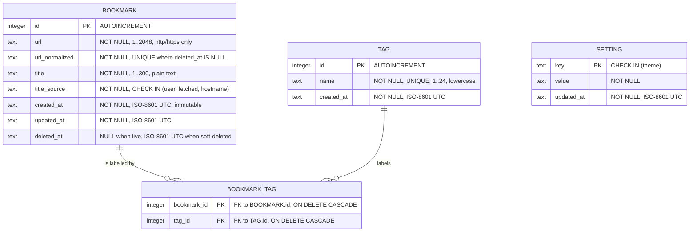

# ER Diagram

**Data model version:** 3 (must match `data-model.md`)
**Status:** approved (dev-1, 2026-10-01)

> AMD-001 changed no entity, field, key or relationship. Only this version pointer moved, to stay equal to `data-model.md`.
> AMD-002 likewise changed no entity, field, key or relationship — it reworded INV-02's trailing-slash rule, which is a service-layer derivation, not a schema object. Only this version pointer moved again.

## Notes

- **`BOOKMARK` 1 : 0..8 `BOOKMARK_TAG`.** The diagram shows `||--o{` (one to zero-or-many) because SQLite cannot express an upper row-count bound declaratively. The maximum of 8 tags per bookmark (R02, clarification C03) is enforced in the tag service; `data-model.md` §2 and INV-08 record that this is a boundary rule, not a schema constraint, so review looks in the right place.
- **`TAG` 1 : 0..N `BOOKMARK_TAG`.** A tag may legitimately have zero live links — `data-model.md` §1 explains why orphaned `tag` rows are kept rather than swept. EC17's "the tag disappears from the filter list" is produced by the tag-list query filtering on `b.deleted_at IS NULL`, not by deleting the row.
- **`BOOKMARK_TAG`** has the composite primary key `(bookmark_id, tag_id)`, shown as two `PK` fields. That key is what prevents the same tag being attached twice to one bookmark (EC14).
- **Cascade rules.** Both foreign keys are `ON DELETE CASCADE`, but under the soft-delete design (AD-04) a user-initiated delete is an `UPDATE` of `deleted_at`, so the cascade does **not** fire and the links survive for R13 Undo to restore. The cascade exists for genuine hard deletes (test teardown, NFR-01 seed reset). Cascades only work when `PRAGMA foreign_keys = ON` is set on every connection — SQLite defaults it off (INV-12).
- **Uniqueness on `url_normalized` is partial**, not absolute: `UNIQUE ... WHERE deleted_at IS NULL`. Two rows may share a normalized URL provided at most one of them is live. Without this, deleting a bookmark would permanently prevent re-adding the same URL.
- **`SETTING` is deliberately unrelated** to the other three entities. It holds exactly one row today (`theme`, from AD-05 / R12 / EC26). The `CHECK` on `key` is an allow-list so the table cannot become an open key-value write surface (S1, INV-11). This is why it stands alone in the diagram with no connector — the absence of a relationship is intentional, not an omission.
