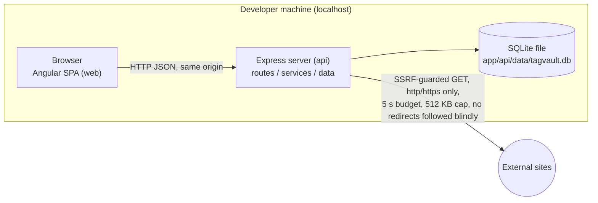
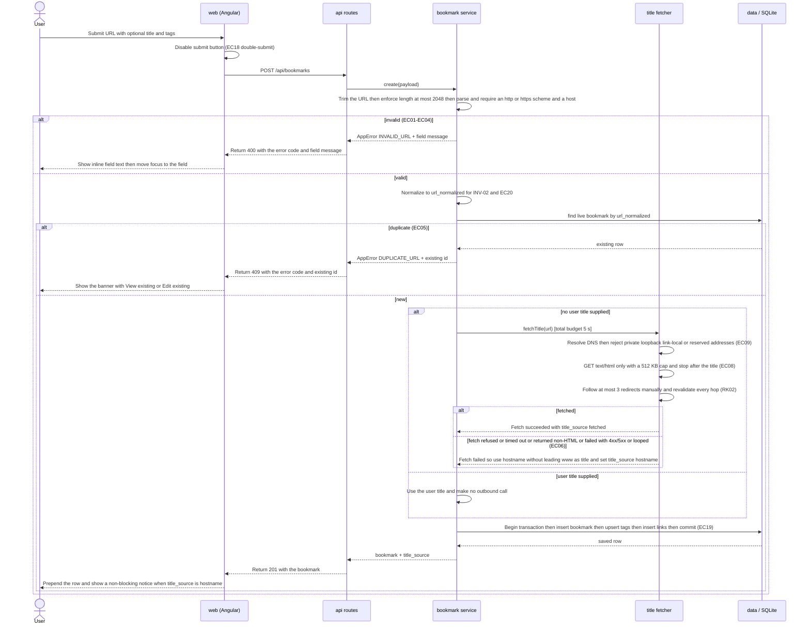
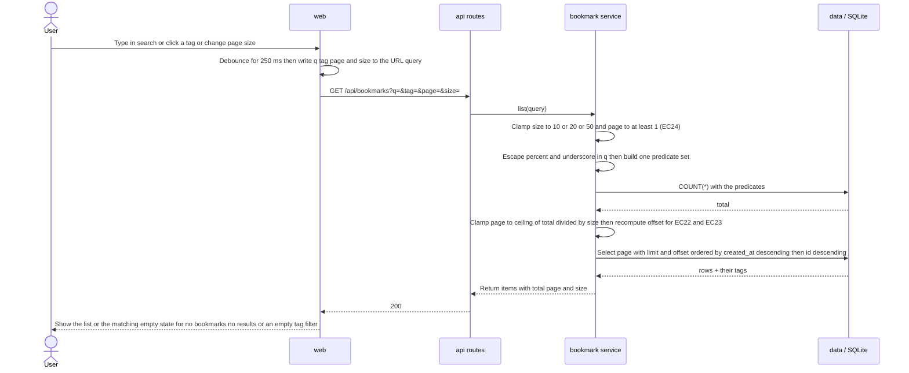
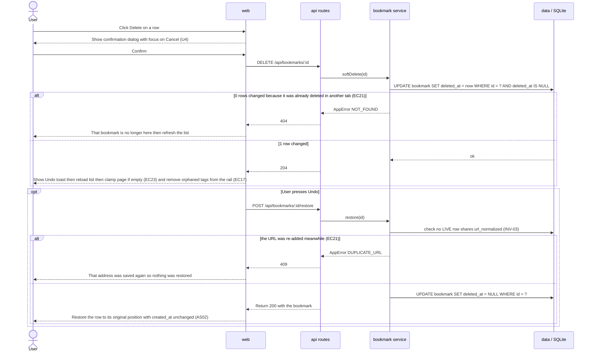
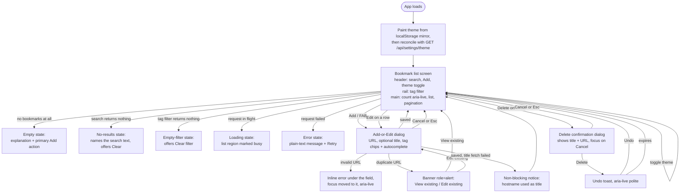

# High-Level Design (HLD)

**Version:** 4
**Status:** approved (dev-1, 2026-10-01); amended by AMD-001, AMD-002, AMD-003, AMD-004 (dev-1, 2026-10-01)
**Inputs:** constitution v1.0.0, product-spec v1, technology v1

> Shared artifact. Now that the architecture gate is approved, change only through `/amend-architecture`.

## 1. Context and Goals

TagVault is a personal bookmark manager that runs entirely on one developer machine. A user saves a web address, optionally with a title of their own; when they do not supply one, the server tries to retrieve the page title and falls back to the hostname if it cannot. Bookmarks carry up to eight tags, appear newest-first in a paginated list, and can be narrowed by tag or searched by title and address. They can be edited, deleted with a confirmation, and restored from a transient Undo. Everything survives stopping and restarting the application.

**Quality goals**, in the order they constrain the design:

| Goal | Driver | What it forces |
|---|---|---|
| Nothing leaves the machine except one guarded outbound fetch | NFR-04, S1, S2, RK02 | The title fetch is the single outbound call path and the single highest-risk component in the system. It gets its own module, its own probe suite, and a design that rejects addresses **after** DNS resolution and **before** the socket opens. |
| Answers in under half a second at 1,000 records | NFR-01, RK05 | Indexed ordering and an indexed tag join, `LIMIT`/`OFFSET` paging, and a measured run — not an estimate (Q6). |
| Nothing is lost on restart | NFR-02, A2, A5, EC19 | One embedded SQLite file, WAL journaling, and one transaction per logical write. |
| Every action reachable by keyboard, every error readable as text | NFR-03, U1–U5 | Labels, focus management and `aria-live` regions ported from the approved reference at `docs/mockup.html` (U6). |
| A title fetch never holds up a save for more than five seconds | NFR-05, EC06, EC08 | A hard total budget on the fetch, with a defined fallback rather than an error. |

## 2. Architecture Style

**A local client–server modular monolith**, split into two deployable components in one repository.

The `web` component is an Angular single-page application. The `api` component is an Express server that owns all business rules, all validation, all persistence, and the only outbound network call. For the demo and for the NFR measurement runs, `api` also serves the built `web` assets, so the whole application is one process on one port. During development `ng serve` runs separately and proxies API calls to `api`, which avoids a cross-origin setup entirely — there is no CORS middleware in this design, and that absence is deliberate.

There is no intermediate tier, no message broker, no cache and no background worker. See Alternatives, section 10 (AD-01, AD-03).



## 3. Component Map

> Human-readable copy. **`specs/architecture/component-map.json` is authoritative.**

| Component id | Type | Workspace root | Path | Responsibility |
|---|---|---|---|---|
| `api` | backend | `.` | `app/api` | JSON API for R01–R15. URL validation and normalization, SSRF-guarded title fetch, duplicate detection, tag normalization, search and filter queries, pagination, soft delete and restore, theme setting. Owns the SQLite file. Serves the built `web` assets from `app/api/public` for the demo and the NFR runs. |
| `web` | frontend | `.` | `app/web` | Angular 22 zoneless SPA. Bookmark list with pagination, search box, tag filter rail, add/edit dialog with tag chips and autocomplete, delete confirmation dialog, undo toast, theme toggle. All state in signals. `dependsOn: ["api"]`. |

## 4. Project Structure

`app/` sits at the **repository root**, as a sibling of `specs/` and `docs/` — not inside either of them. This matches `component-map.json`, where both components carry `workspaceRoot: "."` (the folder containing `specs/`) and paths `app/api` and `app/web`.

```
<repo root>/
├─ .github/
├─ docs/
├─ specs/
└─ app/
   ├─ api/                      component id: api  →  <repo root>/app/api
   │  ├─ src/
   │  │  ├─ server.js           entry point; start command `node src/server.js`
   │  │  ├─ app.js              Express app assembly, static assets, error middleware
   │  │  ├─ routes/             HTTP only: bookmarks, tags, settings, health
   │  │  ├─ services/           business rules: bookmark, tag, title-fetch, url-normalize, setting
   │  │  ├─ data/               db connection, schema bootstrap, repositories (all SQL lives here)
   │  │  └─ lib/                validation helpers, LIKE escaping, AppError, address-range checks
   │  ├─ test/                  Vitest specs, including the SSRF probe suite and the NFR-01 seed script
   │  ├─ data/                  tagvault.db  ← runtime data, git-ignored
   │  ├─ public/                ← GENERATED. Output of the web build. Git-ignored, never hand-edited.
   │  └─ package.json
   └─ web/                      component id: web  →  <repo root>/app/web
      ├─ src/app/
      │  ├─ core/               ApiService (HttpClient), models, error mapping
      │  ├─ state/              signal stores: bookmarks, tags, theme
      │  └─ features/           list, search, tag-filter, bookmark-form dialog,
      │                         delete-confirm dialog, undo toast, theme toggle, pagination
      ├─ src/styles.css         ported from docs/mockup.html
      └─ package.json
```

The three root folders `app/` shares the level with:

| Folder | Contents |
|---|---|
| `.github/` | prompts, skills, instructions, templates, seeds |
| `docs/` | the six assignment docs + `mockup.html` (UX reference) |
| `specs/` | constitution, product spec, backlog, technology, architecture, features, evidence — **specifications only, no application code** |

Two notes on the tree, so neither is mistaken for a constitution violation:

- **`app/api/public/` is build output, not source.** `npx ng build` in `web` writes there so that a single Express process can serve the whole app. No file in it is authored by hand; it is git-ignored. This is the one place where one component's command writes into another's folder, and it is declared here rather than discovered during `/build-feature`.
- **`app/api/data/` holds user data**, is created on startup, and is git-ignored. D1 forbids committing anything but synthetic data.

## 5. Layers and Responsibilities

Decided in AD-01. The "Must not" column is the maintainability check for `/review-phase`.

| Layer | Responsibility | Must not |
|---|---|---|
| Routes / controllers (`api/src/routes`) | Parse the request, call one service, map the result to a status code and JSON body. Translate `AppError` codes to HTTP status. | Must not contain SQL. Must not contain a business rule (no duplicate checks, no tag limits, no normalization). Must not call the title fetcher directly. Must not build an `ORDER BY` or a `LIMIT` from request data. |
| Services (`api/src/services`) | All business rules: validate and normalize the URL, decide the title and its source, enforce the duplicate rule and the 8-tag limit, normalize tags, clamp page and size, orchestrate the transaction, decide soft delete vs restore. **This is the layer Q4's ≥80% coverage is measured on.** | Must not reference `req` or `res`. Must not write SQL strings. Must not format HTML or user-facing markup. |
| Data access (`api/src/data`) | Own the connection and the pragmas, bootstrap the schema, and expose repository functions that run **prepared statements only**. Own transaction boundaries when handed a unit of work. | Must not contain a business rule. Must not concatenate values into SQL — every value is a bound parameter (S4). Must not return raw row objects shaped by the schema to the routes without passing through a service. |
| UI / views (`web/src/app`) | Render state, capture input, manage focus, present empty / loading / error / no-results states, and show the messages the API supplies. | Must not be the only place validation happens — every client check is duplicated server-side (S1). Must not use `[innerHTML]` with any value that originated from a user or a fetched page (S3, TD-03). Must not hold UI-driving state outside a signal (TD-09 zoneless: a plain field assignment renders nothing). Must not construct an `href` from a URL that has not passed the scheme check. |

## 6. Key Flows

### 6.1 Add a bookmark, with the guarded title fetch (R01, R09, R10, EC01–EC09, EC18, NFR-04, NFR-05)



The fetch is **synchronous inside the request** (AD-03). The 5 s budget NFR-05 measures is therefore one timer on one call path, and the client learns from `title_source` in the same response whether the fallback was used — no second round trip, no background job, no row that can be stranded mid-update by a restart.

### 6.2 List, search, filter, paginate (R03, R04, R05, R15, EC11, EC12, EC13, EC22, EC24)



The count query and the page query are built from the **same** predicate set (AD-07). Building them separately is the defect this design is written to prevent: `total` would disagree with the rows and the page clamp would be wrong.

### 6.3 Edit (R06, R09, R10, EC16)

Identical to 6.1's validation and normalization path, reusing the same service functions, with two differences: the duplicate lookup excludes the record's own id (`AND id <> ?`, INV-04), and `created_at` is never rewritten, so the bookmark keeps its place in the newest-first order (AS02, AS03, INV-10). Tags are replaced as a set inside the same transaction. If no user title is supplied and the URL changed, the title fetch runs exactly as in 6.1.

### 6.4 Delete and undo (R07, R13, U4, EC17, EC21, EC23)



Soft delete (AD-04) is what makes the restored bookmark return to its **original** position rather than jumping to the top, and what makes the tags come back with it (INV-09). The restore path re-checks the duplicate invariant, because the window between delete and undo is exactly when another tab could re-add the same URL.

### 6.5 Tag autocomplete and theme (R14, R12, EC25, EC26)

Autocomplete: as the user types in the tag field, `web` queries `GET /api/tags?prefix=` (debounced). The service runs an indexed prefix match `name LIKE ? || '%'` against the `tag` table — no bookmark rows are read. With no tags stored the result is an empty array and the suggestion list simply renders nothing (EC25).

Theme (AD-05): the authoritative value is the `setting` row with key `theme`, read by `GET /api/settings/theme` on load and written by `PUT` on toggle, so the preference survives a browser-profile wipe as well as an app restart (EC26). To avoid the app painting light and then flipping when the response arrives, `web` also writes a **non-authoritative mirror** to `localStorage`, read synchronously to paint the first frame and overwritten by the server value as soon as it arrives. The mirror is a render hint only; it is never the source of truth and the app is fully correct if it is absent or stale. Constitution §10's exclusion of `localStorage` as a *persistence mechanism* is therefore respected — see §11 and the clarification A03 in §12.

## 7. UI / User Flow (screens)

One screen with two modal dialogs and two transient regions, ported from the approved reference at `docs/mockup.html` (U6).



**States every view must implement** (U3): empty, loading, error, and — for search and filter — no-results. The reference already demonstrates empty, invalid-address, duplicate and title-fetch-failure states through its demo controls; those are the visual contract.

**Keyboard and focus contract** (U1, U2, NFR-03), carried from the reference:

- Every control is a real `<button>`, `<input>` or `<a>`; every input has a `<label for>` (the search input uses a visually-hidden label, as the reference does).
- Both dialogs are `<dialog>` elements: focus moves in on open, is trapped while open, `Esc` closes, and focus returns to the control that opened them. The delete dialog focuses **Cancel**, not Delete (U4).
- The result count, the inline field error, the title-fetch notice and the undo toast all live in `aria-live` regions, so their content is announced as text rather than signalled by colour alone (U2, U5).
- Tag chips carry an accessible name that includes the tag ("Remove tag research"), because "×" alone is not a label.

**U6 deviations — declared, with reasons.** Both are additions the reference does not cover; neither changes its layout, states or copy.

| Deviation | Reason |
|---|---|
| A pagination control (page-size selector 10 / 20 / 50, plus page navigation) is added below the list. | R15 requires it and the reference has no counterpart. It is styled to match the reference's button and chip treatment, and the page size is a fixed set of constants in code, not configuration (C05). |
| The footer text "Bookmarks are stored in this browser only" and the "Reset demo data" control are dropped. | Both are artefacts of the reference's `localStorage` mockup. Constitution U6 states the reference's storage mechanism is not binding, and the statement would be false in the real application. |

## 8. Cross-Cutting Concerns

### Validation strategy

Validation happens **at the API boundary, in the service layer**, and is the only validation that counts. The Angular form repeats the cheap checks (non-empty, obvious scheme) purely so the user gets feedback without a round trip; nothing in `api` trusts anything `web` sends, because the API is reachable directly with `curl` (S1).

Order of checks for a URL, stopping at the first failure so the message is specific: trim → non-empty (EC01) → length ≤ 2048 (EC04) → parses as a URL → scheme ∈ {`http`, `https`} (EC02, EC03) → hostname present **and contains a dot** (rejects `localhost`, `intranet` and other single-label names before the fetcher is reached — F01-EC1) → normalize (EC20) → duplicate lookup (EC05, EC16). Tags: split → trim → drop empties (EC15) → lowercase → dedupe (EC14) → length 1–24 → character allow-list → at most 8 (C03). Query parameters: `size` clamped to the `{10, 20, 50}` allow-list, `page` clamped to `[1, maxPage]`, `q` trimmed and capped at 200 characters, `tag` normalized like any tag (EC24).

### Error handling strategy

One internal error type, `AppError { code, message, field?, status, details? }`, thrown by services and translated by a single Express error middleware. Every response body for a failure has the same shape:

```json
{ "error": { "code": "DUPLICATE_URL", "message": "You already saved this address.", "field": "url", "existingId": 42 } }
```

| Code | HTTP | User-facing message (text, never colour alone — U5) | Cases |
|---|---|---|---|
| `INVALID_URL` | 400 | "Enter a web address to save." / "Enter a web address starting with http:// or https://." / "That web address is too long (limit 2,048 characters)." | EC01, EC02, EC03, EC04, F01-EC1 |
| `DUPLICATE_URL` | 409 | "You already saved this address." with *View existing* and *Edit existing* | EC05, EC16, and the restore race in 6.4 |
| `INVALID_TAG` | 400 | "Tags can be up to 24 characters." / "You can add up to 8 tags." | EC15, C03 |
| `INVALID_THEME` | 400 | 'Theme must be "light" or "dark".' | F08-AC6, F08-EC2 (AMD-004) |
| `NOT_FOUND` | 404 | "That bookmark is no longer here." | EC21, editing or deleting a removed row |
| `EDIT_CONFLICT` | 409 | "This bookmark changed in another tab. Reload to see the latest, then try again." | F06-AC11, EC21 (AMD-003) |
| `STORAGE_ERROR` | 500 | "TagVault could not save that. Your other bookmarks are safe — try again." | database failure |
| *(not an error)* | 201 | "Couldn't fetch the title, so we used the domain instead. You can edit it anytime." | EC06, EC08, EC09, F01-EC3 — the fetch failing is **never** an error response; the bookmark is saved and the notice is informational. Wording is the exact string from `docs/mockup.html` (U6, AMD-001) |

Three rules this table encodes. A failed title fetch is not a failure of the request (R01 as clarified in C01). Every message says what happened and what to do next, and no stack trace, SQL fragment, internal identifier or raw exception text ever reaches the client (U5) — the full detail goes to the server console only. And the empty states (EC10, EC11, EC13) are not errors at all: they are ordinary successful responses with zero items, rendered as their own states (U3).

### Security design (trust boundaries)

| Untrusted input | Entry point | Validation | Escaping/Restriction |
|---|---|---|---|
| Submitted URL | `POST /api/bookmarks`, `PUT /api/bookmarks/:id` (also typed into the Angular form) | trim → non-empty → ≤ 2048 → parse → scheme ∈ {http, https} → hostname required, **must contain a dot** → normalize (INV-02). Rejected before any outbound call is considered (S1, EC03, F01-EC1) — the dot rule removes every single-label name, which by definition resolves only on this machine or this LAN, before the resolver is consulted at all (AMD-001, RK02). | Stored as text and bound as a parameter (S4). Rendered in `href` **only after** the scheme check, so a `javascript:` value can never become a live link (S3). Displayed through Angular interpolation, never `[innerHTML]`. |
| Fetched page title | `api/src/services` title fetcher, over the network | SSRF guard before connecting: resolve the hostname and reject if **any** resolved address is private, loopback, link-local, unspecified, multicast or reserved — IPv4 `0/8, 10/8, 100.64/10, 127/8, 169.254/16, 172.16/12, 192.168/16, 224/4, 240/4`; IPv6 `::1, ::, fc00::/7, fe80::/10` and IPv4-mapped forms; the literal `localhost`. Connect to the **validated address** via a custom `lookup` so there is no DNS-rebinding window (TD-05). `Content-Type: text/html` only. Redirects followed manually, at most 3, **re-running the whole check on every hop** (RK02). No cookies, no credentials, fixed honest User-Agent. Total budget 5 s, read cap 512 KB, stop reading after `</title>` (S2, EC08, EC09, NFR-05). | Decode entities, collapse whitespace, truncate to 300, store as **plain text** — never as HTML. Escaped on output by Angular interpolation, so `<script>` in a title is inert (S3, EC07). |
| User-supplied title | `POST`/`PUT` body, add/edit form | trim → ≤ 140 at the boundary (INV-05) → plain text | Bound parameter; escaped on output (S3). |
| Submitted `updatedAt` (edit-conflict token) | `PUT /api/bookmarks/:id` | compared by exact string equality against the stored row's `updated_at`; missing or mismatched value is rejected, never coerced or defaulted | The comparison and the decision happen server-side only — the client's claim is never trusted to assert a conflict was resolved (S1); bound parameter, no new storage (AMD-003). |
| Tags | `POST`/`PUT` body, tag chips input | split → trim → drop empties → lowercase → dedupe → 1–24 characters → allow-list of letters, digits, `-`, `_`, space → at most 8 (EC14, EC15, C03) | Bound parameter; escaped on output, including inside the chip's `aria-label` (S3). |
| Search text | `GET /api/bookmarks?q=` | trim → ≤ 200 characters | **Bound parameter, never concatenated.** `%`, `_` and `\` escaped with `\` before binding, statement carries `ESCAPE '\'` (S6, EC12). Echoed back into the no-results message through interpolation, so `<script>` in a query is inert. |
| Tag filter value | `GET /api/bookmarks?tag=` | normalized exactly like a tag on input | Bound parameter; equality match, not a pattern. |
| `page` / `size` query parameters | `GET /api/bookmarks` | `size` must be one of `{10, 20, 50}` or it falls back to 20; `page` coerced to an integer ≥ 1 and clamped to the last page. Never an error, never "return everything" (EC24, S1). | Injected into `LIMIT`/`OFFSET` as **bound integers**, never string-interpolated. `ORDER BY` is a fixed constant and is never built from input. |
| `setting` key and value | `PUT /api/settings/:key` | `key` must be in the allow-list `{theme}` (INV-11); `theme` value must be `light` or `dark`. | Bound parameters. The `CHECK` constraint is a second line of defence at the data level. |

Two further controls apply across the whole surface. A `Content-Security-Policy: default-src 'self'; script-src 'self'; object-src 'none'; base-uri 'none'` header is set on the served application, so even a successful injection has no script origin to load from. And `[innerHTML]` with any user or fetched value is prohibited outright in `web` — carried forward as a `/review-phase` lens, because TD-03 moved S3's guarantee from server-side template escaping onto Angular's default interpolation.

### Dependency safety

Exact versions pinned and lockfiles committed, per `technology.md` §4. `npm audit --omit=dev` is run per component during `/review-phase` and the **actual** output recorded (S5). Two known traps are already documented and carried forward: TypeScript must be `~6.0` because npm's `latest` is 7.0.2, which `@angular/build` 22.2.0 rejects (RK07); and `better-sqlite3` is a native module whose Windows prebuild is unverified until the first install, with `node:sqlite` as the documented fallback (RK06). No dependency is added for anything the standard library covers — which is why the outbound fetch and the title parse add none at all.

## 9. Meeting the NFRs

| NFR | Design approach (indexes, pagination, persistence, a11y) |
|---|---|
| **NFR-01** Search and tag filter < 500 ms, list page < 1 s, at 1,000 bookmarks | `ix_bookmark_list (deleted_at, created_at DESC, id DESC)` serves the newest-first ordering and the soft-delete predicate from the index. `ix_bookmark_tag_lookup (tag_id, bookmark_id)` makes the R04 filter an indexed join. `LIMIT`/`OFFSET` means at most 50 rows are materialized per request regardless of total size (R15). SQLite is read in-process, so there is no network or IPC hop. **Known and accepted cost:** the `LIKE '%…%'` search (AD-06) cannot use an index and scans the live rows, and the `COUNT(*)` (AD-07) is a second pass. Both are deliberate at this volume and both are inside the measured path. Per Q6 and RK05 this is **measured** at 1,000 seeded records in `/test-phase`, with the observed median and maximum recorded — never estimated. |
| **NFR-02** 100% of bookmarks and tags present after restart, no partial writes | One embedded SQLite file at `app/api/data/tagvault.db`, reopened on start (A2, A5). `PRAGMA journal_mode = WAL`, `synchronous = NORMAL`. Every logical write — bookmark plus its tag links, edit plus link replacement, restore — is one `better-sqlite3` transaction, so a crash mid-write rolls back whole (EC19). Schema bootstrap is idempotent and runs inside a transaction before the listener opens. Verified by saving a known synthetic set, stopping, restarting and comparing the full list. |
| **NFR-03** Keyboard-operable with visible focus, labelled inputs, errors as text | Native `<button>` / `<input>` / `<a>` throughout; no `div` acting as a control. Every input has a `<label for>`. Both dialogs are `<dialog>` with focus trapping, `Esc` to close, and focus returned to the opener; the delete dialog focuses Cancel. A visible focus indicator is kept in the ported stylesheet — never removed by an `outline: none` without a replacement. The count, field errors, the title-fetch notice and the undo toast sit in `aria-live` regions so they are announced as text (U2, U5). The new pagination control (the R15 U6 deviation) is included in the keyboard walkthrough, as RK04 requires. Verified by a keyboard-only walkthrough of every flow plus a label and role audit, recorded pass/fail per flow. |
| **NFR-04** 0 non-http(s) URLs accepted, 0 fetches to private addresses, everything escaped, all queries parameterized | The §8 trust-boundary table is the design. Scheme allow-list before anything else; the SSRF guard resolves DNS and validates every address, connects to the validated address through a custom `lookup`, and re-validates each of at most 3 manual redirect hops (S2, RK02). Output escaping rests on Angular interpolation with `[innerHTML]` prohibited, plus the CSP header (S3). Every statement is prepared with bound parameters, and `LIKE` input is escaped with an explicit `ESCAPE` clause (S4, S6). Verified by the probe list in `product-spec` §4 — `javascript:`, `file:`, `ftp:`, scheme-less, `127.0.0.1`, `10.x`, `192.168.x`, `169.254.169.254`, `[::1]`, a stubbed redirect to a private address, a `<script>` title, and search text containing `%`, `_`, quotes and `<script>` — each recording its observed result. |
| **NFR-05** A title fetch never blocks a save for more than 5 s | One hard total budget across DNS resolution, connection, response and read, enforced by the fetcher, not by the caller's patience (AD-03 keeps this on a single synchronous path so there is exactly one timer to get right). Read capped at 512 KB and abandoned after `</title>`, so a huge page cannot consume the budget (EC08). Every failure path — refusal, timeout, non-HTML, 4xx/5xx, redirect loop — returns `{ ok: false, reason }`, and the bookmark is saved with the hostname (EC06). Verified by pointing the add form at a deliberately unresponsive endpoint and timing submit → saved confirmation. |

## 10. Alternatives and Trade-offs (architecture level)

Every decision below was presented with at least two genuine options and a challenge ("what breaks at 1,000 records, on fetch failure, on restart, with keyboard-only use?"), and **chosen by dev-1 on 2026-09-30**. Full option tables were put to the human in the `/architecture` clarification rounds; the essentials are preserved here.

### AD-01 Layering inside the `api` component

| Option | Pros | Cons |
|---|---|---|
| **A: Routes → Services → Data access** | The duplicate rule (R10) and tag normalization (R02) live once and are reused by F01 and F06, so EC05 and EC16 cannot drift apart. Services are plain functions over repositories, which is exactly the surface Q4's ≥80% measurement needs. | One extra hop per call; three folders instead of one. |
| B: Routes with inline SQL | Fewest files. | F06 must re-implement F01's validate/normalize/duplicate logic. S4's "every query parameterized" becomes a per-file audit. **No business-logic layer exists for Q4 to measure.** |
| C: Repository + use-case + domain entity (ports/adapters) | Maximum substitutability. | Interfaces and mappers for one SQLite file that will never be swapped — abstraction the requirements do not ask for (P4). |

**Decision:** A (dev-1, 2026-09-30).
**Trade-off:** one more indirection than the smallest possible codebase, accepted because Q4 requires a *measured* ≥80% on business logic and option B leaves nothing separable to measure.

### AD-02 Tag storage

| Option | Pros | Cons |
|---|---|---|
| **A: `tag` table + `bookmark_tag` join** | R04 is an indexed join; R14 autocomplete is an indexed prefix match on `tag` alone; EC14 merging and EC17 orphan detection fall out of the schema. Tag text is a bound parameter everywhere. | Three tables and one join. |
| B: Delimited text column (`,work,css,`) | One table. | R04 becomes `LIKE '%,css,%'` — unindexable, a full scan at 1,000 rows against NFR-01. A tag containing `,` corrupts the row. Mixing user text into a `LIKE` pattern collides with S6. |
| C: JSON array column + `json_each()` | One table; SQLite JSON1 is built in. | The R04 filter expands rows at query time and cannot use an index; R14 still needs a distinct pass over every bookmark; no uniqueness guarantee on tag names. |

**Decision:** A (dev-1, 2026-09-30).
**Trade-off:** two extra tables and a join, accepted because A is the only option where R04 and R14 are index-backed at NFR-01's 1,000-record volume — and RK05 says that volume is where the number is actually measured.

### AD-03 Title-fetch timing

| Option | Pros | Cons |
|---|---|---|
| **A: Synchronous inside the create request, hard 5 s budget, hostname fallback** | NFR-05's measured interval is the real user-visible wait. One timer, one call path, one place for the EC06 fallback. `title_source` returns in the same response, so the notice needs no second round trip. | The user waits up to 5 s in the worst case. |
| B: Save immediately, fetch in the background, update the row, client polls | The save feels instant. | Needs a job record, a status field and a polling or SSE channel. NFR-05 would be satisfied on a technicality while the user still waits for the title. Adds a second race window to EC18 and EC21, and a restart can strand a row mid-job. |
| C: Fetch the title in the browser before POSTing | No server-side fetch at all. | **Disqualified:** cross-origin `fetch` is blocked for most sites, so the title would usually be missing — and the SSRF guard would run in the browser, which can reach `127.0.0.1` and the LAN and is trivially bypassed by calling the API directly. S1 and S2 cannot hold. |

**Decision:** A (dev-1, 2026-09-30).
**Trade-off:** a worst-case 5 s wait on save, accepted because it is the interval NFR-05 actually measures and because it keeps the highest-risk component (RK02) on one synchronous, probe-testable path rather than spread across a background job.

### AD-04 Delete safeguard and undo

| Option | Pros | Cons |
|---|---|---|
| A: Hard `DELETE`; client re-`POST`s the record on Undo | No schema change. | The restored row gets a new id and a new `created_at`, so it **jumps to the top** of the newest-first order — contradicting AS02/AS03. A crash while the toast is showing destroys the record permanently. |
| **B: Soft delete (`deleted_at`) + `POST /:id/restore`** | Restore returns the same row with its original `created_at`, so ordering is preserved (AS02, AS03), and the tag links come back with it. EC17 and EC23 reuse the same predicate. Restore is an id-scoped server operation, not a client replay of user data. | Every read carries `deleted_at IS NULL`, and the uniqueness index must be made partial so a deleted URL can be re-added. |
| C: Hard delete + a `trash` table with a TTL | Same user-visible outcome as B. | A second table, a copy of the tag links, and a sweeper to maintain (P4). |

**Decision:** B (dev-1, 2026-09-30).
**Trade-off:** one extra predicate on every read and a partial unique index, accepted because B is the only option where Undo restores the bookmark to its **original position**, which AS02 and AS03 already fix as confirmed behaviour. The challenge round surfaced two consequences that are now design constraints rather than latent bugs: `deleted_at` leads `ix_bookmark_list` so the predicate is index-satisfied, and `ux_bookmark_url_live` is partial so a soft-deleted row cannot permanently block re-adding its URL.

### AD-05 Where the dark-mode preference lives

| Option | Pros | Cons |
|---|---|---|
| **A: `setting` table in SQLite + `GET`/`PUT /api/settings/theme`** | Survives a browser-profile wipe, so it satisfies constitution §10 as literally worded, with no amendment needed. Restart-tested the same way as NFR-02. | One table, two routes, one extra request at load — and a visible theme flash unless mitigated. |
| B: `localStorage`, as the reference mockup does | One line, no round trip, no flash. | Constitution §10 states `localStorage` is "explicitly not an acceptable persistence mechanism", worded generally rather than scoped to bookmarks. Choosing it as the store would need a §10 clarification. |
| C: A `theme` cookie read server-side | Available before first paint. | Still browser-profile-scoped, so it does not actually answer §10, and it adds a cookie the application otherwise has no use for. |

**Decision:** A, plus an explicitly-approved mitigation (dev-1, 2026-09-30).
**Trade-off:** an extra request at load, and a theme flash that has to be handled. The human accepted the mitigation: `localStorage` holds a **non-authoritative mirror** used only to paint the first frame, overwritten by the server value on arrival. The SQLite `setting` row remains the single source of truth, and the application is fully correct if the mirror is missing or stale — so `localStorage` is a render hint here, not a persistence mechanism, and §10 is respected rather than reinterpreted (clarification A03).

### AD-06 Search mechanism

| Option | Pros | Cons |
|---|---|---|
| **A: `LIKE '%'‖?‖'%' ESCAPE '\'` on `title` and `url`, bound parameter** | S6 is satisfied by construction: the value is a bound parameter and `%`/`_` are escaped before binding, so EC12's probe characters are literal text. Substring matching is what R05 plainly means. | A leading wildcard cannot use an index, so this scans the live rows. |
| B: FTS5 virtual table + sync triggers | Fast at volumes this project never reaches. | Token-based, so a mid-word search returns nothing — a behaviour regression against R05. The search string becomes an FTS *query expression* where `"`, `*`, `:`, `-`, `OR`, `NOT` are operators, so EC12 needs a bespoke quoting layer. The trigger-sync path is a second consistency surface for NFR-02. URLs tokenize badly, so `LIKE` would still be needed for the URL column. |
| C: Load all rows and filter in JavaScript | Simple code. | Reads every row to return 20; abandons pagination at the query level. |

**Decision:** A (dev-1, 2026-09-30).
**Trade-off:** an unindexed scan of the live rows on every search, accepted at the 1,000-record volume this specification fixes — and explicitly placed inside the NFR-01 measurement so RK05 is settled by a number rather than by this paragraph. A is also the only option where S6 is satisfied by a bound parameter and one `ESCAPE` clause instead of a hand-written query-syntax quoter, which matters because RK02-style hand-written security code is where defects live.

### AD-07 Pagination and total count

| Option | Pros | Cons |
|---|---|---|
| **A: `COUNT(*)` with the same predicates, then the page with `LIMIT`/`OFFSET`** | Returns `total`, which the reference's `aria-live` count region needs and which makes EC23 a computed clamp rather than a guess. EC22 and EC24 both need `total` to clamp correctly. A stable announced total is what a screen-reader user hears after filtering (NFR-03). | A second scan per request. Both queries must share one predicate builder or the count lies. |
| B: Fetch `size + 1` rows and infer `hasNext` | One query. | No total, so the count region has nothing to show and no page-number list is possible. EC23 degrades to a visible empty page followed by a correction. |
| C: Cached or estimated count | Avoids the second scan. | Invalidation on every write including restore; a stale count mis-clamps the page (P4). |

**Decision:** A (dev-1, 2026-09-30).
**Trade-off:** a second query per list request, accepted because `total` is load-bearing for the count region (U6), for EC22, EC23 and EC24, and for the NFR-03 announcement. The shared predicate builder is recorded as a design constraint in §6.2 precisely because building the two queries separately is the defect this choice invites.

## 11. Constitution Compliance

| Clause | How complied |
|---|---|
| P1 spec before code | No code exists. This HLD and the feature LLDs precede every line of it. |
| P2 human approval gates | Seven AD decisions were put to dev-1 as option tables and chosen by them; the architecture gate was approved by dev-1 on 2026-10-01, and this artifact now changes only through `/amend-architecture`. |
| P3 honesty over polish | Nothing here is claimed as verified. RK05 (search performance) and RK06 (`better-sqlite3` prebuild) are named as open and unmeasured in §9 and §8. No command has been run. |
| P4 simplicity first | No cache, no broker, no background worker, no ORM, no migration framework, no ports-and-adapters layer, no FTS index, no CORS middleware. Options C in AD-01, AD-04 and AD-07 were rejected on exactly this ground. |
| P5 incremental delivery | The layering in §5 lets F01–F08 be built one at a time against a running app; the backlog dependency order is unchanged. |
| P6 single source of truth | `component-map.json` is authoritative and §3 is a copy of it. `data-model.md` and `er-diagram.md` are both at version 1. Technology facts are referenced, not restated. |
| P7 measurable requirements | §9 gives every NFR a concrete mechanism and names the measurement, rather than asserting an outcome. |
| Q1 every AC testable | Each flow in §6 corresponds to acceptance criteria the feature specs will map to tests. |
| Q2 tests executed | No test result is recorded here. |
| Q3 zero lint and build errors | Commands are declared per component in `component-map.json`, copied from `technology.md` §3. |
| Q4 ≥80% coverage on business logic | AD-01 exists so a separable service layer is there to measure; §5 names it as the measured layer. |
| Q5 no open Critical/High findings | Review lenses are carried in `technology.md` §10 and reinforced by §5's "Must not" column and §8's prohibitions. |
| Q6 measured NFR verification | §9 states for NFR-01 that the number is measured at 1,000 seeded records and never estimated, and §6 of `data-model.md` defines the seed. |
| S1 boundary validation | §8 validation strategy: the API boundary is the only validation that counts; the client repeats checks for UX only. Includes `page`, `size` and the `setting` key (EC24, INV-11). |
| S2 SSRF-guarded fetch | §8 trust-boundary row 2: full address-range rejection after DNS resolution, connection to the validated address through a custom `lookup`, manual redirects re-validated per hop, 5 s budget, 512 KB cap, `text/html` only, no credentials. |
| S3 output escaping | Angular interpolation only; `[innerHTML]` with user or fetched data prohibited in §5 and §8; `href` built only after the scheme check; CSP header set. |
| S4 parameterized queries | §5 forbids SQL outside the data layer and forbids concatenating values; `LIMIT`/`OFFSET` are bound integers and `ORDER BY` is a constant. |
| S5 no secrets, pinned and audited dependencies | No secret exists in this design. Pinning, lockfiles and `npm audit --omit=dev` per component, per `technology.md` §4. |
| S6 search text is data | `LIKE` with `ESCAPE '\'`, `%`/`_`/`\` escaped before binding, value never concatenated, echoed query escaped on output (AD-06, EC12). |
| U1 keyboard-operable, visible focus | §7 keyboard contract: native controls, dialog focus trapping, `Esc` to close, focus returned, focus indicator preserved. |
| U2 labelled controls, errors not by colour alone | Every input has a `<label for>`; errors and notices are text in `aria-live` regions. |
| U3 empty, loading, error states | §7 names empty, loading, error and no-results states for the list, search and tag filter (EC10, EC11, EC13). |
| U4 destructive actions confirmed or undoable | Both: a confirmation dialog focused on Cancel, **and** an Undo toast backed by the soft delete of AD-04. |
| U5 actionable errors, no internals | §8 error table gives every code a plain-language message saying what to do next; stack traces and SQL stay on the server console. |
| U6 approved UX reference | Layout, states, copy and interaction patterns are ported from `docs/mockup.html`. Two deviations are declared with reasons in §7 (the R15 pagination control; the removal of the `localStorage` footer text). Conformance is a review obligation, as TD-03 recorded. |
| A1 local, browser UI, no paid or external service | One Express process on localhost plus a file. The only outbound traffic is the guarded title fetch. |
| A2 data persists across restarts | SQLite file reopened on start; WAL journaling; §9 NFR-02. |
| A3 runnable on Windows through evaluation | Node v24.18.0 is installed; no provisioning beyond `npm ci`; `better-sqlite3`'s native prebuild remains the open RK06. |
| A4 code only in declared paths | Two components, `app/api` and `app/web`, both declared in `component-map.json`. §4 flags `app/api/public` as generated build output so it is not mistaken for undeclared source. |
| A5 embedded, file-based persistence | `better-sqlite3` reads the file in-process. No database server, no container. The theme preference lives in that same file (AD-05), not in the browser. |
| D1 synthetic data only | Every example and every seed record uses `example.com` / `example.org`. The `data/` folder is git-ignored. |
| D2 free or open-source licensing | Every dependency is MIT except TypeScript (Apache-2.0); recorded in `technology.md` §5. |
| D3 no copied proprietary code | No code exists yet. The Express 5-versus-4 idiom trap is already recorded as a review lens for copy-pasted snippets. |
| E1 evidence format | `E-design-002` is drafted for this run using the standard template. |
| E2 docs headings and counts | The rollup into `docs/02-design.md` fills Data Model, UI / User Flow, Error Handling, Security Design, Meeting the NFRs and Alternatives & Trade-offs without changing the mandatory headings. |
| E3 no artifact disagrees | §3 mirrors `component-map.json`; `data-model.md` and `er-diagram.md` are both version 1; the backlog's *Components affected* is filled from the same ids. `/sync-check` before the rollup commit. |

## 12. Clarifications

| Q-ID | Question | Answer (human) | Date | Affects |
|---|---|---|---|---|
| A01 | Repository layout, component granularity, ports and data-file location, dev-time serving, and pagination state — five context questions, each with a recommended default. | "A01. Accpet recommendation of monorepo / A02. Accpet recommendation / A03. Accpet recommendation / A04. Accpet recommendation / A05. Accpet recommendation" | 2026-09-30 | §3, §4, `component-map.json`, §6.2 |
| A02 | AD-01 through AD-05: layering, tag storage, title-fetch timing, delete safeguard, theme storage. | "AD-01. Accpet recommendation / AD-02. Accpet recommendation / Ad-03. Accpet recommendation / AD-04. Accpet recommendation / AD-05. Accpet recommendation" | 2026-09-30 | §10, §5, §6, `data-model.md` |
| A03 | AD-05 puts the theme in SQLite, which causes a visible flash on load. Accept the flash, or add a non-authoritative `localStorage` mirror read only to paint the first frame? | "Accepted the approach for removing the flips when theme changes" | 2026-09-30 | §6.5, AD-05, §11 U6/A2 rows |
| A04 | AD-06 (search mechanism) and AD-07 (pagination and total count). | "AD-06. Accpet recommendation / AD-07. Accpet recommendation" | 2026-09-30 | §10, §6.2, `data-model.md` §3 |
| A05 | Three gaps resolved in the preview without objection: R15 has no counterpart in the reference mockup; R10's *View existing* has no screen to navigate to; the title length is 140 in the mockup but 300 in the security guidance. | Approved implicitly by replying `Go` to the execution preview that stated all three resolutions. | 2026-09-30 | §7 U6 deviations, §6.4, `data-model.md` INV-05 |

## 13. Change Log

| Version | Date | Change | Why | AMD |
|---|---|---|---|---|
| 1 | 2026-09-30 | Initial high-level design: two components (`api`, `web`), three-layer API, join-table tags, synchronous guarded title fetch, soft delete with restore, SQLite-backed theme setting with a non-authoritative render mirror, `LIKE`-based search, `COUNT(*)` pagination | `/architecture` CREATE mode; AD-01…AD-07 all chosen by dev-1 on 2026-09-30 | — |
| 2 | 2026-10-01 | §8 URL validation order and the §8 trust-boundary row now require the hostname to contain a dot (F01-EC1); `INVALID_URL` gains F01-EC1 with no new message; the 201 fetch-failure notice becomes the exact `docs/mockup.html` string and gains F01-EC3; §6.1's fallback strips a leading `www.` | Resolves three disagreements between `docs/mockup.html` (U6) and this file that `/plan-phase F01-add-bookmark` surfaced; strengthens S1/S2 by removing a class of SSRF target before the resolver runs (RK02) | AMD-001 |
