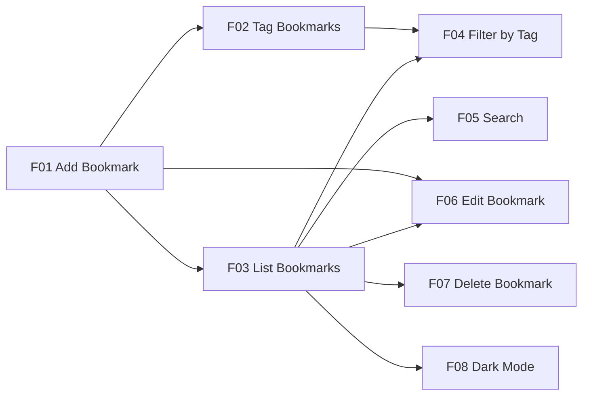

# Product Specification

**Project:** TagVault
**Version:** 1
**Status:** approved
**Approved:** 2026-09-30 by dev-1
**Constitution version:** 1.0.0

## 1. Problem Understanding

- **Problem:** Links worth keeping get scattered across browser bookmark bars, chat messages to oneself, and open tabs. Browser folders force a single location per link, so a page that is both a CSS reference and an accessibility reference has to go in one folder or the other. There is no way to attach several labels to one link and then narrow a long list down to the few that matter.
- **Target user:** *Priya*, a self-taught developer (synthetic persona). She saves five to ten reference links on a busy day — documentation, recipes, design inspiration — and comes back to them weeks later remembering a word from the title but not the site. She works on one machine and does not want an account, a subscription, or a sync service.
- **Value delivered:** One local list of bookmarks, each carrying as many tags as it needs, that can be narrowed by tag or searched by title and web address, and that is still there after the application is stopped and restarted.

## 2. Functional Requirements

| ID | Requirement | Acceptance summary (from source) | Source |
|---|---|---|---|
| R01 | Add Bookmark | Submit a URL with an optional title. If no title is given, try to retrieve a useful page title. If retrieval fails, handle it gracefully. **Clarified 2026-09-30:** on failure the bookmark is still saved, the hostname is used as the title, and a non-blocking notice is shown. | Seed §Functional Requirements (assignment §3); failure behavior: human decision, 2026-09-30 |
| R02 | Tag Bookmarks | Assign one or more tags to a bookmark. **Clarified 2026-09-30:** tags are trimmed and stored lowercase, at most 24 characters each, at most 8 per bookmark; duplicates within one bookmark are merged. | Seed §Functional Requirements (assignment §3); limits: human decision, 2026-09-30 |
| R03 | List Bookmarks | View all saved bookmarks, most recent first. | Seed §Functional Requirements (assignment §3) |
| R04 | Filter by Tag | Select a tag and see only the bookmarks associated with it. | Seed §Functional Requirements (assignment §3) |
| R05 | Search | Search bookmarks by title or URL. | Seed §Functional Requirements (assignment §3) |
| R06 | Edit Bookmark | Change the URL, title, or tags of an existing bookmark. | Seed §Functional Requirements (assignment §3) |
| R07 | Delete Bookmark | Remove a bookmark, with a reasonable confirmation or safeguard. | Seed §Functional Requirements (assignment §3) |
| R08 | Persistence | Bookmarks remain after the app is stopped and restarted. | Seed §Functional Requirements (assignment §3) |
| R09 | Validation | Clearly invalid or empty URLs are not saved. Show understandable feedback. | Seed §Functional Requirements (assignment §3) |
| R10 | Duplicate Handling | Detect or sensibly handle saving the same URL more than once. **Clarified 2026-09-30:** the save is blocked and a banner offers *View existing* and *Edit existing*. | Seed §Functional Requirements (assignment §3); resolution: human decision, 2026-09-30 |
| R11 | Empty/Error States | No bookmarks, no search results, title-fetch failure, invalid input: all handled in a user-friendly way. | Seed §Functional Requirements (assignment §3) |
| R12 | Dark Mode | The user can switch between light and dark appearance, and the choice persists across restarts. | Human decision, 2026-09-30 — **not stated in the assignment source** |
| R13 | Undo Delete | After deleting a bookmark, the user can restore it from a transient undo affordance. | Human decision, 2026-09-30 — **not stated in the assignment source** |
| R14 | Tag Autocomplete | While typing a tag on the add or edit form, existing tags are suggested. | Human decision, 2026-09-30 — **not stated in the assignment source** |
| R15 | Paginated List | The bookmark list is paginated. The user can select a page size of 10, 20 or 50 records per page; the available sizes are fixed constants in code, not external configuration. | Human decision, 2026-09-30 — **not stated in the assignment source** |

> **Traceability honesty note.** R12–R15 are mandatory for this project by the human's decision of 2026-09-30, but they do not appear in the requirement source. They are marked so that `docs/05-review.md` can distinguish assignment-mandated scope from self-imposed scope.

### Optional enhancements (deferred)

Not requested by the source or the human. They are recorded so that later sessions do not mistake them for scope.

| Item | Why deferred |
|---|---|
| Import/export of bookmarks (HTML or JSON) | Not in the source; adds a file-handling surface and its own validation burden |
| Favicon display per bookmark | Not in the source; adds a second class of outbound fetch with its own SSRF surface (S2) |
| Bulk actions (multi-select delete or retag) | Not in the source; adds selection state across pagination |
| Browser-extension or bookmarklet capture | Not in the source; outside the local web-app constraint (A1) |
| Full-text search of page contents | Not in the source; R05 covers title and URL only |

## 3. Requirement Breakdown and Dependencies

| Feature ID | Feature | Covers requirements | Depends on | Est. effort (S/M/L) |
|---|---|---|---|---|
| F01 | Add Bookmark | R01, R08, R09, R10, R11 | — | M — carries URL validation, the SSRF-guarded title fetch with its timeout and fallback, and the duplicate check; the largest single risk surface |
| F02 | Tag Bookmarks | R02, R09, R14 | F01 | M — tag entry, normalization and the eight-tag limit, plus the autocomplete suggestion list |
| F03 | List Bookmarks | R03, R08, R11, R15 | F01 | M — ordering is simple, but pagination and the page-size selector add state that interacts with filter and search |
| F04 | Filter by Tag | R04, R11 | F02, F03 | S — one predicate over the list query, plus the tag list and its empty state |
| F05 | Search | R05, R11 | F03 | S — one predicate over title and URL, plus wildcard escaping (S6) and the no-results state |
| F06 | Edit Bookmark | R06, R08, R09, R10 | F01, F03 | M — reuses F01's validation and duplicate rules, but must exclude the record being edited from the duplicate check |
| F07 | Delete Bookmark | R07, R08, R11, R13 | F03 | S — confirmation dialog plus a transient undo that restores the record |
| F08 | Dark Mode | R12 | F03 | S — a theme toggle and a persisted preference; no data model impact |

**Build order (planning decision, 2026-09-30).** F01–F07's assignment-mandated slices (R01–R11) are completed before the human-added requirements R12–R14. Constitution P4 puts core requirements before enhancements. If the 2026-10-05 date comes under pressure, the honest response is to report R12–R14 as incomplete in `docs/03-build.md`, not to drop them silently (P3).

### Requirement to feature traceability

| Requirement | Covered by |
|---|---|
| R01 | F01 |
| R02 | F02 |
| R03 | F03 |
| R04 | F04 |
| R05 | F05 |
| R06 | F06 |
| R07 | F07 |
| R08 | F01, F03, F06, F07 |
| R09 | F01, F02, F06 |
| R10 | F01, F06 |
| R11 | F01, F03, F04, F05, F07 |
| R12 | F08 |
| R13 | F07 |
| R14 | F02 |
| R15 | F03 |

Every requirement maps to at least one feature, and every feature covers at least one requirement.

## 4. Non-Functional Requirements (measurable)

| ID | Category | Target | How it will be measured |
|---|---|---|---|
| NFR-01 | Performance | With 1,000 bookmarks stored: search and tag filter return in < 500 ms; a list page renders in < 1 s. | Seed the store with 1,000 synthetic bookmarks, then run a timed test over the search, filter and list operations and record the observed median and maximum. Constitution Q6 forbids estimates. |
| NFR-02 | Reliability/Persistence | 100% of saved bookmarks and their tags are present after the application is stopped and restarted. No partial writes. | Save a known synthetic set, stop the application, restart it, and compare the full list against the expected set. Interrupt a write and confirm no half-written record survives. |
| NFR-03 | Usability/Accessibility | Every action is reachable and operable by keyboard with a visible focus indicator; every input has an associated label; every error is conveyed as text, not by colour alone. Target WCAG 2.1 AA where practical. | Keyboard-only walkthrough of every flow, plus a label and role audit of every form control. Recorded as a pass/fail per flow in `docs/04-testing.md`. |
| NFR-04 | Security | 0 non-`http(s)` URLs accepted; 0 outbound title fetches to private, loopback, link-local or reserved addresses; fetched titles, user titles, tags and search text always escaped on output; all persistence queries parameterized. | Negative probe tests: `javascript:`, `file:`, `ftp:` and scheme-less input; URLs resolving to `127.0.0.1`, `10.x`, `192.168.x`, `169.254.x`; a page whose `<title>` contains a script tag; search text containing `%`, `_`, quotes and `<script>`. Each probe records its observed result. |
| NFR-05 | Robustness | A title fetch never blocks a save for more than 5 s. | Point the add form at a deliberately unresponsive endpoint and time the interval from submit to the saved confirmation. |

All five targets are taken from the seed's non-functional targets (assignment §3). The measurement methods are added here so `/test-phase` has something it can actually run.

## 5. Cross-Feature Edge Cases

| ID | Edge case | Expected behavior | Features | Found by |
|---|---|---|---|---|
| EC01 | Empty or whitespace-only URL submitted | Not saved. Inline message "Enter a web address to save." next to the field. | F01, F06 | assignment |
| EC02 | URL with no scheme, e.g. `example.com` | Not saved as-is. Inline message naming the `http://` / `https://` requirement. | F01, F06 | assignment |
| EC03 | Non-http scheme: `javascript:`, `file:`, `ftp:` | Rejected. Same inline message. Never fetched. (S1, NFR-04) | F01, F06 | assignment |
| EC04 | Overlong URL beyond the accepted maximum | Rejected with a message stating the limit. | F01, F06 | assignment |
| EC05 | Duplicate URL differing only by case, trailing slash, or fragment | Treated as the same bookmark. Save is blocked; banner offers *View existing* / *Edit existing*. | F01, F06 | assignment |
| EC06 | Title fetch times out, returns 404/500, returns non-HTML, or redirects in a loop | Bookmark is still saved with the hostname as title, and a non-blocking notice explains the fallback. Never longer than 5 s. (NFR-05) | F01 | assignment |
| EC07 | Fetched page title contains HTML or a script tag | Stored as text and escaped on output. Nothing executes. (S3) | F01 | assignment |
| EC08 | Fetched page is very large | Read is capped; the cap does not delay the save beyond 5 s. | F01 | assignment |
| EC09 | URL resolves to a private, loopback, link-local or reserved address | No outbound fetch is made. The bookmark may still be saved with the hostname as title. (S2) | F01 | assignment |
| EC10 | No bookmarks saved yet | Empty state with an explanation and a primary action to add the first bookmark. (U3) | F03 | assignment |
| EC11 | Search returns no results | No-results state naming the search text and offering to clear it. (U3) | F05 | assignment |
| EC12 | Search text contains `%`, `_`, quotes or `<script>` | Treated as literal text, not as a pattern or markup. Results are correct and nothing executes. (S6) | F05 | assignment |
| EC13 | Filter applied to a tag with no bookmarks | Empty state offering to clear the filter. | F04 | assignment |
| EC14 | Duplicate tags on one bookmark differing only by case, e.g. `Research` and `research` | Merged into one tag. The bookmark shows it once. | F02 | assignment |
| EC15 | Empty or whitespace-only tag entered | Not added. No empty chip appears. | F02 | assignment |
| EC16 | Editing a URL so that it matches another existing bookmark | Blocked with the duplicate banner. The record being edited is excluded from its own duplicate check. | F06 | assignment |
| EC17 | Deleting the last bookmark that carries a given tag | The tag disappears from the filter list. If it was the active filter, the view falls back to all bookmarks rather than showing a dead filter. | F04, F07 | AI |
| EC18 | Double-submit of the add form | One bookmark is created, not two. | F01 | assignment |
| EC19 | Application restarted mid-write | No partially written bookmark survives. The list is consistent on restart. (NFR-02) | F01, F03 | assignment |
| EC20 | Host is an internationalized or unicode domain, e.g. `münchen.example` | Normalized consistently so that the duplicate check cannot be fooled by two spellings of one host. | F01, F06 | AI |
| EC21 | Two browser tabs edit or delete the same bookmark | The second action does not resurrect a deleted record or silently overwrite without the user noticing. | F06, F07 | AI |
| EC22 | Page size changed while a tag filter or search is active | The filter or search stays applied; the user returns to the first page of the narrowed results. | F03, F04, F05 | AI |
| EC23 | The last bookmark on the final page is deleted | The view moves to the previous page rather than showing an empty page with a page number that no longer exists. | F03, F07 | AI |
| EC24 | Page or page-size value supplied outside the allowed set, e.g. page 0, a negative page, or a page size of 500 | Falls back to a valid default instead of erroring or returning everything. (S1) | F03 | AI |
| EC25 | Tag autocomplete when no tags exist yet | The suggestion list is simply empty. No error, no empty dropdown artifact. | F02 | AI |
| EC26 | Dark-mode preference set, then the application restarted | The chosen appearance is still in effect. | F08 | human |

Twenty-six cases: 16 tagged `assignment` (named in the seed's edge-case list), 9 tagged `AI`, 1 tagged `human`. The `AI` cases are ones this session raised that the seed does not name; they are the candidates for `docs/04-testing.md` → *AI-Discovered Edge Cases* once they have been tested.

## 6. Risks, Assumptions and Questions

| ID | Type | Description | Impact | Mitigation / Answer | Status |
|---|---|---|---|---|---|
| RK01 | Risk | Scope against the time box: 8 features covering 15 requirements, one developer, and a 2026-10-05 completion date recorded in the constitution §10. | H | Build order puts R01–R11 first (§3). If the date is at risk, report R12–R14 incomplete in `docs/03-build.md` rather than dropping them silently (P3, P4). | open |
| RK02 | Risk | The SSRF guard on the title fetch (S2, NFR-04) is the easiest thing in this project to implement incorrectly — DNS rebinding, redirects to a private address after an initially public one, and IPv6 loopback forms are all easy to miss. | H | Treat the redirect chain as untrusted and re-validate after every hop. Cover each bypass shape with its own probe test in `/test-phase`. | open |
| RK03 | Risk | The requirement source `docs/AI SDLC Course 101 Assignment - 1.pdf` could not be read by the agent, so every R01–R11 citation is to the seed's restatement of assignment §3 rather than to the PDF text. A requirement stated only in the PDF would be missed. | M | **Closed 2026-09-30:** the human reviewed §2 against the PDF and confirmed "all are captured". The seed's restatement stands as the cited source. | closed |
| RK04 | Risk | R12–R14 add UI surface (a theme toggle, an undo affordance, a suggestion list) that NFR-03 must still cover, including keyboard operation of the autocomplete and the undo. | M | Include the new controls in the keyboard walkthrough rather than auditing only the original forms. | open |
| RK05 | Risk | Performance at 1,000 records (NFR-01) cannot be judged until persistence is chosen in `/technology`; an unindexed substring search over 1,000 rows may or may not meet 500 ms. | M | Measure at the real volume in `/test-phase` (Q6). Treat indexing as an architecture decision, not a planning one. | open |
| RK06 | Risk | `better-sqlite3` is a native module. If no prebuilt binary resolves for Node 24 on Windows x64, `npm install` falls back to compiling from source, which requires Visual Studio Build Tools and Python — a provisioning step that would cost time against the 2026-10-05 date (RK01). Registry evidence lowers the likelihood: 13.0.3 declares `gypfile: false` and ships per-platform exports including `win32-x64`. It does not close it, because nothing has been installed. Raised by `/technology`, 2026-09-30. | M | **Verify at first install.** If the build fails, the documented fallback is `node:sqlite` (technology.md TD-04 option A), which ships with Node 24 and needs no native build. Switching would be a `/technology change persistence` run. | open |
| RK07 | Risk | TypeScript's npm `latest` tag is 7.0.2, while `@angular/build` 22.2.0 requires `>=6.0 <6.1`. A habitual `npm install typescript` in the web component installs an unsupported major and breaks the build. Raised by `/technology`, 2026-09-30. | L | Let `ng new` pin TypeScript; never install it by hand. If it must be installed explicitly, use `typescript@~6.0`. Recorded in technology.md §4 and §5. | open |
| AS01 | Assumption | Single user, single machine, no authentication, no multi-user access control. The source describes a *personal* bookmark manager. | — | Reversible: adding accounts would be a new requirement and an architecture amendment. | accepted |
| AS02 | Assumption | "Most recent first" (R03) orders by the time the bookmark was added, not by the time it was last edited. **Confirmed by the human, 2026-09-30.** | — | Reversible: an ordering change affects F03's acceptance criteria only. | confirmed |
| AS03 | Assumption | Editing a bookmark does not change its position in the "most recent first" ordering, following from AS02. **Confirmed by the human, 2026-09-30.** | — | Reversible with AS02. | confirmed |
| AS04 | Assumption | Tags are free text created on demand; there is no separate tag-management screen for renaming or merging tags across bookmarks. The source does not ask for one. | — | Reversible: tag management would be a new requirement. | accepted |
| AS05 | Assumption | Search (R05) matches on title and URL only, not on tag names; tag narrowing is R04's job. **Confirmed by the human, 2026-09-30.** | — | Reversible: combining them would change F05's acceptance criteria. | confirmed |
| Q01 | Question | Does the assignment PDF state any requirement, constraint or deliverable that the seed does not restate? | H | **Answered 2026-09-30:** no — the human confirmed "all are captured". | closed |

## 7. Clarifications Log

| Q-ID | Question | Answer (human) | Date | Affects |
|---|---|---|---|---|
| C01 | When automatic title retrieval fails, is the bookmark still saved? | Save the bookmark anyway, using the hostname as the title, and show a non-blocking notice. | 2026-09-30 | R01, EC06, NFR-05, F01 |
| C02 | Is a duplicate URL blocked, or allowed with a warning? | Accepted the mockup's behavior: blocked, with a banner offering *View existing* and *Edit existing*. | 2026-09-30 | R10, EC05, EC16, F01, F06 |
| C03 | Should the mockup's tag limits become requirements (lowercase, trimmed, ≤24 characters, ≤8 per bookmark, in-bookmark duplicates merged)? | Accepted. | 2026-09-30 | R02, EC14, EC15, F02 |
| C04 | Are dark mode, undo-after-delete and tag autocomplete optional enhancements or mandatory? | "All are mandatory and cannot be deferred." Later refined: "we will complete it in the last but we have to complete all." | 2026-09-30 | R12, R13, R14, F02, F07, F08, build order |
| C05 | Should the list render all 1,000 records or paginate? | Paginate. The user selects a page size of 10, 20 or 50; the values are hardcoded constants, not external configuration. | 2026-09-30 | R15, EC22, EC23, EC24, NFR-01, F03 |
| C06 | Does the assignment PDF state any requirement the seed does not restate? | "All are captured." | 2026-09-30 | §2 requirement inventory, RK03, Q01 |
| C07 | Does "most recent first" mean date added, and does editing re-sort a bookmark to the top? | "Yes, 'most recent first' means date added, and editing does NOT re-sort a bookmark to the top." | 2026-09-30 | R03, R06, AS02, AS03, F03, F06 |
| C08 | Does search cover title and URL only, not tag names? | Accepted. | 2026-09-30 | R05, AS05, F05 |

## 8. Change Log

| Date | Change | Why | Source (phase/AMD) |
|---|---|---|---|
| 2026-09-30 | Initial product specification, Version 1 | `/plan-phase app`, APP-CREATE | planning |
| 2026-09-30 | Closed Q01 and RK03; confirmed AS02, AS03 and AS05; added clarifications C06–C08 | Human answered the three open gate questions | planning |
| 2026-09-30 | Status set to approved; rolled up into `docs/01-planning.md` | Planning gate approved by dev-1 | planning |
| 2026-09-30 | Added RK06 (`better-sqlite3` native build on Windows) and RK07 (TypeScript `latest` 7.0.2 is outside Angular 22's supported range) to §6 | Raised by the technology selection; merged at the technology gate rollup | design (`/technology`) |
